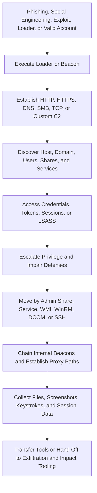

## Executive Summary

Cobalt Strike is a commercial adversary-simulation platform used by authorized security teams and abused by ransomware affiliates, initial-access brokers, espionage operators, and other threat actors. Its primary implant, Beacon, provides asynchronous command and control (C2), execution, credential access, discovery, lateral movement, collection, pivoting, and extensibility. The Team Server coordinates Beacon sessions and operator clients.

Beacon is usually post-compromise tooling. Public incidents commonly begin with phishing, social engineering, stolen remote-access credentials, vulnerable internet-facing services, loaders, or existing privileged access. Finding Beacon identifies an operator foothold but does not establish the initial-access method, actor identity, exfiltration path, or final objective.

Customization is central to Cobalt Strike. Malleable C2 can alter network transactions, payload staging, process injection, post-exploitation processes, memory characteristics, and portable executable (PE) properties. Artifact Kit, User Defined Reflective Loaders (UDRL), Sleep Mask Kit, Beacon Object Files (BOFs), User Defined C2 (UDC2), External C2, and current Beacon Interpreter and BOF-PE capabilities further reduce the value of fixed signatures.

The most durable detection surface is the operating-system effect. High-value signals include executable private memory, execution from unbacked memory, suspicious cross-process access, sacrificial processes with anomalous ancestry, administrative-share payload delivery, service or WMI fan-out, credential access, compressed discovery, cross-host named pipes, and recurring low-volume network traffic from an unusual process.

> [!IMPORTANT]
> Treat Cobalt Strike as dual-use tooling. Confirm whether activity falls within an authorized engagement before declaring compromise, but do not create permanent broad exclusions for red-team infrastructure, accounts, processes, or behaviors.

## Scope and Method

This report prioritizes Fortra product documentation, MITRE ATT&CK, Microsoft Threat Intelligence, Google Cloud and Mandiant, Cisco Talos, and Check Point Research. Product documentation establishes capability, while incident reporting establishes observed malicious procedures. A capability does not prove that every operator or deployment used it.

User-provided text, telemetry, schemas, samples, and public indicators are treated as untrusted until corroborated. Watermarks, profiles, public keys, filenames, and network infrastructure can be copied or reused. No query execution, validation result, optimization gain, or detection coverage is claimed. Candidate Microsoft Defender XDR and Microsoft Sentinel tables and columns must be checked against the target tenant before queries become production detections.

Public infrastructure indicators are historical. Domains and IP addresses require current passive DNS, registration, certificate, hosting, reputation, and first-seen or last-seen enrichment before blocking. Exact file hashes remain useful for retrospective search but do not cover rebuilt or repacked payloads.

## Tool Context and Defensive Interpretation

| Context | Characteristics | Defensive interpretation |
|---|---|---|
| Authorized use | Licensed activity under an approved scope with known dates, accounts, infrastructure, techniques, and owner contacts | Verify scope and cleanup requirements; authorized activity can still expose credentials or disrupt systems |
| Leaked or cracked deployment | Modified licensing checks, fabricated authorization files, redistributed components, or stolen license material | Strong risk context, but a watermark or key does not identify the operator |
| Adversary abuse | Unauthorized Beacon or compatible loader used for control, credential theft, movement, collection, or payload deployment | Investigate the complete intrusion and establish intent through independent evidence |
| Compatible implementation | Third-party payload reproduces Beacon protocol or artifacts without an authentic current Cobalt Strike build | Detect behavior and protocol lineage without overclaiming product provenance |

Trial builds can contain deliberately conspicuous detection artifacts. Licensed and cracked builds permit greater customization. Some redistributed packages have reportedly contained additional backdoors, so possession of a cracked package does not guarantee that its operator controls every observed behavior.

## Current Capability Considerations

Cobalt Strike 4.13 documentation describes Beacon Interpreter bytecode, BOF-PE support, an LLVM-built Beacon, payload versioning, Malleable Profile overrides, and WebSocket or gRPC streaming. These features increase implementation variability. Public malicious-use reporting for the newest capabilities remains less mature than reporting for conventional Beacon, so detection implications should be treated as capability-based until incident evidence is available.

Beacon transports include HTTP, HTTPS, DNS, SMB named-pipe chaining, raw TCP, and extensible channels. DNS Beacon can use A, AAAA, TXT, and DNS-over-HTTPS modes. A protocol or port cannot independently identify Beacon.

## Attack Flow

This sequence is representative, not mandatory. Operators can omit stages, reorder actions, execute tasks through BOFs, or use adjacent tooling for persistence, exfiltration, and impact.

## MITRE ATT&CK Use by Attack Stage

### Initial Access

Cobalt Strike is commonly introduced after another access mechanism succeeds. Documented surrounding paths include Quick Assist social engineering, Qakbot, stolen VPN credentials, exploitation of public-facing services, custom loaders, and pre-existing domain control.

No generic Initial Access technique is assigned to Beacon solely because it appears later in an intrusion. Investigation should reconstruct activity before the first loader, suspicious memory event, or C2 callback.

### Execution

| Technique | ID | Cobalt Strike behavior | Confidence |
|---|---|---|---|
| PowerShell | T1059.001 | Executes PowerShell content or supports PowerShell-based delivery and post-exploitation | High |
| Windows Command Shell | T1059.003 | Runs shell commands for discovery, administration, and remote operations | High |
| Visual Basic | T1059.005 | Supports VBA-based delivery or execution workflows | Medium |
| Native API | T1106 | Loaders, Beacon, and BOFs call Windows APIs without command-shell children | High |
| Reflective Code Loading | T1620 | Reflective loaders and `execute-assembly` place content in a Beacon or sacrificial process | High |
| Rundll32 | T1218.011 | DLL Beacon or associated content can be loaded through `rundll32.exe` | High for observed cases |

BOFs and native API calls can remove the command-line evidence expected from conventional post-exploitation. Absence of PowerShell, `cmd.exe`, or a child process does not clear a suspicious process.

### Persistence and Privilege Escalation

| Technique | ID | Cobalt Strike behavior | Confidence |
|---|---|---|---|
| Windows Service | T1543.003 | Installs a service locally or remotely for execution or persistence | High |
| Bypass User Account Control | T1548.002 | Supports operator-selected Windows UAC bypass workflows | High as capability |
| Token Impersonation or Theft | T1134.001 | Steals and applies process tokens | High |
| Make and Impersonate Token | T1134.003 | Creates an impersonation token from obtained credentials | High |

Scheduled tasks, registry autoruns, and permanent WMI subscriptions can occur in Beacon-enabled intrusions. They require incident-specific evidence and are not intrinsic to every Beacon deployment.

### Defense Evasion

| Technique | ID | Cobalt Strike behavior | Confidence |
|---|---|---|---|
| Process Injection | T1055 | Injects payloads or post-exploitation jobs into selected processes | High |
| DLL Injection | T1055.001 | Uses reflective DLL injection | High |
| Process Hollowing | T1055.012 | Creates and replaces a sacrificial process image | High |
| Obfuscated Files or Information | T1027 | Encrypts, encodes, transforms, or packs payloads and configuration | High |
| Indicator Removal from Tools | T1027.005 | Changes known artifacts through kits, loaders, profiles, and memory masking | High |
| Process Argument Spoofing | T1564.010 | Changes apparent arguments for spawned processes | High as capability |
| Timestomp | T1070.006 | Modifies file timestamps | High as capability |
| User Activity Based Checks | T1497.002 | A documented 2025 Qilin loader required user interaction through `MessageBoxA` | High for that case; low globally |

### Credential Access

| Technique | ID | Cobalt Strike behavior | Confidence |
|---|---|---|---|
| LSASS Memory | T1003.001 | Runs credential-dumping functionality against LSASS | High |
| Token Impersonation or Theft | T1134.001 | Steals process tokens for local or remote use | High |
| Make and Impersonate Token | T1134.003 | Creates tokens using supplied credentials | High |
| Keylogging | T1056.001 | Captures keystrokes | High |
| Browser Session Cookie | T1185 | Browser pivoting can inherit cookies, client certificates, and authenticated sessions | High as capability |

Modern credential protections can block or alter these techniques. Detection should correlate attempted process access, token manipulation, credential alerts, and subsequent authentication rather than require successful credential extraction.

### Discovery

| Technique | ID | Cobalt Strike behavior | Confidence |
|---|---|---|---|
| Process Discovery | T1057 | Enumerates processes for awareness and injection targeting | High |
| Domain Account Discovery | T1087.002 | Enumerates users and privileged groups | High |
| Remote System Discovery | T1018 | Discovers Active Directory systems and reachable hosts | High |
| Network Service Discovery | T1046 | Scans services and ports from the compromised endpoint | High |
| File and Directory Discovery | T1083 | Browses local and remote files | High |
| Network Share Discovery | T1135 | Enumerates local or remote shares | High |

A compressed sequence of host, process, account, trust, share, and service discovery is more discriminating than one command. In-process BOFs can produce behavioral effects without recognizable discovery command lines.

### Lateral Movement

| Technique | ID | Cobalt Strike behavior | Confidence |
|---|---|---|---|
| SMB and Windows Admin Shares | T1021.002 | Copies payloads through `C$` or `ADMIN$` | High |
| DCOM | T1021.003 | Executes payloads through remote COM | High as capability |
| SSH | T1021.004 | Connects to SSH services | High as capability |
| WinRM | T1021.006 | Executes payloads through Windows Remote Management | High |
| Windows Management Instrumentation | T1047 | Creates a remote process or starts a payload using WMI | High |
| Service Execution | T1569.002 | Uses Service Control Manager or PsExec-style execution | High |

The strongest lateral-movement analytic connects remote authentication, payload transfer, remote execution, and destination behavior. Individual administrative tools are common in legitimate operations.

### Collection

| Technique | ID | Cobalt Strike behavior | Confidence |
|---|---|---|---|
| Screen Capture | T1113 | Captures desktop screenshots | High |
| Data from Local System | T1005 | Collects and downloads local files | High |
| Input Capture: Keylogging | T1056.001 | Records user input | High |
| Browser Session Cookie | T1185 | Reuses browser authentication state | High as capability |

### Command and Control

| Technique | ID | Cobalt Strike behavior | Confidence |
|---|---|---|---|
| Web Protocols | T1071.001 | Uses configurable HTTP or HTTPS transactions | High |
| DNS | T1071.004 | Uses A, AAAA, TXT, or DoH-supported channels | High |
| Non-Application Layer Protocol | T1095 | Uses raw TCP or configurable channels | High |
| Protocol Tunneling | T1572 | Encapsulates C2 in HTTP, DNS, SMB, or custom transports | High |
| Internal Proxy | T1090.001 | A parent Beacon relays chained hosts without direct internet access | High |
| Domain Fronting | T1090.004 | Uses separate routing values through supported CDN infrastructure | High as capability |
| Standard Encoding | T1132.001 | Applies Base64, URL-safe Base64, or NetBIOS-style transformations | High |
| Symmetric Cryptography | T1573.001 | Protects tasking with symmetric cryptography | High |
| Asymmetric Cryptography | T1573.002 | Protects Beacon metadata with RSA in documented implementations | High |
| Scheduled Transfer | T1029 | Sleeps and checks in on configurable, jittered intervals | High |
| Ingress Tool Transfer | T1105 | Uploads or retrieves follow-on tools | High |

### Exfiltration and Impact

Cobalt Strike can collect and transfer files, including chunked transfers mapped to `T1030`. Public intrusions frequently use separate exfiltration utilities, cloud services, or ransomware tooling. Beacon presence does not independently prove data theft, encryption, service disruption, or destruction.

## Obfuscation and Detection Avoidance

### Malleable C2

Malleable C2 can change:

* HTTP methods, URI paths, headers, cookies, and query parameters
* Metadata and task-result placement
* Base64, URL-safe Base64, and NetBIOS-style transformations
* User-agent strings and transaction appearance
* Callback hosts, staging behavior, sleep, and jitter
* Process-injection behavior and allocator choices
* Sacrificial or post-exploitation process selection
* PE headers, section characteristics, and memory properties

Current profile overrides can create further variation among exported payloads. A network signature tied to one public profile provides narrow coverage.

### Staged and Stageless Payloads

A small stager may retrieve full Beacon, but staging is optional. Operators can deploy a stageless payload through a custom loader, disable hosted staging, or use redirector filtering that prevents external retrieval. Failure to retrieve a stager does not disprove Cobalt Strike.

Historical four-character paths, URI checksums, default ports, and default certificates remain enrichment leads. They are not universal properties.

### Reflective Loading and Custom Loaders

Full Beacon can execute through its reflective loader or a UDRL. A custom loader may decrypt embedded data, allocate memory, copy the payload, alter page protection, and transfer execution through a thread, timer, wait callback, asynchronous procedure call (APC), or another native mechanism.

File-centric detection loses visibility when execution occurs entirely from memory. Memory allocation, protection transitions, thread start addresses, image mismatch, and call-stack evidence become more important.

### Process Injection and Sacrificial Processes

Process injection is configurable. Documented options include reflective DLL injection and process hollowing, while custom code can change allocation, writing, execution, and target-process behavior. `rundll32.exe` is common in historical reporting but is not a universal spawn-to process.

A useful signal combines unusual ancestry, little legitimate target-process activity, executable private memory, a suspicious thread or call stack, and follow-on network or discovery behavior.

### Sleep, Jitter, and Sleep Masking

Beacon calculates callbacks around a base interval with configurable randomization. Exact periodicity tests lose sensitivity when intervals change or jitter increases, but timing structure can remain visible as bounded or multi-modal recurrence.

Sleep Mask can mask PE sections and heap records while Beacon is dormant. Current documented behavior can change `.text` protection from executable and readable to readable and writable, then restore it, while proxying selected APIs. Detection opportunities include:

* Repeated `RX` to `RW` to `RX` transitions
* Executable private or heap memory
* Timer or wait callbacks into anonymous memory
* Suspicious call stacks during unmasking
* Brief execution followed by network activity
* Memory content that becomes visible only around tasking

Memory scanning at one instant can miss a masked implant. Collection at multiple lifecycle points improves coverage.

### Artifact Kit and Malleable PE

Artifact Kit changes executable, DLL, shellcode, and script templates. Malleable PE modifies loader and in-memory properties. UDRL replaces reflective-loader behavior, while Sleep Mask changes dormant-memory representation. These features remove signatures but still require operating-system actions to execute and communicate.

### BOFs, BOF-PE, and Beacon Interpreter

BOFs are position-independent COFF objects linked and executed inside Beacon. They can avoid traditional fork-and-run process creation and injection patterns, fit constrained channels such as DNS, and invoke Win32 or Beacon APIs directly.

BOF-PE broadens development options for DLL or executable-oriented code, external libraries, and C++ functionality. Beacon Interpreter executes compiled intermediate bytecode in a Beacon virtual machine. Detection should focus on task effects instead of requiring child processes or recognizable command lines.

### Redirectors, Fronting, and Masquerading

Redirectors separate public callback infrastructure from the Team Server, filter scanners, distribute callbacks, and permit front-end rotation. Domain fronting connects to legitimate CDN infrastructure while another routing value directs the encrypted request. Domain masquerading connects directly to attacker infrastructure while making traffic resemble a legitimate service.

Detection should compare destination IP, DNS history, TLS Server Name Indication (SNI), certificate identity, proxy destination, HTTP `Host`, URI behavior, and endpoint process context. Provider-aware baselines are required because legitimate SaaS and CDN traffic can contain routing differences.

### DNS, SMB, and Custom C2

DNS Beacon can vary record types and use DoH. SMB Beacon chains hosts through named pipes, allowing an isolated endpoint to communicate through a parent. Raw TCP, UDC2, and External C2 weaken assumptions tied to HTTP, DNS, or SMB.

Absence of a known Beacon network profile does not exclude Beacon. Endpoint, identity, and east-west behavior must remain part of the detection strategy.

## Durable Indicators of Attack

| Category | Durable behavioral indicator | Hunting value |
|---|---|---|
| Loader execution | Data is decrypted or copied into private memory, changed to executable, and invoked | Strong signal when the initiating process is rare or unexpected |
| Reflective loading | A thread or call stack begins in unbacked executable memory | High value with suitable EDR memory telemetry |
| Process injection | Cross-process allocation, writing, protection change, thread creation, or APC execution | High value after excluding browsers, security tools, and JIT runtimes |
| Sacrificial process | Short-lived process with unusual ancestry, injected memory, little normal activity, and task effects | Strong correlation signal |
| Childless tasking | Discovery, credential, screenshot, or scan behavior occurs without expected command-shell children | Useful for BOF and native API activity |
| C2 recurrence | Unusual process makes bounded, recurring, low-volume egress to a rare destination | Resilient when process and destination rarity are included |
| Lateral transfer | Administrative-share write is followed by service, WMI, WinRM, RPC, or task execution | Critical fan-out signal |
| Chained C2 | Internal endpoint communicates with a parent over a rare pipe or TCP channel, and the parent communicates externally | Strong for segmented networks |
| Credential pivot | LSASS or token activity is followed by remote authentication and service or share use | Links access to movement |
| Discovery burst | Account, host, process, share, trust, and service discovery occurs in a compressed period | Strong after suspicious loading or C2 |

## Volatile Indicators of Compromise

These indicators are historical enrichment and require current validation. They must not be treated as independent attribution or intent proof.

### Network Indicators

| Type | Indicator | Context | Reported |
|---|---|---|---|
| IPv4 address | `91.107.247.163` | Cobalt Strike C2 contacted by `rundll32.exe` over ports 443 and 80 in a Gentlemen affiliate intrusion | Check Point, April 20, 2026 |
| Domain | `zziveastnews.com` | Storm-1811 Cobalt Strike Beacon C2 | Microsoft, May 15, 2024 |
| Domain | `realsepnews.com` | Storm-1811 Cobalt Strike Beacon C2 | Microsoft, May 15, 2024 |

### File and Configuration Indicators

| Type | Indicator | Context |
|---|---|---|
| SHA-256 | `caa21a8f13a0b77ff5808ad7725ff3af9b74ce5b67426c84538b8fa43820a031` | Storm-0501 `name.dll` sample identified as Cobalt Strike |
| SHA-256 | `d37dc37fdcebbe0d265b8afad24198998ae8c3b2c6603a9258200ea8a1bd7b4a` | Storm-0501 `248.dll` sample identified as Cobalt Strike |
| SHA-256 | `53e2dec3e16a0ff000a8c8c279eeeca8b4437edb8ec8462bfbd9f64ded8072d9` | Storm-0501 `cs240.dll` sample identified as Cobalt Strike |
| SHA-256 | `827f7178802b2e92988d7cff349648f334bc86317b0b628f4bb9264285fccf5f` | Storm-0501 `fel.ocx` sample identified as Cobalt Strike |
| SHA-256 | `ee80f3e3ad43a283cbc83992e235e4c1b03ff3437c880be02ab1d15d92a8348a` | Storm-0501 `theme.ocx` sample identified as Cobalt Strike |
| SHA-256 | `de09ec092b11a1396613846f6b082e1e1ee16ea270c895ec6e4f553a13716304` | Storm-0501 `hana.ocx` sample identified as Cobalt Strike |
| Watermark | `666` | Modified Beacon `license_id` repeatedly associated with the Storm-0501 cluster; weak standalone indicator |

Generic names such as `rundll32.exe`, `regsvr32.exe`, `name.dll`, and random executables are excluded as standalone IoCs. `ocsp.verisign.com` is also excluded because a 2025 report described it as an impersonated HTTP `Host` value, not attacker-owned infrastructure.

## Observable Signals by Data Category

### Host and Process

* A user-facing, server, or signed process develops executable private memory and later makes recurring outbound connections.
* A short-lived sacrificial process has anomalous ancestry, an injected thread, or unbacked executable memory.
* A loader allocates memory, decrypts content, changes protection, and transfers execution.
* A process alternates among sleep, memory-protection changes, brief execution, and network activity.
* Discovery, credential access, or scanning occurs without corresponding child processes.
* `rundll32.exe` or `regsvr32.exe` loads a rare DLL or OCX and then initiates external traffic.

### Command Line

* Loader or proxy-binary execution is followed by `whoami`, `systeminfo`, `tasklist`, `net`, `nltest`, `ipconfig`, share discovery, or domain discovery.
* An administrative-share copy is followed by service, WMI, WinRM, RPC, `regsvr32.exe`, or `rundll32.exe` execution.
* Token or credential activity is followed by execution under a different account and rapid remote authentication.
* PowerShell combines encoded content, hidden windows, bypass options, AMSI tampering, downloads, or unusual ancestry.

Command-line visibility is incomplete for BOFs, direct APIs, custom loaders, and direct syscalls.

### Files, Registry, Services, Tasks, and WMI

* A rare executable, DLL, OCX, or loader is written to an administrative share, temporary path, public path, or program-data path and executed shortly afterward.
* A new service references a writable path, UNC path, rare binary, DLL loader, or command interpreter.
* A scheduled task points to a recently written payload, encoded script, network path, or living-off-the-land binary.
* Remote WMI process creation correlates with file transfer, a network logon, and destination execution.
* A mapped module differs from its disk image or contains altered headers and sections.
* A staged file is timestomped or deleted soon after execution.

No registry key, task name, or service name is universal to Beacon.

### Identity

* A new or rare privileged logon is followed by token manipulation, remote service creation, or administrative-share access.
* One account authenticates to many devices, followed by near-synchronous execution or egress.
* A process executes with an alternate token without the expected interactive logon context.
* LSASS, browser-session, or token access is followed by successful lateral movement.
* An identity bridge is compromised before unusual synchronization-account, federation, or Graph activity.

### Network, DNS, TLS, and HTTP

* A long-lived process makes recurring low-volume connections to a rare destination.
* Callback recurrence remains bounded around a changing base interval.
* A low-prevalence or newly observed destination appears after suspicious loading or injection.
* SNI, certificate, destination IP, HTTP `Host`, and process identity are inconsistent.
* Repeated small requests alternate with larger task-result responses.
* DNS labels have unusual length or entropy, or A, AAAA, and TXT query patterns change over time.
* An internal host without internet access communicates with another endpoint that makes external callbacks.

Default certificates, Team Server port 50050, four-character stager paths, URI checksums, static JA3 or JA4 values, exact intervals, fixed user agents, and exact packet sizes are brittle signals.

### Named Pipes and IPC

* Rare cross-host named-pipe access over SMB is followed by synchronized endpoint activity.
* One endpoint acts as a communication parent for hosts without direct egress.
* A short-lived injected process exchanges data over an unusual pipe with a long-lived process.
* Pipe activity correlates with `ADMIN$`, logon type 3, remote service activity, and TCP 445.

Published Beacon pipe prefixes are configurable and should serve only as enrichment.

### Memory and Injection

* Executable private pages contain PE-like structures or suspicious thread start addresses.
* Cross-process allocation, writing, protection change, thread creation, or APC execution occurs between processes that do not normally interact.
* A suspended child process exhibits mapped-image and in-memory divergence.
* Repeated executable-to-writable-to-executable transitions occur around sleep boundaries.
* A mapped module has removed headers, transformed sections, or contents that differ from disk.

### Hybrid Cloud

Public Storm-0501 reporting supports correlation from an on-premises Beacon foothold to stolen Entra Connect credentials, DPAPI material, synchronized identities, cloud sessions, and follow-on cloud operations. It does not establish a universal cloud-Beacon fingerprint.

Prioritize endpoint compromise of identity bridges, unusual synchronization-account sign-ins, new source IP addresses, unfamiliar applications, Graph operations, federation changes, and Conditional Access or MFA changes. Attribute cloud activity only when the causal evidence supports it.

## Priority Hunting Hypotheses

| ID | Hypothesis | Correlation logic | Telemetry | Window | Priority |
|---|---|---|---|---|---|
| H1 | Rare DLL or OCX loading leads to C2 | File write, `rundll32.exe` or `regsvr32.exe` load, then rare external connection or discovery | File, process, image-load, network, signer, and prevalence data | 10 to 30 minutes | Critical |
| H2 | Unbacked memory execution leads to C2 | Executable private memory and execution transfer are followed by network activity | EDR memory, process, thread, call-stack, and network data | 1 to 10 minutes | Critical |
| H3 | Administrative-share delivery enables lateral execution | Remote `ADMIN$` or `C$` write is followed by RPC, service, WMI, WinRM, or task execution and destination egress | File, logon, identity, process, service, WMI, task, and network data | 5 to 20 minutes | Critical |
| H4 | Lateral fan-out creates synchronized callbacks | One source or account deploys a rare payload or execution method to many devices that begin similar callbacks | Endpoint, identity, SMB, service, task, DNS, proxy, and firewall data | 30 to 120 minutes | Critical |
| H5 | Jittered C2 appears as bounded recurring egress | Normally non-networked process contacts a low-prevalence destination with bounded randomized intervals | Endpoint network, proxy, firewall, DNS, and process inventory | 1 to 24 hours | High |
| H6 | Sleep masking produces repeated memory transitions | Anonymous memory changes `RX` to `RW` to `RX` near timer or wait callbacks and network I/O | Memory protection, call stack, timer, thread, process, and network data | Repeated over 30 to 60 minutes | High |
| H7 | Chained Beacon relays isolated hosts | Rare named-pipe or raw TCP traffic reaches a parent endpoint that then communicates externally | Named-pipe, SMB, east-west firewall, process, identity, and egress data | 5 to 60 minutes | High |
| H8 | DNS Beacon creates structured query behavior | Suspicious process generates recurring, high-entropy, or changing A, AAAA, and TXT traffic to a rare domain | DNS resolver, endpoint, proxy, and DoH visibility | 30 minutes to 24 hours | High |
| H9 | Credential access precedes childless discovery and movement | LSASS or token activity is followed by compressed discovery, remote logons, share access, or services | Process, identity, LSASS, token, file, logon, and network data | 5 to 45 minutes | Critical |
| H10 | On-premises compromise precedes cloud identity abuse | Suspicious identity-bridge activity precedes new sync-account, Graph, federation, or cloud privilege operations | Endpoint, identity, Entra sign-in, Graph audit, cloud app, and directory data | 1 to 24 hours | Critical |

## Hypothesis Validation and Tuning

### H1: Rare DLL or OCX Loader

Candidate Microsoft Defender XDR sources include `DeviceFileEvents`, `DeviceProcessEvents`, `DeviceImageLoadEvents`, and `DeviceNetworkEvents`. Require several of the following before assigning high severity: unsigned or low-prevalence content, writable path, unexpected ancestry, uncommon export or invocation, external destination rarity, discovery, or credential behavior.

Legitimate installers and COM registration can match parts of this sequence. Validate against approved software installation and update workflows.

### H2: Executable Private Memory

The hypothesis requires memory or behavioral sensor visibility. Exclude established JIT runtimes, browsers, debuggers, accessibility tools, and security products only after confirming their expected modules and call stacks. Suspicious ancestry, remote writing, unbacked thread starts, image mismatch, and rare egress should increase the score.

Validate in an isolated lab with approved injection or reflective-loading simulations and benign JIT controls. Confirm which memory fields and action types the tenant exposes.

### H3 and H4: Remote Transfer and Fan-Out

Correlate source device, source account, destination device, payload hash, file path, authentication, and execution method. Method diversity is valuable because operators may try several mechanisms. Baseline Configuration Manager, Intune, EDR, backup, vulnerability management, and help-desk systems.

An approved management source using a signed, prevalent package during a maintenance window should score lower. A user workstation or domain controller distributing a rare unsigned payload through multiple methods should score higher.

### H5: Jitter-Aware C2

Use a 7-to-30-day baseline for process and destination prevalence. Score recurrence distributions rather than exact intervals. Features can include median interval, interval variance, boundedness, periodicity at several lags, request-to-response byte ratios, destination age, process signer, device role, and callback duration.

Synthetic jittered series and known legitimate updaters should be used to test thresholds. Exact periodicity is insufficient.

### H6: Sleep Masking

Correlate repeated memory-protection transitions with unbacked pages, timer or wait callbacks, unusual processes, callback stacks, and network activity. Browsers, .NET, Java, and packers can generate similar transitions.

Validate across interactive and long sleep intervals. The documented default sleep mask can be disabled at very short interactive intervals, so a single transition pattern should not be mandatory.

### H7: Chained Beacon

Create an inventory of expected named pipes, administrative tools, backup agents, and security products. Score rare host pairs, rare pipe names, unexpected server or workstation roles, suspicious process context, and parent-host external activity. Preserve local and remote named-pipe telemetry where the sensor supports it.

### H8: DNS Beacon

Evaluate label entropy and length, subdomain uniqueness, query-type transitions, authoritative-domain rarity, domain age, NXDOMAIN ratio, recurrence, process context, and device compromise evidence. CDNs, tracking systems, antivirus products, and legitimate tunneling can produce individual signals.

DoH can bypass enterprise resolver logs. Proxy or endpoint telemetry is required to reduce this gap.

### H9: Credential-to-Movement Chain

Join token or LSASS behavior to account-device affinity, new logon sources, destination fan-out, administrative-share access, and service creation. Approved `runas`, automation identities, and service accounts require baselines. A privileged account used from a new endpoint immediately after credential access should be treated as high risk.

### H10: Hybrid Identity Pivot

Focus on Entra Connect, AD FS, privileged administration endpoints, synchronized accounts, and automation identities. Baseline expected source systems, service principals, Graph applications, maintenance periods, and federation changes. Preserve causal wording: Beacon may provide the on-premises foothold while stolen credentials or adjacent tooling performs cloud operations.

## Query-Building Blocks

| Building block | Detection intent | Candidate predicates |
|---|---|---|
| Rare loader | Identify suspicious DLL or OCX execution | Writable path, low prevalence, unsigned file, proxy binary, unusual parent, first-seen hash |
| Reflective execution | Detect memory-only loading | Executable private memory, unbacked thread, PE-like memory, image mismatch, suspicious call stack |
| Injection chain | Detect cross-process execution | Open-process access, remote allocation, write, protection change, APC or thread start |
| Callback behavior | Identify Beacon-like timing | Rare process and destination pair, bounded recurrence, low volume, intermittent larger response |
| Administrative transfer | Detect lateral payload staging | `ADMIN$` or `C$` write, rare hash, remote logon, source-account rarity |
| Remote execution | Detect destination activation | Service, WMI, WinRM, RPC, DCOM, task, or PsExec-style execution |
| Fan-out | Identify operator expansion | One source or account, many destinations, method diversity, repeated payload identity |
| Chained C2 | Detect segmented Beacon paths | Rare pipe or TCP host pair, parent endpoint egress, synchronized activity |
| Credential pivot | Link theft to movement | LSASS or token event, alternate identity, remote logon, share or service use |
| DNS channel | Identify encoded DNS tasking | Label entropy, query-type transitions, domain rarity, recurrence, suspicious process |
| Fronting anomaly | Identify routing inconsistencies | Destination, SNI, certificate, HTTP `Host`, URI, and process mismatch |
| Hybrid pivot | Link endpoint control to cloud abuse | Identity-bridge compromise, new sync-account source, Graph or federation change |

Useful correlation entities include `DeviceId`, normalized hostname, `AccountSid`, `InitiatingProcessAccountSid`, process ID plus creation time, source and destination IP addresses, remote device name, SHA-256, service name, task name, named-pipe name, domain, certificate identity, and cloud application identifier.

## Detection Engineering Guidance

* Prioritize administrative-share transfer plus service, RPC, WMI, WinRM, or task execution.
* Collect executable private-memory, thread-start, process-access, image-mismatch, and call-stack evidence where supported.
* Correlate process and network behavior instead of relying on traffic fingerprints alone.
* Preserve identity, east-west SMB, named-pipe, service, WMI, WinRM, and remote-logon telemetry.
* Model callback distributions and destination rarity instead of exact beacon intervals.
* Use hashes, domains, IP addresses, watermarks, and public profiles as expiring enrichment.
* Maintain an authorized-engagement registry containing owner, scope, accounts, infrastructure, techniques, start time, end time, and cleanup status.
* Avoid permanent exclusions. Apply time-bound and scope-bound suppression only after independent behavior is reviewed.
* Separate detection of Cobalt Strike-like behavior from claims about actor attribution, initial access, exfiltration, or impact.
* Validate every table, column, parser, entity mapping, time window, and threshold in the target tenant.

## Triage and Containment Guidance

| Phase | Recommended actions |
|---|---|
| Confirm | Establish authorization status, first execution, loader chain, memory behavior, C2 transport, operator actions, affected identities, and follow-on tooling |
| Preserve | Capture volatile memory, process trees, thread and module state, network connections, DNS, proxy, named-pipe, authentication, service, task, WMI, and PowerShell evidence |
| Scope | Search for matching hashes, keys, watermarks, profiles, destinations, process behavior, payload paths, source accounts, administrative-share writes, and callback patterns |
| Contain | Isolate affected endpoints, block confirmed active infrastructure, restrict unauthorized east-west administration, disable compromised accounts, and revoke sessions |
| Identity response | Treat confirmed LSASS, token, directory synchronization, or federation compromise as an identity-compromise event and rotate affected credentials from known-good systems |
| Infrastructure response | Investigate redirectors and related front ends through passive DNS, certificates, hosting, shared configuration, and time-bounded telemetry |
| Recover | Remove persistence and loaders, restore security controls, rebuild compromised trust boundaries where required, and monitor for renewed callbacks |
| Authorized activity | Contact the engagement owner, verify scope, preserve evidence of out-of-scope actions, and confirm cleanup rather than suppressing all detections |

## Coverage Gaps and Confidence Limits

* No tenant telemetry or malware execution was available for this report.
* Advanced Hunting retention and Sentinel ingestion depend on licensing, connectors, and workspace configuration.
* Named-pipe events, process-access events, thread starts, call stacks, memory transitions, and packet content may be unavailable.
* TLS decryption can be limited by privacy policy, QUIC, DoH, certificate pinning, or technical constraints.
* Malleable C2, profile overrides, UDRL, UDC2, External C2, BOFs, BOF-PE, Beacon Interpreter, custom loaders, and cracked modifications create substantial variability.
* Beacon-compatible payloads can reproduce protocol and configuration artifacts without using an authentic current build.
* Watermarks, public keys, profiles, and authorization files can be copied and do not establish operator identity.
* Initial access, persistence, exfiltration, cloud activity, and impact often come from adjacent tools.
* Public domains and IP addresses expire quickly, while hashes identify only exact samples.
* New Cobalt Strike 4.13 capabilities have less public malicious-use reporting than older Beacon functions.
* Detection of a dual-use framework does not establish criminal intent without authorization and contextual evidence.

## Source References

* [Fortra: Cobalt Strike Features](https://www.cobaltstrike.com/product/features)
* [Fortra: Cobalt Strike 4.13 User Guide](https://hstechdocs.helpsystems.com/manuals/cobaltstrike/current/userguide/content/topics/welcome_main.htm)
* [Fortra: Cobalt Strike Releases](https://www.cobaltstrike.com/release-page)
* [Fortra: Malleable Command and Control](https://hstechdocs.helpsystems.com/manuals/cobaltstrike/current/userguide/content/topics/malleable-c2_main.htm)
* [Fortra: Malleable PE, Process Injection, and Post Exploitation](https://hstechdocs.helpsystems.com/manuals/cobaltstrike/current/userguide/content/topics/malleable-c2-extend_main.htm)
* [Fortra: Payload Artifacts and Antivirus Evasion](https://hstechdocs.helpsystems.com/manuals/cobaltstrike/current/userguide/content/topics/artifacts-antivirus_main.htm)
* [Fortra: Sleep Mask Kit](https://hstechdocs.helpsystems.com/manuals/cobaltstrike/current/userguide/content/topics/artifacts-antivirus_sleep-mask-kit.htm)
* [Fortra: Beacon Object Files](https://hstechdocs.helpsystems.com/manuals/cobaltstrike/current/userguide/content/topics/beacon-object-files_main.htm)
* [Fortra: DNS Beacon](https://hstechdocs.helpsystems.com/manuals/cobaltstrike/current/userguide/content/topics/listener-infrastructure_beacon-dns.htm)
* [Fortra: SMB Beacon](https://hstechdocs.helpsystems.com/manuals/cobaltstrike/current/userguide/content/topics/listener-infrastructure_beacon-smb.htm)
* [MITRE ATT&CK: Cobalt Strike S0154](https://attack.mitre.org/software/S0154/)
* [Google Cloud and Mandiant: Defining Cobalt Strike Components](https://cloud.google.com/blog/topics/threat-intelligence/defining-cobalt-strike-components)
* [Microsoft Threat Intelligence: Quick Assist Abuse Leading to Ransomware](https://www.microsoft.com/en-us/security/blog/2024/05/15/threat-actors-misusing-quick-assist-in-social-engineering-attacks-leading-to-ransomware/)
* [Microsoft Threat Intelligence: Storm-0501 Hybrid Cloud Attacks](https://www.microsoft.com/en-us/security/blog/2024/09/26/storm-0501-ransomware-attacks-expanding-to-hybrid-cloud-environments/)
* [Cisco Talos: Qilin Attack Methods](https://blog.talosintelligence.com/uncovering-qilin-attack-methods-exposed-through-multiple-cases/)
* [Check Point Research: The Gentlemen and SystemBC](https://research.checkpoint.com/2026/dfir-report-the-gentlemen/)
* [Microsoft Learn: Defender XDR Advanced Hunting Schema](https://learn.microsoft.com/en-us/defender-xdr/advanced-hunting-schema-tables)
* [Microsoft Learn: Advanced Hunting Overview](https://learn.microsoft.com/en-us/defender-xdr/advanced-hunting-overview)
* [Microsoft Learn: Stream Defender XDR Data to Sentinel](https://learn.microsoft.com/en-us/azure/sentinel/connect-microsoft-365-defender)

## Implementation Next Step

Convert hypotheses H1 through H10 into separate, versioned Microsoft Defender XDR and Microsoft Sentinel hunting queries. Validate required table and column availability, entity normalization, join keys, retention, time windows, expected results, and false-positive rates before promoting any query to a scheduled analytic rule.
