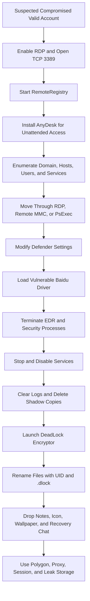

## Executive Summary

DeadLock is an emerging, financially motivated ransomware operation first observed in mid-2025. Public reporting supports an evolving toolset and multiple deployers rather than one immutable malware lineage. Cisco Talos analyzed a C++ encryptor deployed after a five-day hands-on intrusion, while Microsoft later analyzed a materially different Rust encryptor and reported DeadLock deployment by multiple groups, including an affiliate associated with the Lynx and INC ransomware ecosystems. This overlap does not establish that DeadLock is a conventional ransomware-as-a-service program or that Lynx, INC, and DeadLock are the same operation.

The strongest published intrusion sequence begins with suspected valid-account access, followed by RDP and RemoteRegistry enablement, unattended AnyDesk installation, domain and host discovery, lateral administration, Microsoft Defender impairment, bring-your-own-vulnerable-driver activity, broad service termination, recovery inhibition, and `.dlock` encryption. Initial access and the origin of the suspected compromised credentials remain unconfirmed.

DeadLock's most distinctive feature is its decentralized recovery and extortion infrastructure. Its HTML recovery application obtains mutable proxy configuration and leak-blog content from Polygon smart contracts, communicates through the Session network, and can expose stolen data through Wasabi storage. These legitimate platforms must not be blocked globally based only on DeadLock reporting. High-value hunts should correlate local recovery artifacts with endpoint preparation, encryption behavior, and unusual network access.

> [!IMPORTANT]
> DeadLock and DeadLocker are separate ransomware families. DeadLocker was reported in 2022 with a `.deadlocked` extension, Turkish-language pop-up, and Discord contact. Exclude DeadLocker artifacts, Valve's game, software deadlock terminology, and unrelated projects from DeadLock hunts.

## Scope and Method

This report prioritizes Microsoft's August 2026 DeadLock malware analysis, Cisco Talos incident and malware research from December 2025, and Group-IB's January 2026 infrastructure analysis. ThreatScene and ransomware tracking are used only where they add incident context or actor-claim counts. Leak-site entries are actor claims, not independently verified compromises, encryption events, or payments.

User-provided text, public telemetry, schemas, and indicators are treated as untrusted until corroborated. No execution, query validation, optimization gain, or detection coverage is claimed. Candidate Microsoft Defender XDR and Sentinel tables must be checked against the target tenant before queries are promoted to detections.

Public reporting sometimes describes `RunAs` relaunch or PowerShell execution-policy override as a UAC bypass. `RunAs` normally presents a UAC consent prompt, and Microsoft did not observe its analyzed Rust sample relaunch successfully. This report therefore treats elevation attempts as observable behavior, not proof of silent UAC bypass.

## Campaign Timeline and Victimology

| Date | Evidence-Backed Development |
|---|---|
| June 27, 2025 | Creation timestamp of the earliest Group-IB-analyzed sample; its note describes encryption but does not claim data theft |
| July 2025 | Microsoft begins observing DeadLock; a July Group-IB sample adds a claim that data was stolen |
| August 2025 | A later sample adds `RECOVERY_CHAT.<UID>.html`, broader extortion language, and Polygon-backed proxy discovery |
| August 10 to 11, 2025 | Group-IB observes creation of two related Polygon proxy contracts |
| Late 2025 | Talos investigates an intrusion with five days of operator access before DeadLock deployment and documents valid-account, RDP, AnyDesk, BYOVD, and recovery-inhibition activity |
| December 9, 2025 | Talos publishes its analysis of the C++ encryptor and CVE-2024-51324 BYOVD chain |
| January 15, 2026 | Group-IB publishes infrastructure analysis; at that time it finds no known affiliate program or dedicated data leak site |
| July 2026 | Microsoft reports more than 80 organizations published on the DeadLock blog, with more than half of claims in Europe |
| August 10, 2026 | Microsoft publishes analysis of a Rust encryptor and expanded decentralized recovery infrastructure |

Microsoft reports claimed or observed activity across Europe, Asia, North America, South America, and Africa. Reported sectors include information technology, mining, transportation and logistics, manufacturing, hospitality, and consumer goods. Available public evidence does not establish a fixed sector focus.

The apparent change from no dedicated leak site in January 2026 to more than 80 blog claims by July 2026 reflects rapid operational development or a change in visibility. It should not be interpreted as a verified count of encrypted organizations.

## Threat Actor Profile

| Attribute | Assessment |
|---|---|
| Motivation | Financial extortion with high confidence |
| First observed | Mid-2025; the earliest analyzed sample has a June 27, 2025 creation timestamp |
| Operating model | Multiple deployers are reported; no public evidence establishes a formal affiliate program or stable ransomware-as-a-service structure |
| Initial access | Talos suspects compromised valid accounts from telemetry; credential origin and acquisition method are unknown |
| Actor relationships | Microsoft observed deployment by multiple groups, including an affiliate associated with Lynx and INC ecosystems; this is operational overlap, not identity proof |
| Extortion model | Encryption evolved into double-extortion claims and a public blog; the transfer mechanism for allegedly stolen data is not publicly established |
| Communications | Session messenger and a local HTML recovery application |
| Infrastructure | Polygon smart contracts for mutable configuration and blog data, custom proxy relays, Session nodes, and Wasabi-backed leak storage |
| Payment reporting | Ransom notes accept Bitcoin or Monero; no reliable public aggregate demand or payment total was identified |
| Geographic signal | The Rust sample excludes selected language identifiers associated with former Soviet, CIS-linked, and some Middle Eastern environments; this is not nationality proof |
| Attribution confidence | High confidence in the ransomware artifacts; medium confidence that published intrusion activity represents a recurring playbook; low confidence in operator identity and organizational structure |

The malware's transition from C++ to Rust, use by multiple groups, changing notes, and expanding infrastructure argue against treating every DeadLock intrusion as operationally identical. Detection content should prioritize behavior and preserve variant-specific qualifiers.

## Infection and Attack Flow

### Stage 1: Initial Access and Remote Enablement

Initial access is not established by public evidence. Talos suspects compromised valid accounts because of observed telemetry but does not identify credential theft, phishing, exploitation, or an access broker as the source. In the documented intrusion, the actor modified `fDenyTSConnections`, added an inbound TCP/3389 firewall rule, and configured and started RemoteRegistry.

This sequence is valuable for hunting because the actions form a coherent remote-administration preparation pattern even when the initial credential event is unavailable.

### Stage 2: Persistent Remote Access

One day before encryption, Talos observed installation of a new AnyDesk instance despite other AnyDesk instances already being present. The operator configured silent installation, start with Windows, disabled updates, started the service, set an unattended-access password, and invoked control functionality. The suspicious signal is the new configuration and surrounding behavior, not AnyDesk alone.

### Stage 3: Discovery and Lateral Administration

The operator used `nltest`, domain group queries, `quser`, `ping`, RDP, and remote Computer Management through `mmc.exe compmgmt.msc /computer:<host>`. ThreatScene separately reported SoftPerfect NetScan, Mimikatz, PsExec, RDP, AnyDesk, and PCHunter64 in DeadLock-related incident response. Those tools are incident-specific observations and are not inherent DeadLock components.

### Stage 4: Defense Evasion and BYOVD

Talos observed `SystemSettingsAdminFlows.exe` used to change Defender real-time protection, cloud reporting, sample submission, and notification settings. The actor then deployed `EDRGay.exe` with a legitimate vulnerable Baidu Antivirus driver, `BdApiUtil.sys`, renamed `DriverGay.sys`. The loader exploited CVE-2024-51324 through IOCTL `0x800024b4` to terminate targeted security processes from kernel mode.

The filenames are mutable. Stronger analytics correlate an unusual driver write or load, its real device name `\\.\BdApiUtil`, the vulnerable-driver hash or certificate metadata, and termination of security processes.

### Stage 5: Service and Recovery Impairment

A PowerShell preparation script attempts administrative relaunch, stops and disables services outside an extensive allowlist, deletes volume shadow copies, and self-deletes. DeadLock variants target security, backup, database, cloud synchronization, remote access, search, virtualization, and directory services to release file handles and weaken response and recovery.

Microsoft's Rust sample also empties recycle bins, enables powerful token privileges, clears named and enumerated event channels, sets WINEVT channel `Enabled` values to `0`, and changes channel access controls. This broader log impairment is variant-specific but forms a high-confidence pre-impact signal.

### Stage 6: Execution and Encryption

The Talos C++ build drops a batch launcher in `ProgramData`, sets UTF-8 code page `65001`, launches the malware, deletes the launcher, and hollows `rundll32.exe`. It waits 50 seconds before encryption, uses a custom stream cipher with time-derived keys, and appends a hexadecimal identifier and `.dlock`.

The Microsoft-analyzed Rust build parses an XOR-obfuscated configuration, checks excluded system languages, and either encrypts a supplied target path or performs elevated preparation. It uses resource-aware throttling, XChaCha20 for content, Curve25519 ECDH with XSalsa20-Poly1305 key wrapping, and full or intermittent encryption based on file size. Files are renamed to `<filename>.<UID>.dlock`.

### Stage 7: Extortion and Recovery Infrastructure

The Rust build writes `HOW_RECOVER.<UID>.txt` in encrypted directories and `RECOVERY_CHAT.<UID>.html` at drive roots and Desktop locations. It also writes a UID-named icon and bitmap under `C:\ProgramData`, associates `.dlock` with the icon, changes the system wallpaper, and self-deletes through a batch loop.

The HTML application queries public Polygon RPC endpoints to read smart contracts that hold the current proxy address and blog data. The proxy relays encrypted Session traffic. Blog attachments can point to Wasabi S3-compatible storage. These services have broad legitimate use and require correlation with local DeadLock artifacts.

No public source establishes the collection or exfiltration utility used before leaked data reached actor-controlled storage. Do not infer that Wasabi access from an infected endpoint performed the original exfiltration.

## Commonly Observed Tools and Commands

| Function | Observed Examples |
|---|---|
| RDP enablement | `reg add ... fDenyTSConnections ... /d 0 /f`, `netsh advfirewall ... localport=3389 action=allow` |
| Remote registry | `sc config RemoteRegistry start= demand`, `sc start RemoteRegistry` |
| Remote access | AnyDesk with `--install`, `--start-with-win`, `--silent`, `--update-disabled`, `--start-service`, `--set-password`, and `--control` |
| Domain and user discovery | `nltest /dclist`, `net localgroup /domain`, `quser`, and `ping` |
| Lateral administration | `mstsc.exe /v:<host>`, `mmc.exe compmgmt.msc /computer:<host>`, and incident-specific PsExec |
| Defender impairment | `SystemSettingsAdminFlows.exe Defender RTP 1`, `SpynetReporting 0`, `SubmitSamplesConsent 0`, and `DisableEnhancedNotifications 1` |
| BYOVD | `EDRGay.exe`, `DriverGay.sys`, Baidu `BdApiUtil.sys`, device `\\.\BdApiUtil`, and IOCTL `0x800024b4` |
| Service and recovery impairment | PowerShell service stop and disable logic, shadow-copy deletion, `stop.ps1`, and optional `run.txt` allowlist |
| Log impairment | Event Log API clearing, WINEVT channel `Enabled=0`, restrictive `ChannelAccess`, and full channel enumeration |
| Encryptor staging | Random or embedded `.cmd` under `ProgramData`, `chcp 65001`, 50-second delay in the C++ build, and process hollowing into `rundll32.exe` |
| Impact artifacts | `<name>.<UID>.dlock`, `HOW_RECOVER.<UID>.txt`, `RECOVERY_CHAT.<UID>.html`, `<UID>.ico`, and `<UID>.bmp` |

Commands are examples from published analysis. Several are legitimate administrative functions and require context, sequence, and account baselines.

## MITRE ATT&CK Map for Hunting

| Technique | ID | Confidence | Evidence Pattern to Hunt |
|---|---|---|---|
| Valid Accounts | T1078 | Medium | Suspected compromised account precedes remote enablement and operator activity; credential source is unknown |
| Remote Services: RDP | T1021.001 | High | RDP registry and firewall changes followed by `mstsc.exe` or remote interactive logon |
| Remote Access Tools: Remote Desktop Software | T1219.002 | High | New unattended AnyDesk installation and service execution before encryption |
| PowerShell | T1059.001 | High | Preparation scripts stop services, delete shadow copies, and self-delete |
| Windows Command Shell | T1059.003 | High | Batch launchers, registry, firewall, service, code-page, and self-deletion commands |
| Modify Registry | T1112 | High | RDP, `.dlock` icon, wallpaper, event-channel, and service-related changes |
| Impair Defenses | T1562.001 | High | Defender changes, EDR termination, service disabling, and security-process kill lists |
| Disable or Modify System Firewall | T1562.004 | High | New inbound firewall rule permits TCP/3389 |
| Exploitation for Defense Evasion | T1211 | High | CVE-2024-51324 exploitation in a signed Baidu driver terminates security processes |
| System Services: Service Execution | T1569.002 | Medium | AnyDesk service and incident-specific PsExec execution |
| Domain Trust Discovery | T1482 | High | `nltest` domain-controller and trust discovery |
| Permission Groups Discovery: Domain Groups | T1069.002 | High | Domain group and member enumeration |
| Remote System Discovery | T1018 | High | Ping, network scanning, and remote-host administration |
| System Owner/User Discovery | T1033 | High | `quser` and related logged-on user checks |
| Network Service Discovery | T1046 | Medium | SoftPerfect NetScan and internal probing in reported incidents |
| System Binary Proxy Execution: MMC | T1218.014 | High | Remote Computer Management through `mmc.exe` |
| Process Injection: Process Hollowing | T1055.012 | High | C++ variant hollows `rundll32.exe` |
| Clear Windows Event Logs | T1070.001 | High | Named and enumerated event channels are cleared |
| File Deletion | T1070.004 | High | Preparation scripts, launchers, and encryptor self-delete |
| Service Stop | T1489 | High | Broad security, backup, database, and application service stops |
| Inhibit System Recovery | T1490 | High | Shadow copies and recovery services are removed or disabled |
| Data Encrypted for Impact | T1486 | High | High-rate encryption and renames ending in `.<UID>.dlock` |
| System Language Discovery | T1614.001 | High | Rust build checks configured language identifiers before execution |
| OS Credential Dumping: LSASS Memory | T1003.001 | Medium | Mimikatz appears in separate incident reporting, not the Talos malware chain |
| SMB/Windows Admin Shares | T1021.002 | Medium | PsExec appears in separate incident reporting |

No exfiltration technique is assigned because public sources do not identify a sufficiently concrete collection or transfer mechanism. Repeated `RunAs` elevation attempts are also not mapped as confirmed UAC bypass.

## Durable Indicators of Attack

| Attack Phase | Durable Behavioral Indicator | Hunting Value |
|---|---|---|
| Initial access | A remote account changes RDP, firewall, and RemoteRegistry settings before interactive access | Strong correlated signal despite unknown credential origin |
| Persistence | A new or reconfigured AnyDesk instance enables start-with-Windows and unattended control | Higher value when outside approved RMM inventory |
| Discovery | Domain-controller, group, user, and host enumeration precedes remote MMC or RDP | Distinguishes operator expansion from a single remote session |
| Defense evasion | Defender settings change before vulnerable-driver activity and security-process termination | Critical pre-impact sequence |
| Recovery impairment | Broad service disabling, shadow-copy deletion, recycle-bin emptying, and log clearing occur together | High-confidence preparation pattern |
| Anti-forensics | WINEVT channels are disabled or access-restricted, then event logs and staged files are deleted | Rare outside deliberate administration or incident response |
| Execution | ProgramData batch activity precedes unusual `rundll32.exe` behavior or a rare Rust binary | Variant-aware encryptor launch signal |
| Encryption | High-rate renames match `.<UID>.dlock` while many notes appear across directories | High-confidence impact signal |
| Extortion | UID-matched note, recovery HTML, icon, wallpaper, and `.dlock` registry association appear together | Very low expected false-positive rate |
| Recovery network | Local recovery HTML access precedes Polygon RPC and rare proxy traffic | Distinctive when anchored to local artifacts |

## Volatile Indicators of Compromise

Indicators in this section are historical enrichment. Confirm them against current intelligence and local context before blocking. Shared hosting, legitimate software, Polygon, Session, and Wasabi must not be blocked globally based only on their appearance in this report.

### Network Indicators

| Type | Indicator | Context | Source |
|---|---|---|---|
| IP address and path | `138.226.236.51/prrq.php` | Historical custom Session proxy read from a Polygon contract | Group-IB |
| IP address and path | `94.74.164.207/prrq.php` | Historical HTTP and HTTPS custom proxy | Group-IB |
| Domain and path | `biggoalsports.co.za/minif.php` | Historical proxy candidate; potentially compromised legitimate site | Group-IB |
| Domain and path | `nmsneustadtl.ac.at/xml.php` | Historical proxy candidate; potentially compromised legitimate site | Group-IB |
| Domain and path | `envisionreg.com/wp-activate.php` | Historical proxy candidate; potentially compromised legitimate site | Group-IB |
| Domain | `deadlock.liveblog365.com` | Historical leak-site domain | Microsoft |
| Domain | `dlock.liveblog365.com` | Historical leak-site domain | Microsoft |
| Domain | `deadlockblog.great-site.net` | Historical leak-site domain | Microsoft |
| Domain | `deadlockblog.medianewsonline.com` | Historical leak-site domain | Microsoft |
| Onion address | `deadblogdbdu5wprek7wa2o4ce7rnt6u6ntqeud3hzjjcveosgpsqqqd.onion` | Historical leak and recovery infrastructure | Microsoft |

Public Polygon RPC endpoints and Wasabi or Session infrastructure are deliberately excluded as standalone network IoCs because they have substantial legitimate use.

### File Indicators

| SHA-256 | Filename or Context | Source |
|---|---|---|
| `a1fdf65020ce4a0f0940c793c6425baf8a0b994ec48b9baaf72788661a9d29f4` | Rust DeadLock encryptor | Microsoft |
| `3c1b9df801b9abbb3684670822f367b5b8cda566b749f457821b6481606995b3` | Earliest analyzed `svhost.exe` sample | Group-IB and Talos |
| `3cd5703d285ed2753434f14f8da933010ecfdc1e5009d0e438188aaf85501612` | July 2025 `svhost.exe` sample | Group-IB and Talos |
| `c9cc95ff8f2998229394dfd31c2bd6b723e826a3ca5e008d2b5be19ba419ae2c` | August 2025 `svhost.exe` sample | Group-IB |
| `be1037fac396cf54fb9e25c48e5b0039b3911bb8426cbf52c9433ba06c0685ce` | `stop.ps1` preparation script | Group-IB and Talos |
| `2d89fb7455ff3ebf6b965d8b1113857607f7fbda4c752ccb591dbc1dc14ba0da` | `EDRGay.exe` BYOVD loader | Talos |
| `47ec51b5f0ede1e70bd66f3f0152f9eb536d534565dbb7fcc3a05f542dbe4428` | Vulnerable Baidu driver | Talos |

Defender SHA-256 fields can be sparsely populated in some event types. Where available, pivot through source-provided SHA-1 or MD5 values and file-profile enrichment rather than assuming a missing SHA-256 is exculpatory.

### File, Host, and Infrastructure Artifacts

| Artifact | Context and Caveat |
|---|---|
| `.<UID>.dlock` | Encrypted-file suffix pattern; UID or hexadecimal identifier varies by victim and variant |
| `HOW_RECOVER.<UID>.txt` | Rust-build text ransom note |
| `RECOVERY_CHAT.<UID>.html` | Recovery application at drive roots and Desktop locations |
| `READ ME.<identifier>.txt` | Earlier note naming pattern reported by Talos |
| `C:\ProgramData\<UID>.ico` | Custom encrypted-file icon |
| `C:\ProgramData\<UID>.bmp` | Generated ransom wallpaper |
| `HKLM\SOFTWARE\Classes\.dlock\DefaultIcon` | `.dlock` file association |
| `HKLM\SOFTWARE\Microsoft\Windows\CurrentVersion\Policies\System\Wallpaper` | Ransom wallpaper persistence |
| `DriverGay.sys`, `EDRGay.exe`, `BdApiUtil.sys` | Observed BYOVD chain; names can change |
| `stop.ps1`, `run.txt` | Service and recovery impairment artifacts |
| `\\.\BdApiUtil`, IOCTL `0x800024b4` | Driver device and process-termination control code |
| `0x8EF7c3e531d871D3B9D559722DE77EB1dEc19dAe` | Polygon contract storing a chat proxy URL |
| `0x757984507c82c8dA1d3969c535dB5706eEE6426C` | Polygon contract storing DeadLock blog content |
| `0xAc9f868E285C8141617a97b85b667f229147815c` | Related Polygon proxy contract identified by Group-IB |
| `05084f9b14b02f4ffa97795a60ab1fafaf5128e3259c75459aaaeaebc80c14da78` | Session identifier in 2025-era notes and recovery code |

## Observable Signals by Attack Phase

| Phase | Observable Signals | Defender XDR and Sentinel Sources |
|---|---|---|
| Initial access | Remote or unusual account activity before RDP, firewall, and RemoteRegistry changes | `DeviceLogonEvents`, `DeviceProcessEvents`, `DeviceRegistryEvents`, `SecurityEvent`, `WindowsEvent` |
| Persistence | New AnyDesk file, service, silent install, unattended password setup, and outbound session | `DeviceProcessEvents`, `DeviceFileEvents`, `DeviceNetworkEvents`, `DeviceEvents` |
| Discovery | `nltest`, domain group queries, `quser`, ping, NetScan, and internal fan-out | `DeviceProcessEvents`, `DeviceNetworkEvents`, `DeviceLogonEvents`, `SecurityEvent`, `WindowsEvent` |
| Lateral movement | `mstsc.exe`, remote MMC, PsExec, or remote interactive logon reaches additional hosts | `DeviceProcessEvents`, `DeviceLogonEvents`, `DeviceNetworkEvents`, `SecurityEvent`, `WindowsEvent` |
| Defense evasion | Defender-setting changes, vulnerable-driver creation or load, and security-process termination | `DeviceProcessEvents`, `DeviceFileEvents`, `DeviceEvents`, `DeviceRegistryEvents`, `SecurityAlert` |
| Recovery impairment | Service disablement, shadow-copy deletion, recycle-bin emptying, and backup-process termination | `DeviceProcessEvents`, `DeviceEvents`, `DeviceRegistryEvents`, `SecurityEvent`, `WindowsEvent` |
| Anti-forensics | Event-log clearing, WINEVT channel disablement, restrictive channel ACLs, and self-deletion | `DeviceRegistryEvents`, `DeviceProcessEvents`, `DeviceEvents`, `WindowsEvent`, collection-health telemetry |
| Encryptor execution | ProgramData batch activity, unusual `rundll32.exe`, rare executable, and preparation-to-impact sequence | `DeviceProcessEvents`, `DeviceFileEvents`, `DeviceEvents` |
| Impact | High-rate file changes, `.<UID>.dlock`, ransom-note fan-out, icon association, and wallpaper changes | `DeviceFileEvents`, `DeviceRegistryEvents`, `DeviceProcessEvents`, `SecurityAlert` |
| Recovery infrastructure | Recovery HTML opens before Polygon RPC, rare proxy, Session relay, or Wasabi requests | `DeviceProcessEvents`, `DeviceNetworkEvents`, proxy, DNS, firewall, and web telemetry |

Use `DeviceId` as the preferred endpoint join key. Otherwise normalize `DeviceName` and `Computer`. Correlate identity through `AccountSid`, remote sessions through available logon identifiers, and processes through process ID plus creation time. Validate each table and column against the target workspace schema.

## Priority Hunting Hypotheses

| ID | Hypothesis | Correlation Logic | Candidate Predicates and Telemetry | Priority | False Positives and Data Gaps |
|---|---|---|---|---|---|
| H1 | A compromised account prepares DeadLock-compatible remote access | RDP enablement, TCP/3389 firewall rule, and RemoteRegistry start are followed within hours by remote interactive logon from the same device or account | `fDenyTSConnections=0`, `netsh advfirewall`, `RemoteRegistry`, logon type 10, and source-account rarity | Critical | Approved helpdesk and server provisioning; initial credential origin remains unknown |
| H2 | An operator establishes unattended AnyDesk access before encryption | New AnyDesk installation with persistence, disabled updates, password setup, or control invocation is followed by discovery or remote activity | AnyDesk file or service creation and command-line switches `--start-with-win`, `--update-disabled`, `--set-password`, or `--control` | Critical | Approved RMM deployment; compare path, signer, tenant inventory, account, and maintenance window |
| H3 | Domain discovery precedes lateral administration | Domain-controller and privileged-group discovery plus user or host probing is followed by RDP, remote MMC, or PsExec to another host | `nltest`, `net localgroup /domain`, `quser`, NetScan, `mstsc.exe`, `compmgmt.msc /computer:`, and cross-device fan-out | High | Domain administrators and helpdesk workflows; source-host and account baselines are required |
| H4 | BYOVD activity disables endpoint protection before DeadLock impact | Defender changes are followed by vulnerable Baidu driver creation or load and abrupt security-process termination | `SystemSettingsAdminFlows.exe Defender`, Baidu driver hash or metadata, `DriverGay.sys`, `\\.\BdApiUtil`, IOCTL-capable loader, and EDR process exit | Critical | Security testing or legitimate vulnerable-driver software; low-level IOCTL telemetry may be unavailable |
| H5 | Broad service and recovery impairment prepares encryption | Multiple security, backup, database, or application services are disabled with shadow-copy deletion in a short window | PowerShell or service-control activity, `stop.ps1`, recovery service changes, shadow-copy commands, and backup alerts | Critical | Maintenance and incident response; require phase diversity and unusual initiating account |
| H6 | Event-log suppression conceals ransomware preparation | Burst log clears plus WINEVT `Enabled=0` or `ChannelAccess` changes occur before service stops or file impact | Event-channel registry writes, clear-log processes or events, collection interruption, and subsequent encryption artifacts | Critical | Administrative troubleshooting or policy changes; endpoint telemetry can be lost after channel disablement |
| H7 | DeadLock encrypts files and deploys a matched extortion package | High-rate renames to `.<UID>.dlock` coincide with UID-matched note, recovery HTML, icon, and wallpaper artifacts | `DeviceFileEvents` rename and creation rates, `.dlock` registry association, `ProgramData` UID files, and wallpaper policy | Critical | Bulk file-management software may resemble renames, but the combined artifact set is highly distinctive |
| H8 | A local recovery application accesses decentralized DeadLock infrastructure | Opening `RECOVERY_CHAT.<UID>.html` is followed by Polygon RPC and a rare proxy, Session, or Wasabi request from the same device | Browser process initiated from local recovery HTML, contract selectors or addresses in proxy logs, historical proxy paths, and local `.dlock` artifacts | High | Legitimate Web3, Session, or Wasabi use; browser and TLS inspection coverage may be incomplete |
| H9 | A staged C++ DeadLock build hides inside `rundll32.exe` | ProgramData batch execution and a 50-second delay precede anomalous `rundll32.exe` memory or file behavior and mass renames | `.cmd`, `chcp 65001`, rare parent-child chain, hollowing alert, and delayed file-impact burst | High | Legitimate `rundll32.exe` use; process-hollowing visibility varies by sensor |
| H10 | Historical DeadLock IoCs identify a broader behavioral chain | A known hash, domain, contract, or proxy is accompanied by remote access, defense impairment, recovery inhibition, or `.dlock` artifacts | File hash and network matches joined to endpoint stages over a 24-hour window | Medium | Stale infrastructure, shared hosting, compromised sites, and legitimate blockchain access |

## Query-Building Blocks

| Building Block | Detection Intent | Candidate Predicates |
|---|---|---|
| Remote enablement | Detect operator preparation for interactive control | `fDenyTSConnections=0`, inbound TCP/3389 rule, RemoteRegistry start, and remote logon |
| Unauthorized RMM | Detect new unattended AnyDesk outside approved inventory | New file or service, silent install, start with Windows, update disablement, password setup, and first-seen destination |
| Operator discovery | Detect domain and host mapping before movement | `nltest`, domain group queries, `quser`, ping or NetScan fan-out, and remote admin process |
| Defender impairment | Detect staged security-control removal | Defender settings process, policy change, vulnerable-driver write or load, and security-process termination |
| Recovery inhibition | Detect broad preparation for encryption | Service stop and disable burst, shadow-copy deletion, backup impairment, recycle-bin emptying, and self-deletion |
| Log suppression | Detect anti-forensics and telemetry interference | Event clear, WINEVT `Enabled=0`, `ChannelAccess` overwrite, and collection-health drop |
| DeadLock impact | Detect variant-resilient encryption behavior | Rename pattern `.<UID>.dlock`, high file-event rate, UID-matched notes, icon association, and wallpaper change |
| Recovery infrastructure | Detect DeadLock-specific post-impact access | Recovery HTML launch followed by contract, historical proxy, Session, or Wasabi access |

Useful correlation entities include `DeviceId`, normalized hostname, `AccountSid`, available logon identifiers, source IP address, process ID plus creation time, file hash, driver identity, and the victim UID embedded in file and note names. A 24-hour window covers the late preparation chain, while a multi-day lookback is needed to capture the five-day dwell time in the Talos incident.

## Detection Engineering Guidance

* Prioritize remote enablement, unauthorized RMM, BYOVD, service impairment, and log suppression over hashes or filenames
* Preserve variant boundaries when using process hollowing, Rust-specific throttling, or exact note formats
* Baseline approved AnyDesk, RDP, RemoteRegistry, remote MMC, PsExec, driver, backup, and maintenance activity
* Correlate at least two attack phases before assigning high confidence to dual-use administration tools
* Alert early on Defender changes followed by driver activity rather than waiting for `.dlock` impact
* Monitor event collection health because DeadLock can disable channels and erase evidence at the source
* Treat Polygon, Session, Wasabi, WordPress paths, and public RPC endpoints as enrichment unless a local recovery artifact anchors the activity
* Use actor infrastructure and smart-contract addresses for scoping and historical pivots, not independent attribution
* Do not infer data exfiltration from extortion language or leak hosting; hunt separately for archive creation, unusual egress, and cloud storage activity without labeling the transfer path as confirmed DeadLock behavior
* Validate table names, columns, parsing, expected results, and false-positive rates in the target tenant before production deployment

An example evidence score for prototyping is: remote enablement `+2`, unauthorized AnyDesk `+3`, discovery plus lateral administration `+2`, Defender impairment `+3`, BYOVD or security-process termination `+5`, service or recovery impairment `+4`, log suppression `+4`, and `.dlock` plus matched recovery artifacts `+6`. This score is a design aid and has not been validated against tenant telemetry.

## Triage and Containment Guidance

| Phase | Recommended Actions |
|---|---|
| Confirm | Validate account use, RDP and firewall changes, RemoteRegistry, AnyDesk configuration, discovery, lateral administration, Defender changes, driver activity, service impairment, and encryption artifacts |
| Preserve | Capture volatile process and network evidence, loaded-driver state, EDR alerts, registry hives, AnyDesk configuration and logs, ProgramData artifacts, recovery HTML, encrypted samples, and upstream logs |
| Scope | Search for the same account, source IP, AnyDesk deployment, driver identity, loader, service changes, hashes, UID, notes, contract access, proxies, and `.dlock` events across the environment |
| Contain | Isolate affected endpoints, disable suspected accounts, revoke active sessions, restrict unauthorized RDP and remote administration, and remove unauthorized AnyDesk after evidence capture |
| Security recovery | Restore Defender configuration, enable tamper protection, block confirmed vulnerable drivers, validate event-channel settings, and confirm EDR health before reconnecting systems |
| Infrastructure recovery | Protect offline and immutable backups, verify backup integrity, restore only after access paths and persistence are removed, and rotate exposed administrative credentials |
| Network response | Block confirmed case-specific hashes and destinations; do not globally block Polygon, Session, Wasabi, shared hosting, or WordPress paths solely from this report |

## Research Gaps and Confidence Limits

* The initial access vector and source of suspected compromised credentials are unknown
* The relationship among DeadLock operators, individual deployers, and Lynx or INC affiliates is not fully established
* No public evidence establishes a formal affiliate program or stable ransomware-as-a-service model
* The collection and exfiltration utility, account, destination path, and timing are not publicly documented
* Leak-blog victim claims are not independently verified incident or payment counts
* C++ and Rust builds differ materially, so variant-specific behavior should not be generalized without evidence
* Public reporting does not establish Linux, ESXi, or self-propagating capability
* Smart-contract configuration can change rapidly, and proxy infrastructure may be replaced or hosted on compromised systems
* Geofencing indicates avoided environments but does not establish operator location, language, or nationality
* No dedicated MITRE ATT&CK group or software identifier for DeadLock was identified as of August 27, 2026

## Source References

* [Microsoft Threat Intelligence: DeadLock ransomware, Rust encryptor, and decentralized recovery infrastructure](https://www.microsoft.com/en-us/security/blog/2026/08/10/deadlock-ransomware-breaking-down-a-rust-based-encryptor-with-decentralized-recovery-infrastructure/)
* [Cisco Talos: New BYOVD loader behind DeadLock ransomware attack](https://blog.talosintelligence.com/byovd-loader-deadlock-ransomware/)
* [Cisco Talos: DeadLock indicator bundle](https://raw.githubusercontent.com/Cisco-Talos/IOCs/main/2025/12/byovd-loader-deadlock-ransomware.json)
* [Group-IB: DeadLock ransomware smart contracts for malicious purposes](https://www.group-ib.com/blog/deadlock-ransomware-polygon-smart-contracts/)
* [NVD: CVE-2024-51324](https://nvd.nist.gov/vuln/detail/CVE-2024-51324)
* [ThreatScene Unit 31: DeadLock ransomware current assessment and Defender guidance](https://threatscene.com/blog-update/deadlock-ransomware-current-assessment-and-defender-guidance/)
* [Ransomware.live: DeadLock group snapshot](https://www.ransomware.live/group/Deadlock)
* [PCrisk: DeadLocker ransomware](https://www.pcrisk.com/removal-guides/24217-deadlocker-ransomware)
* [MITRE ATT&CK: Enterprise techniques](https://attack.mitre.org/techniques/enterprise/)

## Implementation Next Step

Convert hypotheses H1 through H10 into versioned Microsoft Defender XDR and Sentinel hunting queries. Validate table and column availability against the target tenant, then test expected results, false-positive rates, entity normalization, variant assumptions, and correlation windows before promoting any query to a detection rule.