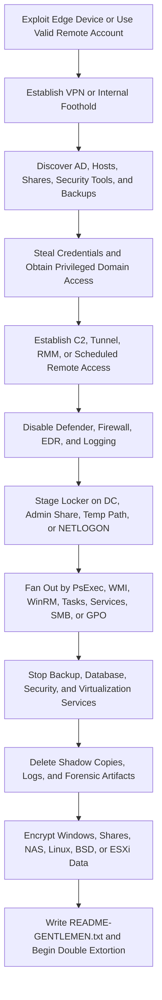

## Executive Summary

The Gentlemen is a financially motivated ransomware-as-a-service (RaaS) operation that emerged in mid-2025. Microsoft tracks the RaaS operators as Storm-2697. The operators provide affiliates with Windows, Linux, network-attached storage (NAS), BSD, and ESXi lockers, while affiliates conduct intrusions with varying access methods and post-exploitation tools.

Group-IB assesses that the operation developed from ArmCorp, formerly an active Qilin affiliate cluster led under the alias `hastalamuerte`. A Gentlemen Windows sample uploaded on July 17, 2025 contained the operation's data leak site address five days before `hastalamuerte` publicly disputed a Qilin payment. This chronology supports a planned breakaway. It does not establish that Gentlemen and Qilin are the same malware family or that their operators are coextensive.

The Windows locker is written in Go, obfuscated with Garble, and requires a build-specific `--password` argument. Its most distinctive capability is optional self-propagation: it discovers domain systems and attempts up to 21 remote operations per target through PsExec, WMI, WinRM, scheduled tasks, services, SMB shares, and PowerShell. A separate `--gpo` mode can weaponize Group Policy and `NETLOGON` for domain-wide deployment after a domain controller is compromised.

The most durable hunting pattern is edge-device or valid-account access followed by privileged domain control, credential theft, security control impairment, administrative fan-out, centralized locker deployment, recovery inhibition, and coordinated encryption. Exact hashes, extensions, filenames, and command-and-control (C2) addresses are volatile and often affiliate-specific.

> [!IMPORTANT]
> Treat The Gentlemen as a RaaS ecosystem, not a single fixed intrusion chain. SystemBC, Cobalt Strike, AnyDesk, Rclone, individual C2 addresses, and FortiGate exploitation were observed in specific affiliate activity and are not required characteristics of every Gentlemen attack.

## Scope and Method

This report prioritizes Microsoft's May 2026 locker analysis, Group-IB's March 2026 actor and intrusion research, Check Point Research incident response and malware analysis, and Huntress investigations published in May 2026. Trend Micro and Cybereason reporting provides earlier campaign context.

User-provided text, public telemetry, malware samples, underground material, and published indicators are treated as untrusted until corroborated. Leak-site victim counts are actor claims or collection estimates, not independently verified incident totals. Underground chat evidence can establish actor intent or discussion but does not prove that a technique was executed in a victim environment.

## Naming and Lineage Assessment

| Name | Scope | Assessment |
|---|---|---|
| The Gentlemen | RaaS brand, locker family, and data leak operation | Distinct operation active since mid-2025 |
| Storm-2697 | Microsoft actor designation | Operators who manage the Gentlemen RaaS platform |
| ArmCorp | Group-IB historical cluster name | Former Qilin affiliate activity assessed to have preceded Gentlemen |
| `hastalamuerte` | Underground alias | Assessed by Group-IB as the operation's leader; Check Point links the alias with `zeta88` at high confidence |
| `zeta88` | Underground and internal account | Assessed by Check Point as the RaaS administrator, infrastructure operator, builder developer, and an active intrusion participant |
| Qilin | Separate RaaS operation | Historical affiliate relationship; not proof of shared malware or current operational identity |

The strongest public linkage is between the ArmCorp affiliate cluster, `hastalamuerte`, `zeta88`, and Gentlemen administration. Real-world identity, nationality, complete membership, and the precise relationship among all affiliates remain unverified.

## Campaign Timeline and Victimology

| Date | Evidence-Backed Development |
|---|---|
| July 17, 2025 | Earliest known Windows sample is uploaded to VirusTotal with the Gentlemen data leak site address embedded |
| July 22, 2025 | `hastalamuerte` opens a Qilin payment-dispute thread and states that a separate locker was already being developed |
| Early September 2025 | The Gentlemen data leak site becomes publicly known |
| September 2025 | Operators begin publicly recruiting affiliates; Check Point reports a 90 percent affiliate revenue share |
| September 10, 2025 | Group-IB reports release of an ESXi-specific locker |
| September 21, 2025 | Group-IB reports timer and aggressive WMI-based spread capabilities in the Windows locker |
| November 2025 | Cybereason publishes technical analysis linking a locker string to a forum post by `hastalamuerte` |
| April 2026 | Check Point publishes an affiliate intrusion involving SystemBC, Cobalt Strike, domain-controller staging, built-in spread, and GPO deployment |
| May 4, 2026 | The RaaS administrator acknowledges a leak of the operation's internal Rocket backend |
| May 2026 | Huntress reports two incidents involving scheduled tasks, log clearing, Defender impairment, `NETLOGON` deployment, and scheduled SOCKS access |
| May 28, 2026 | Microsoft publishes detailed analysis and identifies the operators as Storm-2697 |

Microsoft observed affected organizations in education, transportation, healthcare, and financial services across North America, South America, Europe, Africa, and Asia. Group-IB and Check Point report broad cross-sector activity and high leak-site volume, but published victim totals vary by collection date and methodology. They should be treated as lower-bound claims rather than confirmed compromises.

## Threat Actor Profile

| Attribute | Assessment |
|---|---|
| Motivation | Financial extortion with high confidence |
| Operating model | Closed operation at launch, followed by affiliate recruitment from September 2025 |
| Core organization | Small operator group that develops lockers, maintains infrastructure and the RaaS panel, recruits affiliates, and supports negotiations |
| Affiliate model | Affiliates conduct access, privilege escalation, exfiltration, and deployment with shared or independently selected tools |
| Initial access | Exploited edge appliances, brute-forced or stolen VPN credentials, valid accounts, and purchased access; exact distribution is unknown |
| Target selection | Revenue, regulatory exposure, criticality, accessible edge infrastructure, and privileged directory integration influence selection |
| Extortion model | Data theft, encryption, leak-site publication, direct negotiation over Tox, and pressure based on regulatory and reputational harm |
| Locker portfolio | Go-based Windows, Linux, NAS, and BSD lockers plus a C-based ESXi locker |
| Publicly sourced aliases | Storm-2697, The Gentlemen, ArmCorp, `hastalamuerte`, and `zeta88` |
| Attribution confidence | High for the RaaS and malware family; moderate for alias relationships; low for real-world identities and complete membership |

Check Point identified eight unique affiliate Tox IDs in 29 public sample campaigns and found the assessed administrator's Tox ID in four infections. This supports the assessment that the administrator also conducts hands-on intrusions, but the sample set does not measure the full affiliate population.

## Infection and Attack Flow

### Stage 1: Initial Access

Reported access paths include exploitation of internet-facing FortiGate devices through CVE-2024-55591, brute-force activity against FortiGate VPN accounts, compromised remote-access credentials, and access broker supply. Group-IB observed backdoor firewall accounts and configuration theft after FortiGate compromise. Check Point's detailed affiliate incident could not conclusively identify its initial access vector and began with domain-admin control of a domain controller.

Internal chats show interest in Cisco, SonicWall, Oracle E-Business Suite, NTLM relay, and other vulnerabilities. Discussion or proof-of-concept evaluation is not evidence of successful operational exploitation.

### Stage 2: Domain Control and Discovery

Affiliates enumerate domain computers, privileged groups, trusts, sessions, shares, security products, and backup infrastructure. Observed commands include `systeminfo`, `whoami`, `query session`, `nltest /domain_trusts`, `nltest /dclist`, `net group "Domain Admins" /domain`, `Get-ADComputer`, `gpresult /r`, and `wmic product` queries for security software.

The locker itself enumerates local volumes, cluster shared volumes, mapped drives, and UNC shares. It can enable network-discovery services and firewall rules before dynamically using `mpr.dll` functions to enumerate network resources.

### Stage 3: Credential Access and Privileged Persistence

Incident evidence includes Mimikatz-derived domain and Credential Manager material. Group-IB reports affiliate use of NetExec, Impacket DPAPI tooling, browser credential extraction, Veeam credential recovery, NTLM coercion and relay, and creation of privileged domain accounts. These actions can provide the credentials supplied to the locker's `--spread` mode or support manual lateral movement.

The Windows locker creates `UpdateSystem` and `UpdateUser` scheduled tasks and `GupdateS` or `GupdateU` Run values. Affiliate persistence has also included RDP enablement, remote-access software, tunnels, and scheduled SOCKS tooling.

### Stage 4: Command and Control and Defense Evasion

Affiliate-specific C2 has included SystemBC, Cobalt Strike, AnyDesk, scheduled SOCKS proxies, and tunneling tools. The locker can disable Defender real-time monitoring, add process and broad path exclusions, disable all firewall profiles, stop and disable `mpssvc`, enable SMB1, and weaken anonymous-share restrictions.

Group-IB reports confirmed bring-your-own-vulnerable-driver activity involving signed vulnerable drivers used to terminate security processes. The locker also clears Security, System, and Application logs and removes Prefetch, Defender support, RDP, PowerShell history, and Recycle Bin artifacts.

### Stage 5: Collection and Exfiltration

The operation uses double extortion. Group-IB reports Rclone as the primary exfiltration utility, including a renamed `avastrclone.exe`, with WinSCP and MEGA discussed or observed in related activity. One shared Rclone configuration referenced SFTP infrastructure, but operational use of that specific endpoint was not proven.

Archive creation and transfer details vary by affiliate. A ransom-note claim of exfiltration is not sufficient proof that a transfer occurred in a specific incident.

### Stage 6: Centralized Deployment and Propagation

The `--spread` argument accepts explicit `domain/user:password` credentials or reuses the current token. The locker enumerates domain computers, checks reachability, stages itself in `C:\Temp`, creates a hidden `share$`, copies itself to remote `C$` paths, and attempts execution through PsExec, WMI, WinRM, scheduled tasks, services, and PowerShell. Microsoft counted 21 remote operations per target.

The `--gpo` mode is intended for a compromised domain controller. It copies the locker into `NETLOGON`, modifies Group Policy scheduled-task content, and forces policy refresh for coordinated domain-wide execution. Check Point and Huntress observed GPO or `NETLOGON`-based deployment in incidents.

### Stage 7: Recovery Inhibition and Encryption

The locker stops or disables backup, database, virtualization, security, remote-access, productivity, and application services and processes. It deletes shadow copies through `vssadmin` and WMI, can overwrite free space through `wipefile.tmp`, and self-deletes unless `--keep` is specified.

On Windows, files up to 1 MB are fully encrypted. Larger files are partially encrypted in distributed chunks, with the amount controlled by `--fast`, `--superfast`, or `--ultrafast`. Microsoft describes Curve25519-derived per-file material with XChaCha20. Check Point describes a different use of the derived public and shared-secret values. This discrepancy may reflect sample variance or different reverse-engineering interpretations and should not be generalized without sample-level validation.

Observed encrypted extensions include `.7mtzhh`, `.umc16h`, and `.fjn1jw`. The extension is build-specific. The locker writes `README-GENTLEMEN.txt`, may set `%TEMP%\gentlemen.bmp` as wallpaper, and appends `--eph--`, `--marker--`, and `GENTLEMEN` markers to encrypted files.

## Commonly Observed Tools and Commands

| Function | Observed Examples |
|---|---|
| Edge access | CVE-2024-55591 exploitation, FortiGate VPN brute force, valid VPN credentials |
| Discovery | NetExec, `Get-ADComputer`, `systeminfo`, `whoami`, `nltest`, `query session`, `gpresult`, SoftPerfect Network Scanner |
| Credential access | Mimikatz, Impacket, NetExec modules, DonPAPI, Veeam database access, `ChromeKB3.exe` |
| Remote execution | PsExec, WMI, WinRM, `Invoke-Command`, remote scheduled tasks, remote services, RPC, SMB administrative shares |
| Command and control | Cobalt Strike, SystemBC, AnyDesk, SOCKS proxy payloads, Cloudflare tunnels, Chisel |
| Defense impairment | `Set-MpPreference`, `Add-MpPreference`, firewall disablement, SMB1 enablement, BYOVD, EDR-killing packages |
| Anti-forensics | `wevtutil cl`, Prefetch deletion, Defender support-log deletion, RDP-log deletion, PowerShell history deletion |
| Exfiltration | Rclone, renamed `avastrclone.exe`, WinSCP, SFTP, MEGA references |
| Central deployment | GPO, `NETLOGON`, `gpupdate /force`, Configuration Manager client, `--spread`, `--gpo` |
| Impact | `taskkill`, `sc stop`, `sc config`, `vssadmin delete shadows /all /quiet`, `wmic shadowcopy delete` |

Tools are legitimate or shared across many threat actors. Attribution requires surrounding behavior, timing, identity, and infrastructure context.

## MITRE ATT&CK Map for Hunting

| Technique | ID | Confidence | Evidence Pattern to Hunt |
|---|---|---|---|
| Exploit Public-Facing Application | T1190 | High | FortiGate CVE-2024-55591 activity followed by new administrative access or VPN sessions |
| Valid Accounts | T1078 | High | Compromised VPN or domain account used for privileged access and remote execution |
| Password Guessing | T1110.001 | High | Repeated FortiGate VPN failures followed by success from the same source or account |
| PowerShell | T1059.001 | High | Defender impairment, downloads, GPO operations, WinRM, or propagation scripts |
| Windows Command Shell | T1059.003 | High | Discovery, service control, log deletion, share creation, or deployment commands |
| Windows Management Instrumentation | T1047 | High | Remote `Win32_Process` creation for defense impairment or locker execution |
| Scheduled Task | T1053.005 | High | Local or remote tasks such as `UpdateSystem`, `DefS`, `UpdateGS`, or recurring SOCKS execution |
| Registry Run Keys / Startup Folder | T1060 | High | `GupdateS` or `GupdateU` values that launch a rare executable |
| Windows Service | T1543.003 | High | `DefSvc`, `UpdateSvc`, or `UpdateSvc2` creation on remote hosts |
| Group Policy Modification | T1484.001 | High | GPO scheduled-task change followed by `NETLOGON` file fan-out and policy refresh |
| Impair Defenses | T1562.001 | High | Defender disablement, broad exclusions, EDR termination, or vulnerable-driver activity |
| Disable or Modify System Firewall | T1562.004 | High | All firewall profiles disabled or `mpssvc` stopped and disabled |
| Clear Windows Event Logs | T1070.001 | High | Security, System, and Application logs cleared in close succession |
| File Deletion | T1070.004 | High | Prefetch, Defender, RDP, history, payload, or batch-script deletion |
| OS Credential Dumping | T1003 | High | Mimikatz or related access to LSASS, LSA, DPAPI, or stored credentials |
| Remote System Discovery | T1018 | High | AD computer enumeration and reachability checks before remote fan-out |
| Network Share Discovery | T1135 | High | Mapped drive and UNC enumeration followed by share access or encryption |
| SMB/Windows Admin Shares | T1021.002 | High | Payload transfer through `ADMIN$`, `C$`, `NETLOGON`, or attacker-created `share$` |
| Windows Remote Management | T1021.006 | High | `Invoke-Command` used to change defenses or launch a rare binary remotely |
| Service Execution | T1569.002 | High | PsExec-style or `sc.exe` remote service creation and process launch |
| Lateral Tool Transfer | T1570 | High | Same rare hash copied from a privileged source to many endpoint temp paths |
| Multi-hop Proxy | T1090.003 | High | SystemBC or scheduled SOCKS process with recurring external communication |
| Exfiltration to Cloud Storage | T1567.002 | Medium | Rclone-like transfer after discovery or archive activity; channel varies by affiliate |
| Service Stop | T1489 | High | Burst of stops targeting backup, database, virtualization, and security services |
| Inhibit System Recovery | T1490 | High | Shadow-copy deletion, free-space wiping, and backup disruption |
| Data Encrypted for Impact | T1486 | High | High-rate file modification, Gentlemen footer markers, extension fan-out, or ransom notes |

## Durable Indicators of Attack

| Attack Phase | Durable Behavioral Indicator | Hunting Value |
|---|---|---|
| Initial access | Edge-device exploit or abnormal VPN authentication followed by privileged internal access | High-value early signal when edge and identity telemetry are available |
| Domain control | Domain controller becomes the source of credential validation, admin-share writes, or remote execution | Strong indication of centralized operator control |
| Credential access | LSASS, DPAPI, browser, Veeam, or domain credential access followed by authenticated fan-out | Links credential theft to impending expansion |
| Defense evasion | Defender disablement or broad `C:\` exclusion followed by firewall changes, EDR termination, or driver load | Critical pre-impact correlation |
| Propagation | One source attempts several remote execution methods against many domain devices | Distinctive behavior of the `--spread` capability |
| Central deployment | Rare binary appears in `NETLOGON` or GPO content and then executes across many devices | Critical domain-wide deployment signal |
| Command and control | Rare process in a temp path creates recurring SOCKS, proxy, RMM, or tunnel traffic | More durable than one C2 address |
| Exfiltration | Archive or high-value share access followed by Rclone-like or SFTP transfer | Supports double-extortion detection |
| Impact | Multi-category service stops and shadow-copy deletion precede mass file changes and ransom-note creation | High-confidence but late-stage signal |
| ESXi impact | Hidden VMware-like binary, boot persistence, VM shutdown, snapshot removal, and datastore write activity | High-value virtualization-host pattern |

## Volatile Indicators of Compromise

Indicators in this section are historical enrichment. Confirm them against current intelligence and local context before blocking. Legitimate tools, shared infrastructure, and recycled addresses must not be treated as independent attribution proof.

### Network Indicators

| Type | Indicator | Context | Observation | Source |
|---|---|---|---|---|
| IP address | `193.233.202.17` | Scheduled SOCKS C2 on port `44729` | May 2026 affiliate incident | Huntress |
| IP address | `77.110.122.137` | Scheduled SOCKS C2 on port `37182` | May 2026 affiliate incident | Huntress |
| IP address | `45.86.230.112` | SystemBC C2; deployment was blocked | 2026 affiliate incident | Check Point Research |
| IP address | `91.107.247.163` | Cobalt Strike C2 over ports 443 and 80 | 2026 affiliate incident | Check Point Research |
| IP address | `194.87.31.69` | SFTP endpoint in an actor-shared Rclone configuration on port `2222`; operational use not proven | March 2026 reporting | Group-IB |

The SystemBC server's broader botnet population must not be counted as Gentlemen victims. The server and associated addresses may support unrelated activity.

### File Indicators

| SHA-256 | Filename or Context | Observation | Source |
|---|---|---|---|
| `22b38dad7da097ea03aa28d0614164cd25fafeb1383dbc15047e34c8050f6f67` | Microsoft-analyzed Gentlemen Windows encryptor | Published May 2026 | Microsoft and Check Point Research |
| `f918535f974591ef031bd0f30a8171e3da27a6754e6426a8ba095f83195661c8` | `G_hlm7jj_windows_amd64.exe` encryptor | May 2026 incident | Huntress |
| `51b9f246d6da85631131fcd1fabf0a67937d4bdde33625a44f7ee6a3a7baebd2` | Earliest known Windows sample | Uploaded July 17, 2025 | Group-IB |
| `3ab9575225e00a83a4ac2b534da5a710bdcf6eb72884944c437b5fbe5c5c9235` | Windows sample linked to `hastalamuerte` research | November 2025 reporting | Cybereason and Group-IB |
| `5dc607c8990841139768884b1b43e1403496d5a458788a1937be139594f01dca` | Linux or ESXi-family sample | Published April 2026 | Check Point Research |
| `992c951f4af57ca7cd8396f5ed69c2199fd6fd4ae5e93726da3e198e78bec0a5` | SystemBC from one affiliate incident | Published April 2026 | Check Point Research |
| `2834114ff7e487c4ca3f50ca39f7d652dea1be98f885c388f01b6ff35309307b` | `ChromeKB3.exe` credential extraction tool | Published March 2026 | Group-IB |
| `078163d5c16f64caa5a14784323fd51451b8c831c73396b967b4e35e6879937b` | Embedded PsExec; legitimate dual-use binary | Published May 2026 | Microsoft |
| `fe1033335a045c696c900d435119d210361966e2fb5cd1ba3382608cfa2c8e68` | Embedded `gentlemen.bmp` wallpaper | Published May 2026 | Microsoft |

### File and Host Artifacts

| Artifact | Context and Caveat |
|---|---|
| `README-GENTLEMEN.txt` | Consistent Windows and ESXi ransom-note name |
| `.7mtzhh`, `.umc16h`, `.fjn1jw` | Build-specific encrypted extensions; not universal family identifiers |
| `--eph--`, `--marker--`, `GENTLEMEN` | Encrypted-file footer markers with stronger family specificity than an extension alone |
| `%TEMP%\gentlemen.bmp` | Optional Windows wallpaper when `--silent` is not used |
| `C:\Windows\Temp\svchost32.exe` | Scheduled SOCKS payload from one Huntress incident |
| `/bin/.vmware-authd` | ESXi locker persistence path masquerading as a VMware daemon |
| `wipefile.tmp` | Optional free-space wiping artifact |
| `UpdateSystem`, `UpdateUser`, `gentlemen_system` | Local execution or persistence task names |
| `DefU`, `DefS`, `UpdateGU`, `UpdateGU2`, `UpdateGS`, `UpdateGS2` | Remote task names used by spread logic |
| `WindowsConnSvc` | Recurring SOCKS task in one affiliate incident |
| `DefSvc`, `UpdateSvc`, `UpdateSvc2` | Remote service names used by spread logic |
| `GupdateS`, `GupdateU` | System and user Run-value names |
| `Ransom:Win64/Gentlemen.SH!MTB` | Defender detection observed by Huntress |
| `Trojan:Win32/MpTamperBulkExcl.H` | Defender detection for antivirus-exclusion tampering |

## Observable Signals by Attack Phase

| Phase | Observable Signals | Defender XDR and Sentinel Sources |
|---|---|---|
| Edge access | FortiGate exploit evidence, VPN failure burst followed by success, new firewall administrator, or configuration export | Fortinet logs, `CommonSecurityLog`, identity and VPN logs |
| Domain control | Privileged logon to a domain controller followed by remote credential validation or administrative fan-out | `DeviceLogonEvents`, `IdentityLogonEvents`, `SecurityEvent`, `WindowsEvent` |
| Discovery | AD, trust, session, share, backup, or security-product enumeration | `DeviceProcessEvents`, `DeviceNetworkEvents`, `SecurityEvent`, `WindowsEvent` |
| Credential access | LSASS or DPAPI access, browser-secret extraction, Veeam database queries, or NTLM coercion and relay | `DeviceProcessEvents`, `DeviceEvents`, `DeviceFileEvents`, identity and network telemetry |
| Persistence and C2 | New task, service, Run value, RMM tool, SOCKS process, or tunnel from an unusual path | `DeviceProcessEvents`, `DeviceRegistryEvents`, `DeviceNetworkEvents`, `DeviceEvents`, task and service logs |
| Defense evasion | Defender disablement, broad exclusions, firewall disablement, SMB1 enablement, vulnerable-driver load, or log clearing | `DeviceProcessEvents`, `DeviceRegistryEvents`, `DeviceEvents`, `SecurityEvent`, Defender operational logs |
| Exfiltration | Rclone or renamed synchronization utility after discovery, archive, or high-value share access | `DeviceProcessEvents`, `DeviceFileEvents`, `DeviceNetworkEvents`, proxy, DNS, firewall, and cloud logs |
| Deployment | Same rare hash written through `ADMIN$`, `C$`, `NETLOGON`, GPO, or an internal HTTP server to many devices | `DeviceFileEvents`, `DeviceProcessEvents`, `DeviceNetworkEvents`, GPO and SMB auditing |
| Impact | Multi-category service stops, shadow-copy deletion, mass file changes, footer markers, extensions, or ransom notes | `DeviceProcessEvents`, `DeviceFileEvents`, `DeviceEvents`, `SecurityAlert` |
| ESXi impact | `.vmware-authd` creation, `rc.local` or cron change, VM shutdown, snapshot removal, and datastore activity | ESXi shell, syslog, vCenter, EDR for Linux, and network telemetry |

## Priority Hunting Hypotheses

| ID | Hypothesis | Correlation Logic | Candidate Predicates and Telemetry | Priority | False Positives and Data Gaps |
|---|---|---|---|---|---|
| H1 | Compromised edge access leads to privileged Windows control | FortiGate exploit or abnormal VPN authentication is followed within 24 hours by a privileged domain or domain-controller logon | CVE-2024-55591 evidence, VPN failure-to-success sequence, unusual source, new firewall admin, `DeviceLogonEvents`, `IdentityLogonEvents`, `SecurityEvent` | Critical | Edge logs may be unavailable; suppress approved VPN changes and known administrators |
| H2 | A compromised domain controller becomes a centralized deployment source | A domain controller writes or serves the same rare binary to multiple devices through HTTP, `ADMIN$`, `C$`, `NETLOGON`, RPC, or SMB | Source is DC, rare SHA-256, internal port 8080, administrative-share writes, remote process creation, `DeviceFileEvents`, `DeviceNetworkEvents` | Critical | Software deployment and incident-response systems can resemble this pattern; baseline source accounts and signed packages |
| H3 | Defender and network controls are weakened before propagation | Defender disablement or broad exclusion is followed by firewall disablement, SMB1 enablement, anonymous-share changes, or remote execution | `Set-MpPreference`, `Add-MpPreference`, `ExclusionPath C:\`, `Set-NetFirewallProfile`, `mpssvc`, SMB1, LSA registry values | Critical | Security administrators and troubleshooting scripts can trigger single predicates; require phase and identity correlation |
| H4 | One privileged source attempts redundant remote execution across the domain | The same source or account creates tasks, services, WMI processes, WinRM sessions, and PsExec activity on several targets in a short window | Distinct target count, `schtasks /S`, `sc \\`, `wmic /node`, `Invoke-Command`, PsExec, SMB copy, task and service events | Critical | Management platforms generate fan-out; distinguish by package prevalence, signer, path, account, maintenance window, and method diversity |
| H5 | Group Policy or `NETLOGON` distributes a rare locker domain-wide | New executable or scheduled-task XML in domain policy paths is followed by forced policy refresh and near-simultaneous execution | `NETLOGON`, `SYSVOL`, `ScheduledTasks.xml`, `gpupdate /force`, Configuration Manager parent, same hash across devices | Critical | Legitimate GPO and software rollouts; baseline approved GPO editors, deployment hashes, and change tickets |
| H6 | Scheduled SOCKS or remote-access tooling provides durable affiliate access | A rare process in `Windows\Temp` or `ProgramData` is launched by a recurring SYSTEM task and connects to an uncommon external destination | `WindowsConnSvc`, two-minute task interval, `svchost32.exe client`, `R:*:socks`, task events 101/107/203/332, `DeviceNetworkEvents` | High | Approved tunneling and support tooling; validate path, signer, task owner, destination prevalence, and command line |
| H7 | Exfiltration is staged before encryption | High-value share discovery or archive activity is followed by Rclone-like execution and high-volume SFTP or cloud egress | Rclone metadata or renamed binary, `copy` command, config file, WinSCP, SFTP, destination rarity, egress volume | High | Backup, migration, and synchronization jobs require account, destination, path, and schedule baselines |
| H8 | Recovery inhibition and coordinated file impact indicate imminent Gentlemen encryption | Service-stop burst and shadow-copy deletion are followed by mass file modification, Gentlemen footer markers, build-specific extensions, or ransom-note fan-out | `taskkill`, `sc stop`, `vssadmin`, `wmic shadowcopy`, file modification rate, `README-GENTLEMEN.txt`, `--marker--GENTLEMEN` | Critical | Late-stage signal; maintenance can produce isolated actions, but multi-category service and file correlation sharply reduces noise |
| H9 | ESXi hosts are prepared for Gentlemen encryption | A hidden VMware-like binary and boot persistence are followed by VM shutdown, snapshot removal, autostart changes, and datastore writes | `/bin/.vmware-authd`, `/etc/rc.local.d/local.sh`, cron `@reboot`, `vim-cmd`, `esxcli vm process kill`, `vmkfstools` | Critical | Hypervisor administration can include VM shutdown and datastore work; hidden path plus persistence and locker arguments are high-value discriminators |

## Query-Building Blocks

| Building Block | Detection Intent | Candidate Predicates |
|---|---|---|
| Edge-to-domain pivot | Find remote access that transitions into privileged internal control | VPN anomaly, edge configuration change, new source IP, privileged logon, domain-controller access |
| Defender impairment | Detect pre-deployment weakening of endpoint controls | Real-time monitoring disabled, controlled-folder access disabled, broad path or process exclusion |
| Network weakening | Detect preparation for self-propagation | Firewall profiles off, `mpssvc` disabled, SMB1 enabled, anonymous LSA values changed, hidden share created |
| Administrative fan-out | Detect redundant spread behavior | One source or account, many targets, multiple methods, rare binary, temp or admin-share path |
| GPO deployment | Detect domain-wide locker distribution | Rare `NETLOGON` file, GPO XML change, forced policy refresh, SYSTEM execution across many devices |
| Scheduled proxy | Detect recurring remote access from a disguised temp binary | Frequent SYSTEM task, SOCKS command line, rare external IP and port, persistent process |
| Exfiltration | Detect double-extortion staging and transfer | Sensitive-share access, archive burst, Rclone-like process, SFTP or cloud egress anomaly |
| Ransomware impact | Detect recovery inhibition and encryption | Multi-category service stops, shadow deletion, file-rate anomaly, footer marker, ransom-note fan-out |
| ESXi impact | Detect hypervisor-specific persistence and preparation | Hidden daemon path, boot script or cron, VM shutdown, snapshot removal, locker arguments |

Useful correlation entities include `DeviceId`, normalized hostname, `AccountSid`, `InitiatingProcessAccountSid`, source IP address, destination IP address, SHA-256, task name, service name, GPO identifier, and domain-controller role. The strongest early score combines a privileged source, defense impairment, multiple remote execution methods, and rare-file fan-out.

## Detection Engineering Guidance

* Prioritize behavior across attack phases over campaign-specific hashes, extensions, filenames, and C2 addresses
* Treat a domain controller serving or writing the same rare binary to multiple devices as a critical escalation condition
* Correlate Defender exclusions, firewall changes, SMB1 enablement, and anonymous-share registry changes within a short window
* Detect method diversity during fan-out; the locker deliberately attempts multiple remote execution channels even when earlier methods succeed
* Monitor `NETLOGON`, `SYSVOL`, GPO scheduled-task content, and forced policy refresh from unusual accounts
* Preserve Task Scheduler operational logs because Security, System, and Application logs may be cleared while task telemetry remains
* Baseline approved PsExec, WMI, WinRM, RMM, software deployment, Rclone, backup, and hypervisor administration before enabling high-severity detections
* Alert on vulnerable-driver load or security-process termination before relying on encrypted extensions or ransom-note artifacts
* Keep Windows and ESXi hypotheses separate where telemetry and response ownership differ
* Use historical infrastructure for enrichment and scoping, not as independent attribution proof

An example evidence score for prototyping is: edge-to-domain pivot `+2`, credential access `+3`, Defender or EDR impairment `+4`, method-diverse fan-out `+4`, GPO or `NETLOGON` deployment `+5`, exfiltration `+3`, and recovery inhibition or encryption `+5`. This score is a design aid and requires tenant-specific validation.

## Triage and Containment Guidance

| Phase | Recommended Actions |
|---|---|
| Confirm | Establish the initial access path, privileged identities, DC staging, defense changes, remote execution methods, exfiltration, and deployment mechanism |
| Preserve | Capture volatile memory, original lockers, footer-bearing encrypted files, ransom notes, edge and VPN logs, GPO content, task logs, service logs, PowerShell logs, and hypervisor telemetry |
| Scope | Search for the same accounts, hashes, task and service names, source devices, admin-share writes, GPO changes, C2 destinations, RMM tenants, and exfiltration configurations |
| Contain | Isolate affected endpoints and management systems, restrict compromised edge access, disable actor accounts, revoke sessions, and block unauthorized east-west SMB, WMI, WinRM, and RDP |
| Domain response | Treat domain-controller compromise or credential dumping as domain compromise; rotate privileged and service credentials and rebuild trust from known-good systems |
| Security recovery | Enable tamper protection, remove malicious exclusions, restore firewall policy, disable SMB1, restore anonymous-access controls, and block vulnerable drivers |
| Deployment recovery | Quarantine malicious `NETLOGON` or GPO content, preserve a copy for evidence, validate every policy change, and segment software deployment infrastructure |
| Hypervisor recovery | Isolate management interfaces, preserve ESXi logs and hidden binaries, remove boot persistence, rotate vCenter and host credentials, and validate datastore integrity |
| Business recovery | Restore from tested offline or immutable backups only after persistence, access paths, deployment mechanisms, and stolen credentials are removed |

## Research Gaps and Confidence Limits

* Exact initial-access distribution across affiliates is unknown
* Public victim counts are based on leak sites, vendor collections, or actor claims and are not independently verified
* Real-world identities, nationality, complete membership, and the full relationship between ArmCorp, Qilin affiliates, and Gentlemen remain unresolved
* Locker filenames, extensions, passwords, cryptographic implementation details, and features vary by sample and build
* Microsoft's and Check Point's descriptions of key and nonce derivation differ and require sample-level reconciliation
* SystemBC, Cobalt Strike, AnyDesk, SOCKS infrastructure, Rclone, and FortiGate access are affiliate-specific or dual-use
* Actor discussions about exploits, tools, or future capabilities do not prove operational use
* Exfiltration is central to the extortion model, but the transfer channel is not established in every incident
* Appliance, domain file-access, GPO, kernel-driver, and ESXi telemetry may be incomplete or absent
* No tenant telemetry, malware execution, KQL execution, or detection-performance validation was performed

## Source References

* [Microsoft Threat Intelligence: The Gentlemen ransomware - Dissecting a self-propagating Go encryptor](https://www.microsoft.com/en-us/security/blog/2026/05/28/the-gentlemen-ransomware-dissecting-a-self-propagating-go-encryptor/)
* [Group-IB: Hasta la vista, Hastalamuerte - An Overview of The Gentlemen's TTPs](https://www.group-ib.com/blog/hastalamuerte-gentlemen-raas-ttps/)
* [Check Point Research: DFIR Report - The Gentlemen and SystemBC](https://research.checkpoint.com/2026/dfir-report-the-gentlemen/)
* [Check Point Research: Thus Spoke The Gentlemen](https://research.checkpoint.com/2026/thus-spoke-the-gentlemen/)
* [Huntress: The Gentlemen Ransomware in Disguise](https://www.huntress.com/blog/the-gentlemen-ransomware-defense-evasion-ttps)
* [Huntress: Gentlemen IOC Repository](https://github.com/huntresslabs/threat-intel/blob/main/2026/2026-05/20260521_gentlemen.csv)
* [Trend Micro: Unmasking The Gentlemen Ransomware](https://www.trendmicro.com/en_us/research/25/i/unmasking-the-gentlemen-ransomware.html)
* [Cybereason: License to Encrypt - The Gentlemen Make Their Move](https://www.cybereason.com/blog/the-gentlemen-ransomware)
* [FortiGuard: The Gentlemen Ransomware](https://www.fortiguard.com/threat-actor/6387/the-gentlemen-ransomware)
* [NVD: CVE-2024-55591](https://nvd.nist.gov/vuln/detail/CVE-2024-55591)

## Implementation Next Step

Convert hypotheses H1 through H9 into separate, versioned Microsoft Defender XDR and Sentinel hunting queries. Validate each required table and column against the target tenant, then test result quality, false-positive rates, entity normalization, and cross-table time windows before promoting any query to a detection rule.