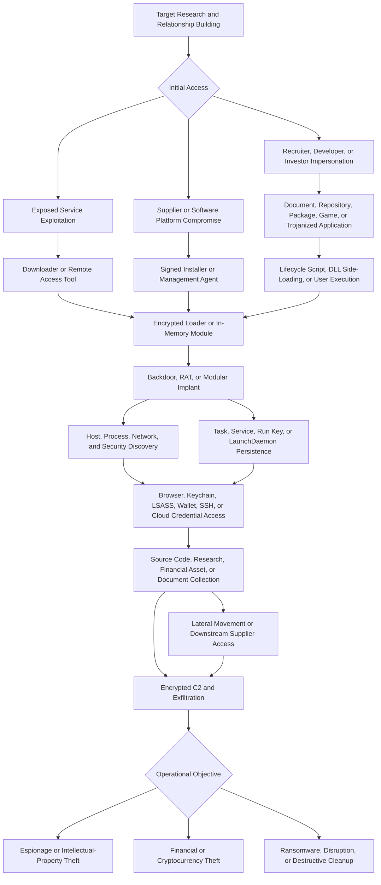

## Executive Summary

Lazarus Group is a long-running North Korean cyber-operations label associated with the Reconnaissance General Bureau (RGB). MITRE ATT&CK tracks Lazarus Group as `G0032`, but public reporting does not describe one stable, monolithic intrusion set. North Korean operators share personnel, infrastructure, malware, and tradecraft, while vendors divide the activity into partially overlapping clusters according to their own evidence and analytic models.

Microsoft's Diamond Sleet is the closest current mapping for much of the conventional Lazarus or ZINC activity. Andariel or Onyx Sleet, BlueNoroff or Sapphire Sleet, Kimsuky or Emerald Sleet, TraderTraitor or Jade Sleet, Citrine Sleet, Moonstone Sleet, and Coral Sleet remain separately tracked clusters or campaign constructs. Their organizational relationships may overlap, but one cluster's behavior should not automatically be assigned to another.

The broader program combines strategic espionage, intellectual-property theft, financial and cryptocurrency theft, software-supply-chain compromise, ransomware, disruption, and destructive operations. Targets include defense, aerospace, telecommunications, government, nuclear research, media, healthcare, software suppliers, security researchers, banks, fintech organizations, cryptocurrency businesses, blockchain developers, and digital-asset custodians.

The most durable hunting pattern is tailored reconnaissance followed by trusted-person or recruiter impersonation, malicious code or trojanized software execution, staged payload loading, persistence, host and credential discovery, access to source code or financial assets, and encrypted command and control. Supply-chain operations extend this flow through build systems, software-management platforms, or signed installers to selected downstream victims.

> [!IMPORTANT]
> Treat Lazarus as an umbrella attribution label. A job lure, cryptocurrency target, malware family, shared infrastructure artifact, or vendor alias does not independently prove a specific North Korean operator. Record attribution at the highest level supported by the complete evidence chain.

## Scope and Method

This report prioritizes MITRE ATT&CK, FBI and CISA advisories, Microsoft Threat Intelligence, Mandiant, GitHub Security, and Cisco Talos. It focuses on behavior that can support hunting in Microsoft Defender XDR and Microsoft Sentinel. Research was current through September 8, 2026; the latest campaign-specific event substantiated by the reviewed primary sources is the February 2025 Bybit theft.

User-provided text, public telemetry, published schemas, and indicators are treated as untrusted until corroborated. Indicators are historical investigation pivots rather than permanent block entries. No query execution, optimization gain, or detection coverage is claimed. Table and column availability must be validated in the target tenant before implementation.

The report separates program-level DPRK attribution from campaign- and cluster-level attribution. It does not use broad labels such as HIDDEN COBRA, Operation Dream Job, Contagious Interview, or LABYRINTH CHOLLIMA as proof that all associated activity belongs to one operator.

## Actor and Cluster Profile

| Attribute | Assessment |
|---|---|
| Assessed sponsor | North Korean state activity associated with the RGB at the program level |
| Operating model | Multiple clusters with shared resources, fluid boundaries, and campaign-specific tasking |
| Primary objectives | Strategic espionage, intellectual-property theft, financial theft, cryptocurrency theft, persistent access, disruption, and destructive effects |
| Strategic targeting | Defense, aerospace, government, nuclear research, telecommunications, media, healthcare, and security research |
| Financial targeting | Banks, fintech, cryptocurrency exchanges, blockchain projects, developers, executives, and asset custodians |
| Common access model | Tailored social engineering, malicious repositories and packages, trojanized applications, supply-chain compromise, and exploitation of exposed services |
| Common execution model | User-executed code, package lifecycle scripts, DLL side-loading, encrypted loaders, shellcode, and in-memory modules |
| Common infrastructure | Actor-controlled domains and servers, compromised infrastructure, code repositories, package registries, and legitimate cloud or collaboration services |
| Attribution confidence | High for DPRK program-level attribution in cited operations; variable for exact unit or cross-vendor cluster equivalence |

### Cluster Boundary Guide

| Cluster or Label | Defensible Interpretation |
|---|---|
| Lazarus Group `G0032` | Historical ATT&CK umbrella for broad RGB-linked activity; useful for context but too broad for precise campaign attribution |
| Diamond Sleet | Microsoft's closest current mapping for Lazarus, ZINC, and Labyrinth Chollima activity targeting media, defense, IT, and other sectors |
| Andariel or Onyx Sleet | Separately tracked RGB cluster focused on military, nuclear, aerospace, government, and technical research; also associated with some ransomware and financial activity |
| BlueNoroff or Sapphire Sleet | Financially focused activity overlapping APT38 and cryptocurrency operations; historic APT38 campaigns also targeted SWIFT environments |
| Kimsuky or Emerald Sleet | Separate espionage cluster targeting governments, academics, think tanks, and Korean-peninsula policy interests |
| TraderTraitor or Jade Sleet | Blockchain-focused social engineering and supply-chain activity; Mandiant assesses UNC4899 as likely corresponding to TraderTraitor |
| AppleJeus or Citrine Sleet | Overlapping analytic constructs associated with trojanized cryptocurrency applications and later exploit activity; not a guaranteed one-to-one mapping with UNC4736 |
| Moonstone Sleet | Distinct Microsoft cluster that moved from Diamond Sleet code and methods to separate infrastructure and concurrent operations |
| Contagious Interview | Employment and coding-test campaign label used across reporting; not a dependable Lazarus alias |
| Operation Dream Job | Job-lure campaign and tradecraft family; later use of similar lures by several DPRK clusters prevents actor identification from theme alone |

## Campaign Timeline and Targeting

| Date | Evidence-Backed Development |
|---|---|
| 2009 onward | Public reporting documents sustained North Korean cyber operations spanning espionage, financial theft, and destructive activity |
| November 2014 | The destructive intrusion against Sony Pictures combines data theft, public disclosure, and destructive impact |
| February 2016 | The Bangladesh Bank operation attempts fraudulent SWIFT transfers and becomes a defining APT38-linked financial campaign |
| May 2017 | The WannaCry outbreak uses ransomware-like impact at global scale; US and allied governments attribute it to North Korea |
| 2018 onward | AppleJeus reporting documents trojanized cryptocurrency applications used against digital-asset targets |
| 2019 to 2020 | Operation Dream Job uses employment lures and malicious files against defense and aerospace targets |
| 2022 | TraderTraitor targets blockchain organizations; ZINC weaponizes PuTTY, KiTTY, and other legitimate tools; MagicRAT appears in exploitation-led intrusions |
| March to April 2023 | A trojanized X_TRADER application compromises a software supplier and contributes to the downstream 3CX supply-chain incident |
| June to July 2023 | UNC4899 compromises JumpCloud and uses its command framework to reach selected downstream macOS systems; Jade Sleet uses malicious repositories and npm packages |
| August to November 2023 | QuiteRAT follows exploitation of exposed services; Diamond Sleet compromises a CyberLink installer and distributes the LambLoad downloader |
| 2024 | Moonstone Sleet uses trojanized PuTTY, npm packages, the DeTankWar game, fake companies, and FakePenny ransomware; Citrine Sleet exploits Chromium vulnerability CVE-2024-7971 |
| February 2025 | The FBI attributes the approximately $1.5 billion Bybit theft to TraderTraitor activity |
| 2026 research cutoff | Taxonomy and ATT&CK records continue to evolve, but reviewed sources do not substantiate a new 2026 Lazarus-specific campaign |

Campaigns consistently use role-aware targeting. Operators research developers, executives, security teams, researchers, and finance personnel before approaching them through email, LinkedIn, messaging platforms, code-hosting sites, or fake companies. Long rapport-building and movement between communication platforms are recurring precursors to malicious code delivery.

## Infection and Attack Flow

### Stage 1: Reconnaissance and Initial Access

Operators identify people with privileged access to source code, build systems, financial workflows, security tooling, or digital assets. Social approaches impersonate recruiters, developers, investors, prospective employers, or known contacts. Delivery includes coding tests, repository invitations, malicious npm packages, archives, weaponized documents, games, cryptocurrency applications, and modified legitimate software.

Other operations exploit public-facing applications or compromise suppliers. Reported examples include VMware Horizon and ManageEngine ServiceDesk exploitation, the X_TRADER-to-3CX cascade, JumpCloud downstream execution, and the compromised CyberLink installer. Exploitation and supply-chain compromise are campaign-specific, not universal Lazarus behavior.

### Stage 2: Execution and Payload Staging

Victims execute a functional but trojanized application, open a malicious file, install a package, or run a supplied project. Package lifecycle scripts or development tools can spawn shells and downloaders. Windows chains frequently use DLL search-order hijacking with familiar signed executables. Other loaders decrypt shellcode, recover command-and-control data from image or data files, or gate execution by IP address, password, host properties, security software, or campaign-specific input.

Rapid deletion of payloads and temporary artifacts can follow execution. Signed-file abuse or a legitimate filename does not establish legitimacy when the file originates from an unexpected path or loads an unsigned, low-prevalence module.

### Stage 3: Persistence and Command and Control

Observed persistence includes scheduled tasks, Windows services, Registry Run keys, startup shortcuts, LaunchAgents, and LaunchDaemons. Supply-chain operations can also retain access through software-management or build infrastructure.

Backdoors use HTTP or HTTPS, encrypted custom protocols, proxy and tunneling functions, and actor-controlled or compromised infrastructure. Low-prevalence outbound traffic from nonbrowser processes, especially shortly after side-loading or package execution, is more useful than a cloud or hosting hostname alone.

### Stage 4: Discovery and Credential Access

Implants enumerate the host, user, processes, network configuration, files, and defensive products. Credential objectives vary by campaign and include browser passwords and cookies, macOS keychains, LSASS memory, SSH keys, personal access tokens, package-registry credentials, cloud credentials, wallet material, and active sessions.

Developer, CI/CD, SaaS, and source-control identities are particularly valuable because they can expose code, secrets, package-publication rights, and downstream customers. Personal messaging and code-hosting accounts can remain outside enterprise visibility.

### Stage 5: Collection, Theft, and Impact

Strategic operations collect defense, aerospace, nuclear, technical, source-code, and government information. Financial operations manipulate payment or digital-asset workflows, compromise wallets or signing processes, and launder stolen cryptocurrency. Some campaigns use ransomware or destructive tooling for revenue, disruption, retaliation, or evidence removal.

Attribution should follow the sequence of behavior, campaign evidence, likely cluster, and broader DPRK program. Financial theft, ransomware, and destructive techniques should be mapped only when the investigated campaign demonstrates them.

## Commonly Observed Tools and Capabilities

| Tool or Capability | Role and Observed Use |
|---|---|
| BLINDINGCAN or ZetaNile | Remote access and command execution associated with DPRK operations |
| TigerRAT | Modular remote access, discovery, file transfer, command execution, and surveillance |
| MagicRAT | Qt-based remote-access implant observed after public-facing service exploitation |
| QuiteRAT | Smaller Qt-based implant used for command execution and follow-on access |
| LambLoad | Environment-gated downloader distributed through a modified CyberLink installer |
| SUDDENICON | Downloader that recovers command-and-control information from icon files in the 3CX chain |
| ICONICSTEALER | Information stealer used to collect browser-related data in the 3CX chain |
| VEILEDSIGNAL | Modular backdoor associated with the X_TRADER compromise and follow-on 3CX investigation |
| TAXHAUL and COLDCAT | Loader and persistence components documented in supply-chain investigations |
| POOLRAT | macOS backdoor associated with the 3CX investigation |
| STRATOFEAR and TIEDYE | Modular macOS backdoors documented in UNC4899-related activity |
| FULLHOUSE.DOORED | Backdoor family with command, file-transfer, proxy, and tunneling functions |
| SplitLoader and YouieLoad | Staging and payload-delivery components associated with Moonstone Sleet activity |
| Kaolin RAT and FudModule | User-mode implant and kernel-tampering rootkit chain used to impair security visibility |
| FakePenny | Ransomware deployed by Moonstone Sleet in selected intrusions |
| Trojanized developer tools | Modified PuTTY, KiTTY, repositories, npm packages, games, and cryptocurrency applications |
| Living-off-the-land utilities | Shells, PowerShell, Python, JavaScript, service utilities, task scheduling, archivers, and download tools |

The presence of a listed tool is supporting evidence, not proof of operator identity. Several tools and techniques may be shared, copied, or reassigned among North Korean clusters.

## MITRE ATT&CK Map for Hunting

| Technique | ID | Confidence | Evidence Pattern to Hunt |
|---|---|---|---|
| Gather Victim Identity Information | T1589 | High | Research into developers, executives, researchers, security personnel, and financial staff before contact |
| Impersonation | T1656 | High | Fake recruiters, developers, investors, companies, and compromised social accounts |
| Spearphishing Link | T1566.002 | High | Tailored links deliver repositories, archives, applications, or credential lures |
| Spearphishing via Service | T1566.003 | High | LinkedIn, messaging, collaboration, and code-hosting services support delivery |
| User Execution: Malicious File | T1204.002 | High | Victim runs a trojanized application, project, package, game, installer, or document |
| Exploit Public-Facing Application | T1190 | Campaign-specific | Exploitation of exposed VMware Horizon or ManageEngine services precedes payload delivery |
| Compromise Software Supply Chain | T1195.002 | High | X_TRADER and 3CX, JumpCloud, and CyberLink operations reach downstream targets |
| Windows Command Shell | T1059.003 | High | Loaders and implants invoke command shells for execution and discovery |
| Python | T1059.006 | High | Malicious projects and tooling use Python execution paths |
| JavaScript or JScript | T1059.007 | High | Node.js and package lifecycle scripts stage malicious code |
| DLL Side-Loading | T1574.002 | High | Familiar signed applications load malicious DLLs from unexpected locations |
| Obfuscated Files or Information | T1027 | High | Packed, encrypted, encoded, image-embedded, and environment-gated payloads |
| Reflective Code Loading | T1620 | High | Shellcode and backdoor modules load directly in memory |
| Process Injection | T1055 | High | Backdoor modules inject into other processes |
| Scheduled Task or Job | T1053.005 | High | Scheduled tasks launch payloads or restore access |
| Windows Service | T1543.003 | High | New or modified services establish persistence |
| Registry Run Keys and Startup Folder | T1547.001 | High | Run keys and startup shortcuts reference staged payloads |
| OS Credential Dumping: LSASS Memory | T1003.001 | Campaign-specific | Moonstone Sleet-linked activity accesses LSASS after malicious npm execution |
| Credentials from Web Browsers | T1555.003 | High | Stealers and backdoors collect browser credentials and profile data |
| Steal Web Session Cookie | T1539 | High | Browser session material supports account takeover |
| System Information Discovery | T1082 | High | Implants collect host and operating-system details |
| Process Discovery | T1057 | High | Backdoors enumerate running processes and security products |
| System Network Configuration Discovery | T1016 | High | Implants collect addresses, adapters, and network configuration |
| File and Directory Discovery | T1083 | High | Operators locate source code, documents, secrets, and wallet data |
| Web Protocols | T1071.001 | High | HTTP and HTTPS carry commands, modules, and collected data |
| Encrypted Channel | T1573 | High | Custom encryption and protected web traffic conceal command and control |
| Ingress Tool Transfer | T1105 | High | Downloaders retrieve RATs, modules, shellcode, or second-stage payloads |
| File Deletion | T1070.004 | High | Loaders and operators remove temporary payloads and forensic artifacts |
| Financial Theft | T1657 | Campaign-specific | APT38 and TraderTraitor operations target banks and digital assets |
| Data Encrypted for Impact | T1486 | Campaign-specific | FakePenny and other ransomware activity encrypt victim systems |
| Disk Structure Wipe | T1561.002 | Campaign-specific | Historic destructive operations damage disk structures |
| Data Destruction | T1485 | Campaign-specific | Selected operations destroy data or remove evidence |

No generic Lazarus incident should receive every mapping. Apply techniques only where telemetry or campaign evidence demonstrates the behavior.

## Durable Indicators of Attack

| Attack Phase | Durable Behavioral Indicator | Hunting Value |
|---|---|---|
| Targeting | Recruiter, developer, investor, or colleague persona builds rapport and moves the conversation to another platform | Strong precursor when the target has source-code, security, financial, or wallet access |
| Delivery | Coding test, repository, package, game, installer, or cryptocurrency tool requires project-specific input before activating network behavior | Captures gated payloads that evade automated sandboxes |
| Developer execution | IDE, package manager, Git client, Node.js, or Python spawns a shell or downloader during install or build | Detects malicious lifecycle scripts and supplied projects |
| Side-loading | Signed or familiar software loads an unsigned DLL from a user-writable or mismatched directory | Durable across PuTTY, KiTTY, X_TRADER, CyberLink, and related chains |
| Staged loading | Process decrypts or extracts executable content from an image, data file, archive, or memory buffer | Connects benign-looking resources to second-stage execution |
| Persistence | Task, service, Run key, startup shortcut, LaunchAgent, or LaunchDaemon references a recent low-prevalence file | Links initial execution to durable access |
| Credential access | Nonbrowser process accesses LSASS, browser stores, keychains, wallet paths, SSH keys, or cloud credentials | Aligns with developer, identity, and financial objectives |
| Supply chain | Build, software-management, RMM, or CI agent writes unexpected scripts or binaries to selected endpoints | Detects downstream targeting through trusted administration channels |
| Command and control | Rare nonbrowser process establishes low-prevalence HTTPS after side-loading or package execution | Stronger than destination reputation alone |
| Evasion | Payload execution depends on IP, password, host attributes, security software, or elapsed time, followed by rapid file deletion | Identifies environment-gated delivery and artifact cleanup |
| Collection | Discovery of source code, technical documents, browser data, or wallet material precedes compression or external transfer | Connects access to espionage or theft objectives |
| Impact | Financial workflow manipulation or encryption follows credential and privilege acquisition | Separates impact from generic initial-access evidence |

## Volatile Indicators of Compromise

These indicators are selected historical enrichment pivots. Confirm current ownership, reputation, observation time, signer, path, and local context before blocking. Shared hosting, compromised sites, expired certificates, and reassigned infrastructure can produce unrelated matches.

### Network and Account Indicators

| Type | Indicator | Campaign Context | Source Date |
|---|---|---|---|
| IP address | `172.93.201.253` | Malicious KiTTY check-in in ZINC social-engineering activity | September 2022 |
| IP address | `146.4.21.94` | QuiteRAT delivery and command-and-control infrastructure | August 2023 |
| Domain | `journalide.org` | POOLRAT command and control identified during the 3CX investigation | April 2023 |
| Domain | `contortonset.com` | UNC4899 STRATOFEAR command and control | July 2023 |
| Domain | `npmjscloud.com` | Jade Sleet second-stage infrastructure | July 2023 |
| npm package | `coingecko-prices` | Malicious Jade Sleet package | July 2023 |
| Domain | `detankwar.com` | Moonstone Sleet malicious game infrastructure | May 2024 |
| Domain | `voyagorclub.space` | Citrine Sleet CVE-2024-7971 exploit infrastructure | August 2024 |
| Ethereum address | `0x51E9d833Ecae4E8D9D8Be17300AEE6D3398C135D` | Bybit laundering infrastructure | February 2025 |
| Ethereum address | `0x96244D83DC15d36847C35209bBDc5bdDE9bEc3D8` | Bybit laundering infrastructure | February 2025 |

### File, Path, and Certificate Indicators

| Type | Indicator | Campaign Context | Source Date |
|---|---|---|---|
| SHA-256 | `1492fa04475b89484b5b0a02e6ba3e52544c264c294b57210404b96b65e63266` | Trojanized PuTTY executable | September 2022 |
| File path | `C:\ProgramData\Comms\colorui.dll` | PuTTY or EventHorizon implant path | September 2022 |
| SHA-256 | `f6827dc5af661fbb4bf64bc625c78283ef836c6985bb2bfb836bd0c8d5397332` | MagicRAT sample | September 2022 |
| SHA-256 | `ed8ec7a8dd089019cfd29143f008fa0951c56a35d73b2e1b274315152d0c0ee6` | QuiteRAT sample | August 2023 |
| MD5 | `ef4ab22e565684424b4142b1294f1f4d` | Trojanized X_TRADER installer | April 2023 |
| SHA-256 | `a8b1c5eb2254e1a3cec397576ef42da038600b4fa7cd1ab66472d8012baabf17` | JumpCloud-delivered `init.rb` | July 2023 |
| SHA-256 | `166d1a6ddcde4e859a89c2c825cd3c8c953a86bfa92b343de7e5bfbfb5afb8be` | Modified CyberLink installer carrying LambLoad | November 2023 |
| SHA-256 | `089573b3a1167f387dcdad5e014a5132e998b2c89bff29bcf8b06dd497d4e63d` | LambLoad fake-PNG stage | November 2023 |
| Certificate serial | `0a08d3601636378f0a7d64fd09e4a13b` | Abused CyberLink signing certificate | November 2023 |
| SHA-256 | `f66122a3e1eaa7dcb7c13838037573dace4e5a1c474a23006417274c0c8608be` | Moonstone Sleet `delfi-tank-unity.exe` | May 2024 |

Broad labels and legitimate filenames are not IoCs. Names such as `putty.exe`, `colorui.dll`, `mscoree.dll`, `UnityPlayer.dll`, and `notify.exe` require path, signer, ancestry, hash, prevalence, and network context.

## Observable Signals by Attack Phase

| Phase | Observable Signals | Defender XDR and Sentinel Sources |
|---|---|---|
| Targeting and delivery | External recruiter or developer contact, unusual repository invitation, malicious package, archive, or download link | `EmailEvents`, `EmailUrlInfo`, `UrlClickEvents`, `CloudAppEvents`, GitHub, npm, proxy, and collaboration audit logs |
| Developer execution | Package manager, IDE, Git, Node.js, or Python launches shell, downloader, or low-prevalence executable | `DeviceProcessEvents`, `DeviceFileEvents`, `DeviceNetworkEvents` |
| Side-loading | Signed application loads an unsigned or rare DLL from a user-writable or mismatched directory | `DeviceImageLoadEvents`, `DeviceFileEvents`, `DeviceFileCertificateInfo`, `DeviceProcessEvents` |
| Exploitation | Browser or exposed service is followed by an exploit alert, memory execution, loader, or kernel behavior | `AlertInfo`, `AlertEvidence`, `DeviceEvents`, `DeviceProcessEvents`, TVM, web application, and firewall logs |
| Persistence | New task, service, Run key, startup item, LaunchAgent, or LaunchDaemon references a recent payload | `DeviceRegistryEvents`, `DeviceProcessEvents`, `DeviceFileEvents`, `DeviceEvents`, macOS and configuration logs |
| Discovery | Compact burst of account, system, process, network, security-product, and file enumeration | `DeviceProcessEvents`, `DeviceEvents`, `SecurityEvent`, `Syslog` |
| Credential access | LSASS access, browser-store or keychain access, wallet-path reads, PAT use, SSH-key access, or unusual OAuth consent | `DeviceEvents`, `AlertEvidence`, `DeviceFileEvents`, `SigninLogs`, `AuditLogs`, SaaS and source-control audit logs |
| Supply chain | Build, CI, RMM, or software-management service writes unexpected code to a selected subset of endpoints | `DeviceProcessEvents`, `DeviceFileEvents`, `CloudAppEvents`, CI/CD, RMM, and supplier audit logs |
| Command and control | Low-prevalence HTTPS or encrypted traffic from a nonbrowser process after staged execution | `DeviceNetworkEvents`, DNS, proxy, firewall, and network security logs |
| Collection and exfiltration | Source-code or credential discovery, archive creation, and transfer to rare infrastructure | `DeviceFileEvents`, `DeviceProcessEvents`, `DeviceNetworkEvents`, SaaS and DLP logs |
| Financial or destructive impact | Wallet or payment approval anomaly, ransomware execution, service disruption, or data destruction | Financial platform logs, blockchain monitoring, `DeviceEvents`, `AlertInfo`, and backup telemetry |

macOS investigations benefit from process and network telemetry, LaunchAgent and LaunchDaemon monitoring, JumpCloud logs, XProtect `XPdb`, Unified Logs, and FSEvents where available. Rosetta ahead-of-time artifacts, code-signing identifiers, and FSEvents may preserve evidence after payload deletion.

## Priority Hunting Hypotheses

| ID | Hypothesis | Correlation Logic | Candidate Predicates and Telemetry | Priority | False Positives and Data Gaps |
|---|---|---|---|---|---|
| H1 | A tailored recruiter or developer interaction leads to malicious project execution | Contact or link is followed within one to seven days by archive extraction, repository clone, package install, Node.js, Python, or unknown executable activity and rare outbound traffic | Email, URL, collaboration, GitHub, npm, `DeviceProcessEvents`, `DeviceFileEvents`, and `DeviceNetworkEvents` | Critical | Personal messaging, personal source-control accounts, and unmanaged devices may be invisible |
| H2 | A malicious dependency or coding test executes through a developer tool | Package manager or IDE spawns a shell or downloader and contacts a low-prevalence destination during install, test, or build | `npm`, `node`, Python, Git, IDE parentage, lifecycle scripts, process, file, proxy, DNS, and network telemetry | Critical | Legitimate package lifecycle scripts and build tooling require repository and developer baselines |
| H3 | A familiar signed application side-loads a malicious module | Signed or expected software loads an unsigned, mismatched, or rare DLL from a user-writable directory and then initiates network traffic | `DeviceImageLoadEvents`, `DeviceFileCertificateInfo`, `DeviceProcessEvents`, file prevalence, and `DeviceNetworkEvents` | Critical | Legitimate updaters and plug-ins require signer, path, version, and installer ancestry checks |
| H4 | A browser exploit or exposed-service exploit deploys a staged implant | Browser or vulnerable service contacts a newly observed domain, then generates exploit, memory, driver, loader, or security-tampering behavior | Browser and service network events, `AlertInfo`, `AlertEvidence`, `DeviceEvents`, process telemetry, TVM, WAF, and firewall logs | Critical | Endpoint telemetry may not expose every exploit stage; validate the vulnerable application and patch state |
| H5 | A trusted software or management platform is abused to target downstream systems | Build, CI, RMM, identity-management, or update service unexpectedly creates scripts or binaries on a selected subset of endpoints | Process and file telemetry, service identity, software deployment, SaaS, CI/CD, RMM, and administrative audit logs | Critical | Legitimate administrative deployment can look identical without change and targeting context |
| H6 | User- or system-context persistence references a recently delivered payload | New task, service, Run key, startup shortcut, LaunchAgent, or LaunchDaemon points to a low-prevalence file created shortly after download or package execution | `DeviceRegistryEvents`, `DeviceFileEvents`, `DeviceProcessEvents`, `DeviceEvents`, macOS configuration logs, signer, and first-seen time | High | Internal deployment tools and user-installed applications require allowlists and ownership context |
| H7 | A nonstandard process steals developer, browser, or financial credentials | Nonbrowser process accesses LSASS, browser stores, keychains, wallet paths, SSH keys, PATs, or cloud credentials, then establishes external traffic | Defender alerts and endpoint events, file-access telemetry, `SigninLogs`, `AuditLogs`, source-control, cloud, wallet, and network logs | Critical | File-read visibility varies; password managers, EDR, and backup products may resemble parts of the behavior |
| H8 | Rapid discovery and collection precede encrypted exfiltration | Account, host, network, process, and file discovery occur in a compressed window before archive creation or transfer to a rare destination | `DeviceProcessEvents`, `DeviceFileEvents`, `DeviceNetworkEvents`, shell history, proxy, and DLP telemetry | High | IT support, inventory, and incident-response scripts need account and tool baselines |
| H9 | A developer or finance identity is used from unfamiliar infrastructure | New repository membership, OAuth consent, PAT use, package publication, source download, or financial approval originates from a new IP, ASN, device, or session | GitHub, npm, Entra ID, SaaS, finance, wallet, `SigninLogs`, `AuditLogs`, and risk telemetry | Critical | Connector coverage may omit personal accounts; travel, VPNs, and automation can create anomalies |
| H10 | A historical IoC appears with contemporaneous Lazarus-compatible behavior | Historical hash, domain, IP, package, certificate, or wallet match occurs within 24 hours of suspicious execution, persistence, credential access, or transfer | Threat-intelligence data joined to endpoint, email, DNS, proxy, source-control, and cloud telemetry | High | Infrastructure and certificates can be reassigned or shared; an IoC-only match is insufficient |

## Query-Building Blocks

| Building Block | Detection Intent | Candidate Predicates |
|---|---|---|
| Social-to-endpoint correlation | Connect targeted contact to the first malicious execution | Recipient identity, URL, repository, package, downloaded hash, `DeviceId`, account, and a one-to-seven-day window |
| Developer-tool child process | Detect malicious projects and lifecycle scripts | IDE, Git, npm, Node.js, or Python parent; shell or downloader child; new file; rare destination |
| Side-loading chain | Detect malicious modules loaded by trusted software | Signed process, user-writable DLL path, signer mismatch, low prevalence, recent creation, and immediate network activity |
| Exploit-to-loader sequence | Connect vulnerable browser or service activity to post-exploitation | Vulnerable version, exploit alert, unusual child process, memory execution, driver load, or security tampering |
| Trusted-platform fan-out | Detect targeted supply-chain or management-channel execution | Service identity, new command or binary, narrow downstream device set, absent change record, and external callback |
| Persistence ancestry | Tie durable access to a delivered or staged payload | Task, service, Run key, or LaunchDaemon target; file first-seen time; download or package parent; signer and prevalence |
| Credential and secret access | Detect access to credentials needed for lateral movement or theft | LSASS, browser database, keychain, wallet, SSH, PAT, npm, CI/CD, and cloud-secret paths or APIs |
| Discovery-to-transfer sequence | Detect espionage or theft preparation | Rapid discovery commands, strategic file access, archive creation, rare destination, and upload volume |
| Identity anomaly | Detect source-control, package, SaaS, or financial account takeover | New IP, ASN, device, token, consent, repository role, package publish, source download, or approval action |
| IoC plus behavior | Use volatile intelligence as corroboration | Historical indicator joined to suspicious process, persistence, credential, supply-chain, or transfer evidence |

Useful correlation entities include `DeviceId`, normalized hostname, user principal name, recipient address, source-control identity, package name, process ID, signer, certificate serial, file hash, URL, source and destination IP address, application identity, token identifier, repository, and wallet address. Candidate windows range from ten minutes for process-to-network chains to seven days for social-contact-to-execution correlation. These windows require tenant-specific testing.

## Detection Engineering Guidance

* Alert on correlated behavior rather than filenames, job-lure themes, or North Korean attribution labels alone
* Baseline package lifecycle scripts, developer tooling, repositories, CI/CD identities, and expected network destinations
* Correlate DLL path, signer, hash prevalence, file creation, parent process, loaded module, and first outbound connection
* Monitor software-management and build systems as security boundaries, including selective downstream command execution
* Treat source-control PATs, package credentials, cloud tokens, SSH keys, browser sessions, and wallet access as high-value credentials
* Retain process, image-load, network, package, source-control, SaaS, and macOS forensic telemetry long enough to reconstruct slow social-engineering chains
* Use historical domains, IP addresses, hashes, certificates, packages, and wallet addresses for enrichment and retrospective scoping
* Separate a behavioral detection's purpose from attribution; the same analytic may detect unrelated supply-chain or developer-targeting threats
* Validate table and column availability against the target tenant before implementing a query or analytic rule
* Test expected results, false-positive rates, entity normalization, time windows, and connector gaps before production use

An example evidence score for prototyping is: tailored contact `+2`, developer-tool or trojanized-application execution `+3`, side-loading or exploit behavior `+3`, persistence `+2`, credential or secret access `+3`, supply-chain fan-out `+4`, rare encrypted command and control `+3`, and confirmed theft or destructive impact `+4`. This score is a design aid and requires tenant-specific validation.

## Triage and Containment Guidance

| Phase | Recommended Actions |
|---|---|
| Confirm | Reconstruct the social interaction, repository invitation, dependency graph, package lifecycle scripts, download source, signer, first execution, loaded modules, persistence, and network timeline |
| Preserve | Disconnect suspected systems from the network while preserving power when appropriate; capture memory, volatile state, payloads, build logs, SaaS audit data, FSEvents, and original messages |
| Scope | Search for the same persona, repository, package, hash, signer, certificate, side-loaded path, service command, destination, token use, wallet interaction, and downstream endpoint activity |
| Contain | Isolate affected endpoints, disable malicious persistence after evidence capture, suspend compromised accounts and tokens, and stop unauthorized software-management or CI/CD commands |
| Credential response | Rotate passwords, PATs, SSH keys, cloud tokens, npm credentials, wallet-related secrets, browser sessions, and CI/CD secrets from a clean device |
| Supply-chain response | Identify supplier and downstream exposure, verify build provenance, revoke signing material where required, and notify affected parties through the incident process |
| Financial response | Freeze or strengthen transaction approval, preserve wallet and signing evidence, contact relevant financial or law-enforcement partners, and trace confirmed transfers |
| Recovery | Rebuild systems where implant removal cannot be verified, restore trusted build and update paths, and monitor for recurring persistence, account use, or command and control |

## Research Gaps and Confidence Limits

* No public source provides a stable, universally accepted equivalence for every North Korean cluster
* Shared personnel, malware, infrastructure, and developers complicate attribution below the DPRK program level
* A campaign name, malware family, job lure, cryptocurrency target, or vendor alias cannot prove actor identity by itself
* Initial access and wallet-signing compromise details remain incomplete for several cryptocurrency thefts
* Personal messaging, source-control, package-registry, and freelance-platform activity is often outside enterprise telemetry
* macOS file-access and memory evidence may be sparse without specialized collection
* Public reporting does not establish that every listed capability appears in every campaign or cluster
* Historic infrastructure, certificates, packages, and wallets can be shared, expired, compromised, or reassigned
* Reviewed public sources do not substantiate a new Lazarus-specific campaign after the February 2025 Bybit attribution through the September 2026 research cutoff

## Source References

* [MITRE ATT&CK: Lazarus Group G0032](https://attack.mitre.org/groups/G0032/)
* [MITRE ATT&CK: APT38 G0082](https://attack.mitre.org/groups/G0082/)
* [MITRE ATT&CK: Kimsuky G0094](https://attack.mitre.org/groups/G0094/)
* [MITRE ATT&CK: Andariel G0138](https://attack.mitre.org/groups/G0138/)
* [Mandiant: Not So Lazarus, Mapping DPRK Cyber Threat Groups to Government Organizations](https://cloud.google.com/blog/topics/threat-intelligence/mapping-dprk-groups-to-government/)
* [Mandiant: Assessed Cyber Structure and Alignments of North Korea in 2023](https://cloud.google.com/blog/topics/threat-intelligence/north-korea-cyber-structure-alignment-2023)
* [Mandiant: 3CX Software Supply Chain Compromise](https://cloud.google.com/blog/topics/threat-intelligence/3cx-software-supply-chain-compromise)
* [Mandiant: North Korea Leverages SaaS Provider in a Targeted Supply Chain Attack](https://cloud.google.com/blog/topics/threat-intelligence/north-korea-supply-chain)
* [Microsoft: How Microsoft Names Threat Actors](https://learn.microsoft.com/en-us/unified-secops/microsoft-threat-actor-naming)
* [Microsoft: ZINC Weaponizing Open-Source Software](https://www.microsoft.com/en-us/security/blog/2022/09/29/zinc-weaponizing-open-source-software/)
* [Microsoft: Diamond Sleet Supply-Chain Compromise Distributes a Modified CyberLink Installer](https://www.microsoft.com/en-us/security/blog/2023/11/22/diamond-sleet-supply-chain-compromise-distributes-a-modified-cyberlink-installer/)
* [Microsoft: Moonstone Sleet Emerges as New North Korean Threat Actor](https://www.microsoft.com/en-us/security/blog/2024/05/28/moonstone-sleet-emerges-as-new-north-korean-threat-actor-with-new-bag-of-tricks/)
* [Microsoft: Citrine Sleet Exploiting Chromium Zero-Day](https://www.microsoft.com/en-us/security/blog/2024/08/30/north-korean-threat-actor-citrine-sleet-exploiting-chromium-zero-day/)
* [GitHub: Social Engineering Campaign Targets Technology Industry Employees](https://github.blog/security/vulnerability-research/security-alert-social-engineering-campaign-targets-technology-industry-employees/)
* [Cisco Talos: MagicRAT Lazarus Campaign](https://blog.talosintelligence.com/lazarus-magicrat/)
* [Cisco Talos: QuiteRAT Lazarus Campaign](https://blog.talosintelligence.com/lazarus-quiterat/)
* [FBI: North Korea Aggressively Targeting Crypto Industry with Well-Disguised Social Engineering Attacks](https://www.ic3.gov/PSA/2024/PSA240903)
* [FBI: North Korea Responsible for $1.5 Billion Bybit Hack](https://www.ic3.gov/PSA/2025/PSA250226)

## Implementation Next Step

Convert hypotheses H1 through H10 into versioned Microsoft Defender XDR and Sentinel hunting queries. Validate table and column availability in the target tenant, then test expected matches, false-positive rates, entity normalization, source-control and SaaS connector coverage, and cross-table time windows before promoting any query to a detection rule.