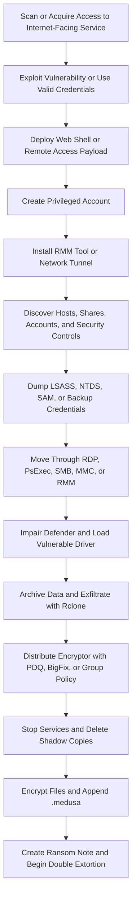

## Executive Summary

Medusa is a financially motivated, human-operated ransomware operation active since June 2021. MITRE tracks the operation as Medusa Group (`G1051`) and the encryptor as Medusa Ransomware (`S1244`). Microsoft tracks a prominent Medusa-deploying actor as Storm-1175, while Symantec uses Spearwing. These names describe vendor-specific scopes and should not be assumed to represent every Medusa affiliate.

The operation shifted from a relatively closed model toward affiliate participation by early 2023. The updated joint federal advisory published on August 18, 2026 reports more than 500 affected victims based on investigations through April 2026. Medusa conducts double extortion through data theft, encryption, direct victim contact, and threatened publication on its data leak site.

The most durable hunting pattern is exploitation of an internet-facing service followed by privileged account creation, remote monitoring and management (RMM) or tunneling activity, credential theft, security control impairment, archive and cloud exfiltration, centralized ransomware distribution, recovery inhibition, and `.medusa` encryption. Behavioral indicators should carry more detection weight than hashes, IP addresses, or filenames.

> [!IMPORTANT]
> Medusa and MedusaLocker are separate ransomware families. Public reporting does not substantiate an operational link. Do not mix MedusaLocker infrastructure or artifacts into Medusa hunts.

## Scope and Method

This report prioritizes the 2026 Microsoft Storm-1175 investigation, the 2026 update to joint advisory AA25-071A, MITRE ATT&CK entries, and incident evidence published by Symantec. Vendor reporting is used to supplement primary sources when it provides concrete host artifacts or observed commands.

User-provided text, public telemetry, and published indicators are treated as untrusted until corroborated. Victim counts and leak-site claims are lower-bound reporting rather than independently verified incident totals. No execution or detection coverage is claimed without validation against tenant telemetry.

The March 2025 AA25-071A advisory was authored by the FBI, CISA, and MS-ISAC. NSA was not an author. HHS joined the August 2026 update.

## Campaign Timeline and Victimology

| Date | Evidence-Backed Development |
|---|---|
| June 2021 | Federal agencies and Microsoft identify the beginning of Medusa activity |
| Early 2023 | The operation moves toward affiliate participation and increases use of a dedicated data leak site |
| 2023 onward | Storm-1175 exploits more than 16 types of internet-facing applications; incident reporting shows recurring RMM, PDQ, and bring-your-own-vulnerable-driver tradecraft |
| 2023 to 2024 | Symantec measures a 42 percent increase in Medusa leak-site postings |
| January 2025 | Symantec investigates a US healthcare intrusion in which ransomware follows four days of operator activity and affects several hundred devices |
| March 2025 | AA25-071A reports more than 300 victims through February 2025 |
| April 25, 2025 | Microsoft observes SAP NetWeaver CVE-2025-31324 exploitation one day after public disclosure |
| 2025 to 2026 | Storm-1175 exploits GoAnywhere CVE-2025-10035 and SmarterMail CVE-2026-23760 before public disclosure; N-day exploitation remains the dominant pattern |
| April 6, 2026 | Microsoft publishes its Storm-1175 investigation |
| August 18, 2026 | Updated AA25-071A reports more than 500 victims based on findings through April 2026 |

Reported victims span healthcare, education, legal, insurance, technology, manufacturing, defense, government, IT, professional services, and financial services. Microsoft particularly observed victims in Australia, the United Kingdom, and the United States. Available evidence supports opportunistic, exposure-driven targeting more strongly than fixed sector targeting.

## Threat Actor Profile

| Attribute | Assessment |
|---|---|
| Motivation | Financial extortion with high confidence; no credible ideological or state attribution is established |
| Operating model | Closed operation in 2021 with affiliate participation since at least early 2023 |
| Access acquisition | Direct exploitation, phishing, stolen credentials, and initial access brokers; the federal advisory reports payments of `$100,000` to `$1 million` for access |
| Model caveat | Consistent tradecraft may indicate a small affiliate pool, a prescribed playbook, or direct core-team participation |
| Sourced names | Medusa Group, `G1051`, Medusa actors, Storm-1175, and Spearwing |
| Extortion model | Data theft plus encryption, sample-data publication, a public countdown, direct victim contact, and threatened leak-site publication |
| Reported demands | Symantec observed demands from `$100,000` to `$15 million`; the federal advisory states that demands are informed by victim revenue |
| Deadline reporting | Symantec describes a ten-day deadline, while the updated advisory describes 48 hours to respond before direct contact; this may reflect campaign or process changes |
| Extension fee | `$10,000` in cryptocurrency for each additional day, consistently reported by federal and vendor sources |
| Attribution confidence | High confidence in the activity cluster and ransomware family; low confidence in real-world identities, nationality, or complete affiliate relationships |

Microsoft's Storm-1175 and Symantec's Spearwing labels overlap with Medusa deployment activity but are not proven to be perfectly coextensive with Medusa Group. Detection content should use the observable behavior rather than treating vendor names as identity proof.

## Infection and Attack Flow

### Stage 1: Initial Access

Medusa operators scan internet-facing systems and exploit vulnerabilities shortly after disclosure, and in a smaller number of cases before public disclosure. Reported target products include Microsoft Exchange, PaperCut, Ivanti, ScreenConnect, TeamCity, SimpleHelp, CrushFTP, GoAnywhere, SAP NetWeaver, SmarterMail, BeyondTrust, Fortinet EMS, and Oracle WebLogic. Phishing, stolen credentials, and purchased access are additional paths.

The 2026 federal advisory states that investigators found no evidence of internally developed zero-days. Microsoft nevertheless observed pre-disclosure exploitation. The most supportable interpretation is early access to exploit knowledge or access from an external researcher, broker, or partner, not proven in-house zero-day development.

### Stage 2: Foothold and Persistence

After exploitation, operators deploy a web shell or remote access payload, create a local or domain account, and add it to an administrator group. They establish durable access with legitimate RMM tools and tunneling utilities including Atera, Level, N-able, DWAgent, MeshAgent, ScreenConnect, AnyDesk, SimpleHelp, eHorus, Splashtop, Cloudflared, Ligolo, and FRP. Cloudflared has been observed masquerading as `conhost.exe`.

### Stage 3: Discovery and Credential Access

Operators enumerate systems, networking, users, groups, shares, sessions, and drivers with native commands and utilities such as NetScan, Advanced IP Scanner, and PDQ Inventory. Credential access includes LSASS dumping with Mimikatz, Impacket, or Task Manager; enabling WDigest credential caching; accessing `NTDS.dit`, SAM, and registry hives; and recovering Veeam credentials. Domain credential theft may support Kerberos ticket forgery.

### Stage 4: Lateral Movement and Defense Evasion

Medusa activity uses RDP, PsExec, Impacket, MMC, administrative shares, RMM tools, and PDQ Deploy for lateral movement. Operators may change Windows Firewall settings to allow RDP. Defense evasion includes Defender registry and policy changes, broad antivirus exclusions such as `C:\`, PowerShell history deletion, security process termination, and bring-your-own-vulnerable-driver activity using KillAV or POORTRY-style drivers.

### Stage 5: Collection and Exfiltration

Operators search for databases and high-value files with Navicat and RoboCopy, create archives with Bandizip, and exfiltrate data with Rclone. Rclone has been renamed `lsp.exe` in observed incidents. Data theft before encryption supports Medusa's double-extortion model.

### Stage 6: Deployment and Impact

The encryptor is distributed through PDQ Deploy, BigFix, or Group Policy. Observed staging artifacts include `RunFileCopy.cmd`, `gaze.exe`, `readtext85.exe`, and `270.exe`. Operators stop backup, database, file-sharing, and security services; terminate processes; delete shadow copies; encrypt data using AES-256; append `.medusa`; and write a ransom note. Some samples self-delete.

## Commonly Observed Tools and Commands

| Function | Observed Examples |
|---|---|
| Account creation and persistence | `net user`, domain account creation, administrator-group modification |
| Host discovery | `cmd.exe /c systeminfo`, `cmd.exe /c ipconfig /all`, `cmd.exe /c net share`, `quser`, `driverquery` |
| Remote administration | `mmc.exe compmgmt.msc /computer:{host}`, `mstsc.exe /v:{host}`, PsExec, RMM clients, Cloudflared |
| Credential access | Mimikatz, Impacket, Task Manager LSASS dump, `UseLogonCredential=1`, VSS-assisted `NTDS.dit` and registry-hive copying |
| Recovery inhibition | `vssadmin create shadow /for=C:`, `vssadmin delete shadows /shadow=`, and deletion of all shadow copies |
| Defense impairment | Encoded PowerShell that adds antivirus exclusions, KillAV, vulnerable drivers, `net stop <service> & taskkill /F /IM <process> /T` |
| Anti-forensics | `Remove-Item (Get-PSReadlineOption).HistorySavePath`, `cmd /c ping localhost -n 3 > nul & del` |
| Collection and exfiltration | Navicat, RoboCopy, Bandizip, Rclone, and renamed `lsp.exe` |
| Central deployment | PDQ Deploy, PDQ Inventory, BigFix, Group Policy, and `RunFileCopy.cmd` |

Commands are examples from published incidents. Names and syntax are mutable, and legitimate administrators may use several of these utilities.

## MITRE ATT&CK Map for Hunting

| Technique | ID | Confidence | Evidence Pattern to Hunt |
|---|---|---|---|
| Exploit Public-Facing Application | T1190 | High | Internet-facing application exploit followed by service-to-shell process creation or web-root file write |
| Web Shell | T1505.003 | High | New script or executable in a web root followed by shell or outbound network activity |
| Create Domain Account | T1136.002 | High | New account followed by privileged group membership and remote logon |
| Remote Access Software | T1219 | High | New RMM service or binary with unusual outbound activity or cross-device fan-out |
| PowerShell | T1059.001 | High | Encoded execution, downloads, history deletion, or Defender exclusion changes |
| Windows Command Shell | T1059.003 | High | Discovery, service stop, process kill, or self-deletion command chains |
| OS Credential Dumping: LSASS Memory | T1003.001 | High | LSASS access or dump creation by unexpected process or account |
| OS Credential Dumping: NTDS | T1003.003 | High | VSS creation followed by `NTDS.dit` or domain-controller registry hive access |
| Modify Registry | T1112 | High | WDigest, Defender, privilege, RDP, or firewall-related registry modification |
| Remote Services: RDP | T1021.001 | High | Type 10 logon, `mstsc.exe`, firewall change, and unusual east-west RDP |
| System Services: Service Execution | T1569.002 | High | PsExec-style service creation and remote child process execution |
| Software Deployment Tools | T1072 | High | PDQ Deploy or BigFix distributes rare, unsigned, or previously unseen binaries |
| Lateral Tool Transfer | T1570 | High | Identical tool or encryptor written to multiple devices over administrative channels |
| Network Service Discovery | T1046 | High | Scanner behavior or rapid connection attempts across internal address ranges |
| Impair Defenses | T1562.001 | High | Defender exclusions, security policy changes, vulnerable driver load, or AV process termination |
| Subvert Trust Controls: Code Signing | T1553.002 | High | Signed vulnerable driver used to interfere with EDR or security services |
| Exfiltration to Cloud Storage | T1567.002 | High | Archive activity followed by Rclone or high-volume cloud storage egress |
| Service Stop | T1489 | High | Burst of stops targeting backup, security, database, and file-sharing services |
| Inhibit System Recovery | T1490 | High | Shadow-copy deletion through `vssadmin`, WMI, or related tooling |
| Data Encrypted for Impact | T1486 | High | High-rate file modification, `.medusa` renames, and ransom-note fan-out |
| Clear Command History | T1070.003 | High | PowerShell history path deletion or shell history removal |
| File Deletion | T1070.004 | High | Staged tool removal or encryptor self-deletion after execution |

## Durable Indicators of Attack

| Attack Phase | Durable Behavioral Indicator | Hunting Value |
|---|---|---|
| Initial access | Public service spawns a shell, web shell, remote payload, or unusual outbound connection | High-value early warning when application telemetry is available |
| Persistence | New privileged account followed by RMM service creation or remote logon | Strong correlation across identity and endpoint telemetry |
| Command and control | New RMM client, Cloudflared tunnel, or renamed tunnel binary runs from an unusual path | More resilient than a specific C2 address |
| Credential access | LSASS dump, WDigest enablement, or VSS creation followed by `NTDS.dit`, SAM, or hive access | Critical domain-compromise signal |
| Lateral movement | PsExec, RDP, MMC, SMB, RMM, or PDQ activity fans out from a newly compromised host | Distinguishes operator movement from isolated tool use |
| Defense evasion | Defender exclusion or policy change followed by vulnerable-driver load or security process termination | High-confidence pre-impact pattern |
| Exfiltration | Bandizip or archive burst followed by Rclone execution and high-volume cloud egress | Supports double-extortion detection |
| Deployment | PDQ, BigFix, or Group Policy distributes a rare binary across many endpoints | Critical centralized deployment signal |
| Impact | Service-stop burst and shadow-copy deletion precede mass renames and ransom-note creation | High confidence but late-stage |

## Volatile Indicators of Compromise

Indicators in this section are historical enrichment. Confirm them against current intelligence and local context before blocking. Legitimate services and tools must not be blocked globally based only on their appearance here.

### Network Indicators

| Type | Indicator | Context | Observation | Source |
|---|---|---|---|---|
| IP address | `185.135.86.149` | SimpleHelp command-and-control infrastructure | 2024-02-23 to 2026-03-15 | Microsoft |
| IP address | `134.195.91.224` | SimpleHelp command-and-control infrastructure | 2024-02-23 to 2026-02-26 | Microsoft |
| IP address | `85.155.186.121` | SimpleHelp command-and-control infrastructure | 2024-02-23 to 2026-02-12 | Microsoft |
| Domain | `filemail.com` | Legitimate file-hosting service abused for payload delivery; do not block globally | Historical campaign use | MITRE and Unit 42 |

No reliably sourced current Medusa data leak site `.onion` address was recovered from the primary sources used for this report. Similarly named MedusaLocker infrastructure is excluded.

### File Indicators

| SHA-256 | Filename or Context | Observation | Source |
|---|---|---|---|
| `0cefeb6210b7103fd32b996beff518c9b6e1691a97bb1cda7f5fb57905c4be96` | `gaze.exe` | 2026-03-01 | Microsoft |
| `5f9d864d11c79b34c4502edba7d0e007197d0df086a6fb9d6bfda84a1771ff0f` | Medusa encryptor | Historical incident | Symantec |
| `dfdb6d5ef505a0d4cabbcd97e142106ecab9604d0086d77c9431e2fb09088eb6` | `gaze.exe` | Historical incident | Symantec |
| `038fb5e0ba6c35e3ee2f56b5bd926109e8b321bd0c9e3b759489312518efea65` | `readtext85.exe` encryptor | Historical incident | Symantec |
| `1b7add5adbb9ba5b85437c11825e47663bd59729442f6f44fb2576b25945f0eb` | `gaze.exe` encryptor | Historical incident | Symantec |
| `7c340e4d69ac5221bbebcad320814929c1bc376c4d9a64e5daf70c191137fd4a` | `gaze.exe` encryptor | Historical incident | Symantec |
| `d1e1eb0e0aaedb01df8cc2b98b0119c4aef8c1c2a3930ea0c455f0491e3161eb` | `270.exe` encryptor | Historical incident | Symantec |
| `9632d7e4a87ec12fdd05ed3532f7564526016b78972b2cd49a610354d672523c` | `lsp.exe`, renamed Rclone; also used by other actors | 2024-04-01 to 2026-02-18 | Microsoft and Symantec |
| `e57ba1a4e323094ca9d747bfb3304bd12f3ea3be5e2ee785a3e656c3ab1e8086` | `main.exe`, SimpleHelp | 2026-01-15 | Microsoft |
| `5ba7de7d5115789b952d9b1c6cff440c9128f438de933ff9044a68fff8496d19` | `moon.exe`, SimpleHelp | 2025-09-15 to 2025-09-22 | Microsoft |
| `b7703a59c39a0d2f7ef6422945aaeaaf061431af0533557246397551b8eed505` | `smuot.sys`, KillAV driver | Historical incident | Symantec |
| `e0b562b70b9fed98a05680a613f786bd482f71456976c7290ca2059004cb64a5` | `mbaer.sys`, suspected POORTRY driver | Historical incident | Symantec |
| `6106d1ce671b92d522144fcd3bc01276a975fe5d5b0fde09ca1cca16d09b7143` | `wnbios.sys`, Defender-killing driver | Historical incident | Symantec |

### File and Host Artifacts

| Artifact | Context and Caveat |
|---|---|
| `.medusa` or `.MEDUSA` | Encrypted-file suffix; case varies by source and sample |
| `!READ_ME_MEDUSA!!!.txt` | Ransom-note name reported by MITRE |
| `!!!READ_ME_MEDUSA!!!.txt` | Alternate ransom-note name reported by Symantec |
| `RunFileCopy.cmd` | Ransomware deployment script |
| `PDQDeployRunner\service-1\exec\gaze.exe` | Example PDQ staging path |
| `gaze.exe`, `readtext85.exe`, `270.exe` | Encryptor filenames; names are mutable |
| `lsp.exe` | Renamed Rclone; filename alone is insufficient for attribution |
| `mesh.exe`, `SN.exe`, `mx.exe`, `2Gk8.exe` | Campaign artifacts reported by Microsoft or Symantec; names may be reused |
| `smuot.sys`, `mbaer.sys`, `wnbios.sys` | Drivers associated with security control impairment |

## Observable Signals by Attack Phase

| Phase | Observable Signals | Defender XDR and Sentinel Sources |
|---|---|---|
| Exploitation | Internet-facing service spawns a shell, writes a web shell, creates an executable, or opens an unusual outbound session | `DeviceProcessEvents`, `DeviceFileEvents`, `DeviceNetworkEvents`, WAF and application logs, `CommonSecurityLog` |
| Persistence | New account immediately joins a privileged group; new RMM service or scheduled execution appears | `DeviceProcessEvents`, `DeviceRegistryEvents`, `DeviceEvents`, `IdentityDirectoryEvents`, `SecurityEvent` 4720, 4728, and 4732 |
| Discovery | Native reconnaissance commands, scanner fan-out, or PDQ Inventory from an unusual host | `DeviceProcessEvents`, `DeviceNetworkEvents`, `DeviceLogonEvents`, `SecurityEvent`, `WindowsEvent` |
| Credential access | LSASS access or dump, WDigest modification, or `NTDS.dit`, SAM, and hive access | `DeviceProcessEvents`, `DeviceFileEvents`, `DeviceRegistryEvents`, `DeviceEvents`, `SecurityEvent` |
| Lateral movement | PsExec, WMI, SMB, RDP, MMC, PDQ, or RMM fan-out; firewall change enables RDP | `DeviceProcessEvents`, `DeviceNetworkEvents`, `DeviceRegistryEvents`, `DeviceLogonEvents`, `SecurityEvent`, `WindowsEvent` |
| Defense evasion | Defender exclusion or policy changes, vulnerable-driver load, AV process termination, or PowerShell history deletion | `DeviceRegistryEvents`, `DeviceProcessEvents`, `DeviceEvents`, `DeviceFileEvents`, `SecurityAlert` |
| Collection | Database and file discovery followed by a burst of archive creation | `DeviceProcessEvents`, `DeviceFileEvents`, database audit logs |
| Exfiltration | Rclone or renamed synchronization utility starts after archive creation and produces high-volume cloud egress | `DeviceProcessEvents`, `DeviceNetworkEvents`, proxy, DNS, firewall, and cloud application logs |
| Deployment | PDQ, BigFix, or Group Policy writes and starts the same rare binary across many devices | `DeviceProcessEvents`, `DeviceFileEvents`, `DeviceNetworkEvents`, software deployment audit logs |
| Impact | Service-stop burst, shadow-copy deletion, mass renames, `.medusa` files, or repeated ransom-note creation | `DeviceProcessEvents`, `DeviceFileEvents`, `DeviceEvents`, `SecurityAlert` |

## Priority Hunting Hypotheses

| ID | Hypothesis | Correlation Logic | Candidate Predicates and Telemetry | Priority | False Positives and Data Gaps |
|---|---|---|---|---|---|
| H1 | An internet-facing application exploit establishes a Medusa-compatible foothold | Service exploit or anomalous request followed within 24 hours by shell execution, web-root write, privileged account creation, or RMM installation | Web or WAF exploit event joined by device/IP to `DeviceProcessEvents`, `DeviceFileEvents`, 4720/4728/4732, or new service telemetry | Critical | Suppress approved deployments and administrators; appliance process telemetry may be unavailable |
| H2 | An actor-created administrator account enables remote expansion | New account and privileged group addition followed by RDP, PsExec, Cloudflared, or RMM activity from the same identity or host | `IdentityDirectoryEvents`, `SecurityEvent`, `DeviceLogonEvents`, service creation, `mstsc.exe`, tunnel process, or RMM network event | Critical | Compare with change tickets and service-desk provisioning; SID and hostname normalization are required |
| H3 | Operators obtain domain credentials through dump and snapshot activity | WDigest enablement, LSASS dump, or VSS creation followed by `NTDS.dit`, SAM, or registry-hive access | `UseLogonCredential=1`, unexpected LSASS access, dump-file creation, `vssadmin`, or sensitive file access on a domain controller | Critical | Backup and incident-response tools can resemble parts of the chain; file-access telemetry may be incomplete |
| H4 | Security control impairment prepares systems for exfiltration and encryption | Defender exclusion or policy change followed by vulnerable-driver load, security-process termination, Rclone, or ransomware staging | Defender registry path change, `Add-MpPreference`, exclusion of `C:\`, rare `.sys` load, service stop, or known deployment path | Critical | Validate authorized security policy and driver deployment; kernel telemetry coverage varies |
| H5 | Central administration tooling distributes Medusa staging components across the estate | PDQ, BigFix, or Group Policy distributes KillAV and then a rare binary to multiple devices within a short window | `PDQDeployRunner`, `RunFileCopy.cmd`, software distribution parent, identical hash fan-out, unsigned or rare child process | Critical | Baseline approved packages, signer, hash prevalence, deployment accounts, and maintenance windows |
| H6 | Data is staged and exfiltrated before encryption | Bandizip or archive burst is followed by Rclone or renamed `lsp.exe` and high-volume cloud egress | Archive process and file events joined within hours to Rclone-like command line, cloud destination, and egress-volume anomaly | High | Approved backup, migration, and data transfer jobs require destination and account baselines |
| H7 | Recovery inhibition and service destruction signal imminent or active Medusa impact | Shadow-copy deletion plus burst of backup/security/database service stops followed by mass `.medusa` renames or ransom notes | `vssadmin` or WMI deletion, `net stop`, `taskkill`, file rename rate, `.medusa`, and ransom-note filename | Critical | Late-stage signal; administrators may delete snapshots during maintenance, but phase correlation sharply reduces noise |
| H8 | A compromised Linux or network appliance becomes the initial pivot into Windows systems | Public-facing appliance exploit is followed by shell, credential access, tunnel creation, or connections to internal administrative protocols | Appliance/WAF logs, shell history, new process/file telemetry, outbound tunnel, SMB/RDP/WinRM access to internal devices | High | Public Linux post-compromise details are limited; many appliances do not forward process telemetry |

## Query-Building Blocks

| Building Block | Detection Intent | Candidate Predicates |
|---|---|---|
| Perimeter foothold | Identify exploitation that produces interactive control | Public-service parent, shell child, web-root write, unusual outbound connection, new privileged user |
| Unauthorized remote access | Detect RMM or tunneling outside the approved inventory | New service, rare executable, uncommon install path, unsigned binary, first-seen external destination |
| Credential theft | Detect local or domain credential extraction | LSASS access, dump creation, WDigest registry change, VSS plus `NTDS.dit`, SAM, or hive access |
| Security impairment | Detect pre-ransomware control removal | Defender policy/exclusion change, broad path exclusion, vulnerable-driver load, AV process termination |
| Lateral fan-out | Detect operator expansion and centralized delivery | Same account, source device, tool, or hash reaches multiple devices through RDP, SMB, PsExec, RMM, or PDQ |
| Collection and exfiltration | Detect double-extortion staging | Archive burst followed by Rclone-like process and cloud egress anomaly |
| Ransomware impact | Detect recovery inhibition and encryption | Service-stop burst, shadow-copy deletion, high-rate file writes, `.medusa`, ransom-note fan-out |

Useful correlation entities include `DeviceId`, normalized hostname, `AccountSid`, `InitiatingProcessAccountSid`, source IP address, destination IP address, file hash, and software deployment identity. Candidate literals include `vssadmin` with `delete shadows`, PowerShell with `Add-MpPreference` or `ExclusionPath`, registry changes involving Defender or `UseLogonCredential`, `PDQDeployRunner` spawning a rare executable, and archive creation followed by Rclone egress.

## Detection Engineering Guidance

* Prioritize behavior across phases over campaign-specific hashes, IP addresses, and filenames
* Correlate perimeter, identity, endpoint, network, and software deployment telemetry across a 24-hour window; observed dwell time can be less than one day
* Weight phase diversity in alert scoring so that exploitation, credential access, defense evasion, exfiltration, deployment, and impact signals compound confidence
* Baseline approved RMM, PDQ, BigFix, backup, archive, cloud synchronization, and administrative activity before enabling high-severity detections
* Treat a new privileged account followed by remote access as a stronger signal than either event alone
* Alert early on Defender impairment, vulnerable-driver load, and centralized rare-binary fan-out rather than relying only on `.medusa` artifacts
* Use known infrastructure for enrichment and scoping, not as independent proof of attribution
* Preserve uncertainty when appliance telemetry, file-access auditing, or software deployment logs are absent

An example evidence score for prototyping is: foothold `+2`, credential access `+3`, defense impairment or vulnerable-driver activity `+4`, exfiltration `+3`, centralized deployment `+4`, and recovery inhibition or encryption `+5`. This score is a design aid and requires tenant-specific validation before production use.

## Triage and Containment Guidance

| Phase | Recommended Actions |
|---|---|
| Confirm | Validate the initial exploit, account creation, RMM or tunnel installation, credential access, security changes, exfiltration, and deployment path |
| Preserve | Capture volatile memory, original encryptor, ransom note, command history, web and appliance logs, PDQ or BigFix packages, RMM configuration, and firewall, VPN, proxy, and DNS logs |
| Scope | Search for the same account, source host, RMM tenant, tunnel destination, hash, driver, deployment package, and cloud exfiltration destination across the environment |
| Contain | Isolate affected endpoints and perimeter systems, disable actor-created accounts, revoke sessions, remove unauthorized remote access after evidence capture, and restrict east-west RDP and SMB |
| Credential response | Rotate domain, administrator, service, and Veeam credentials; assume domain compromise when `NTDS.dit` was accessed |
| Security recovery | Enable Defender tamper protection, remove malicious exclusions, block vulnerable drivers, and validate security policy integrity |
| Infrastructure recovery | Segment PDQ and BigFix management planes, validate immutable offline backups, and restore only after persistence and access paths are removed |

## Research Gaps and Confidence Limits

* The relationship among core developers, affiliates, initial access brokers, Storm-1175, and Spearwing is not fully established
* No independently verified victim count, payment total, or comprehensive sector distribution is available
* Leak-site postings do not prove successful encryption, payment, or the complete scope of compromise
* Public reporting gives conflicting victim-response deadlines, which may indicate changing procedures
* Linux and network-appliance post-compromise behavior is less documented than Windows behavior
* Several tools and services are legitimate dual-use software, so attribution requires surrounding behavior
* Indicators may expire, be reassigned, or be shared with unrelated actors

## Source References

* [CISA: AA25-071A StopRansomware Medusa Ransomware](https://www.cisa.gov/news-events/cybersecurity-advisories/aa25-071a)
* [FBI, CISA, and HHS: Updated Medusa Advisory, August 18, 2026](https://www.ic3.gov/CSA/2026/260818.pdf)
* [Microsoft Threat Intelligence: Storm-1175 focuses gaze on vulnerable web-facing assets](https://www.microsoft.com/en-us/security/blog/2026/04/06/storm-1175-focuses-gaze-on-vulnerable-web-facing-assets-in-high-tempo-medusa-ransomware-operations/)
* [Microsoft Security Intelligence: Ransom Win32 Medusa](https://www.microsoft.com/en-us/wdsi/threats/malware-encyclopedia-description?Name=Ransom:Win32/Medusa)
* [MITRE ATT&CK: Medusa Group G1051](https://attack.mitre.org/groups/G1051/)
* [MITRE ATT&CK: Medusa Ransomware S1244](https://attack.mitre.org/software/S1244/)
* [Symantec Threat Hunter Team: Medusa Ransomware Activity Continues to Increase](https://www.security.com/threat-intelligence/medusa-ransomware-attacks)
* [Unit 42: Medusa Ransomware Turning Your Files into Stone](https://unit42.paloaltonetworks.com/medusa-ransomware-escalation-new-leak-site/)
* [SecurityScorecard: A Deep Dive into Medusa Ransomware](https://securityscorecard.com/wp-content/uploads/2024/01/deep-dive-into-medusa-ransomware.pdf)

## Implementation Next Step

Convert hypotheses H1 through H8 into versioned Microsoft Defender XDR and Sentinel hunting queries. Validate table and column availability against the target tenant, then test expected results, false-positive rates, and cross-table time windows before promoting any query to a detection rule.