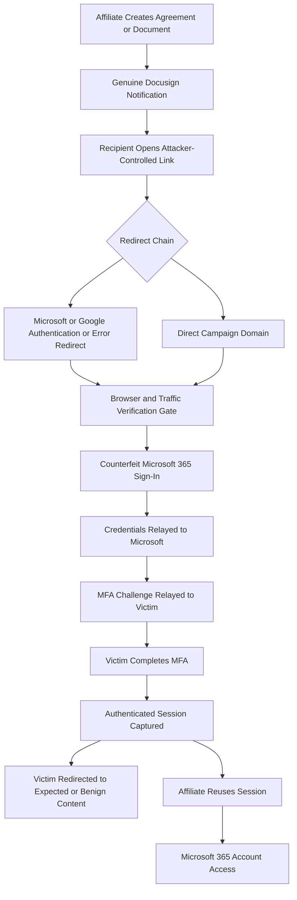

## Executive Summary

NovaCookies, also presented as "Nova Cookies," is a commercial adversary-in-the-middle
(AiTM) phishing-as-a-service platform. Island reported in August 2026 that the service
was advertised through Telegram for approximately $320 per month and used to target
hundreds of organizations. Observed targets included organizations in the United
States, United Kingdom, Canada, Germany, Israel, and the United Arab Emirates.

The observed campaign uses genuine Docusign notifications to establish trust and lead
recipients into attacker-controlled redirect chains. Some chains abuse legitimate
Microsoft or Google authentication and error-redirection behavior before reaching a
counterfeit Microsoft 365 sign-in page. NovaCookies proxies authentication in real
time, relays credentials and multifactor authentication (MFA) responses to Microsoft,
and captures the resulting authenticated session.

NovaCookies is an identity and browser attack rather than a reported malware infection
chain. Current public evidence does not establish a NovaCookies-specific executable,
file hash, PowerShell command, living-off-the-land binary, endpoint persistence method,
or conventional command-and-control implant. Detection should prioritize the trusted
message-to-untrusted-destination journey and incompatible session use after MFA rather
than depend on endpoint malware artifacts.

Island published 755 campaign-associated registered domains, including 736 classified
as confirmed, 8 as probable, and 11 as possible. Static domain matches can provide
immediate coverage, but the most durable detection opportunity is a successful MFA
event followed by Microsoft 365 access from an incompatible network, device, location,
or user-agent context.

## Campaign Profile

| Attribute | Assessment |
|---|---|
| Campaign name | NovaCookies; the operator interface also uses "Nova Cookies" |
| Threat model | Commercial AiTM phishing-as-a-service platform with an affiliate model |
| Primary objective | Microsoft 365 credential and authenticated session theft |
| Assessed motivation | Financially motivated service operation and account takeover with high confidence |
| Delivery method | Genuine Docusign notifications containing or leading to attacker-controlled destinations |
| Authentication target | Microsoft 365 sign-in and MFA workflow |
| Infrastructure | Dedicated registered domains, redirect chains, browser verification gates, and operator services |
| Operator channel | Telegram reportedly supported advertising, customer interaction, and notifications |
| Victimology | Hundreds of organizations across multiple countries; complete sector distribution is not public |
| Attribution | No named criminal group, individual operator, or state sponsor is established |
| Reported lineage | Possible Sneaky 2FA relationship based on secondary reporting; low confidence without independent primary evidence |

The service model suggests that campaign targeting and post-compromise behavior can
vary by affiliate. Shared kit behavior can identify NovaCookies-compatible activity,
but does not establish that the same person selected every target or used every stolen
session.

## Infection and Attack Flow

### Stage 1: Trusted Message Delivery

An affiliate creates a document or agreement that causes Docusign to send a genuine
notification. The trusted sender and familiar document workflow reduce suspicion and
can improve delivery compared with a directly spoofed message. Docusign was used as a
delivery mechanism; current reporting does not indicate that Docusign itself was
compromised.

### Stage 2: Redirection and Traffic Qualification

The recipient follows a link toward attacker-controlled infrastructure. Some observed
journeys pass through legitimate Microsoft or Google authentication or error-handling
endpoints. These services can obscure the final destination and make the initial URL
appear more trustworthy.

Campaign destinations can apply browser, automation, debugging, or traffic-quality
checks before displaying phishing content. These gates help affiliates exclude
scanners, automated analysis, and unsuitable traffic. Browser-side gate behavior is
valuable for research and sandboxing, but may not be visible in standard identity or
email telemetry.

### Stage 3: Live Authentication Relay

The final destination presents a counterfeit Microsoft 365 sign-in experience. The
service proxies the victim's authentication to Microsoft in real time rather than only
collecting values in a static form. Credentials and MFA responses are relayed during
the legitimate authentication transaction.

### Stage 4: Session Capture and Reuse

After successful authentication, NovaCookies captures the authenticated web session.
The victim may be redirected to expected or benign content while the affiliate receives
access to the stolen session. Reuse can bypass another interactive MFA challenge while
the session remains valid and accepted by Microsoft 365 controls.

Public reporting does not establish a consistent NovaCookies post-compromise playbook.
Mailbox access, file access, forwarding changes, consent activity, and other cloud
operations should be treated as investigation hypotheses unless observed in tenant
telemetry.

## Tools, Services, and Infrastructure

| Component | Observed or Assessed Role | Confidence |
|---|---|---|
| NovaCookies platform | Proxies Microsoft 365 authentication and captures authenticated sessions | High |
| Docusign | Sends genuine document notifications used as the trusted delivery layer | High |
| Microsoft redirect behavior | Provides an intermediate redirect layer in some journeys | High for the behavior; campaign attribution requires chain evidence |
| Google redirect behavior | Provides an intermediate redirect layer in some journeys | High for reported campaign use |
| Dedicated campaign domains | Host redirect, verification, or counterfeit authentication content | High |
| Browser verification gates | Filter scanners, automation, researchers, or unwanted traffic | High |
| Telegram | Supports service advertising, customer interaction, or operational notifications | High based on Island reporting |
| Sneaky 2FA code lineage | Possible upstream or related kit lineage | Low |

The presence of Docusign, Microsoft, Google, or Telegram traffic does not independently
identify NovaCookies. Each service has substantial legitimate use and requires chain,
destination, identity, or endpoint context.

## Indicators of Compromise

Island's August 2026 release contains 755 registered domains associated with the
campaign. The dataset classifies domains according to the evidence available to its
researchers:

| Classification | Count | Dataset Meaning |
|---|---:|---|
| Confirmed | 736 | Kit paths, verification gates, or recovered operator linkage support campaign association |
| Probable | 8 | Naming plus gate parameters or redirect-chain evidence support likely association |
| Possible | 11 | Naming and registration characteristics match, but observed kit behavior is absent |

Representative confirmed domains include:

| Type | Indicator | Context | Confidence |
|---|---|---|---|
| Domain | `abacusnextinternationalldtwtd[.]vu` | Registered campaign domain in Island's confirmed set | High within the dataset's observation period |
| Domain | `abcfinasyoncialservices[.]vu` | Registered campaign domain in Island's confirmed set | High within the dataset's observation period |
| Domain | `abcgrpayoupofcompanies[.]vu` | Registered campaign domain in Island's confirmed set | High within the dataset's observation period |
| Domain | `abckraftedxrn[.]vu` | Registered campaign domain in Island's confirmed set | High within the dataset's observation period |
| Domain | `abundantlifiqyechristiancenter[.]vu` | Registered campaign domain in Island's confirmed set | High within the dataset's observation period |
| Domain | `accordinvestmifgents[.]vu` | Registered campaign domain in Island's confirmed set | High within the dataset's observation period |
| Pattern | Mutated organization-like names under `.vu` | Enrichment characteristic that is insufficient for blocking by itself | Medium |

No confirmed NovaCookies-specific IP addresses, executable names, file hashes, CVEs,
registry paths, cryptocurrency wallets, or durable URL paths were identified in the
reviewed evidence. Organization names embedded in campaign domains do not prove that
the named organizations were compromised.

## Indicators of Attack

| Attack Phase | Behavioral Indicator | Hunting Value |
|---|---|---|
| Delivery | Genuine Docusign notification is followed by navigation to a newly registered or unrelated domain | Strong when sender, recipient, click, and destination evidence are correlated |
| Redirection | Microsoft or Google authentication or error endpoint redirects to a non-provider domain | Strong after approved application and redirect inventories are excluded |
| Credential access | Microsoft-themed authentication is rendered on an unrelated registered domain | High-value browser or secure web gateway signal |
| Session theft | Successful MFA is followed quickly by access from a different IP, country, ASN, device, or user agent | Highest-value identity correlation after corporate egress and mobility are baselined |
| Session reuse | Cloud activity occurs without corresponding interactive sign-in evidence on a managed endpoint | Strong investigation lead when endpoint and identity telemetry are complete |
| Infrastructure | Browser contacts a campaign domain shortly before Microsoft 365 authentication | Strong temporal signal on managed endpoints |
| Evasion | Destination applies automation, debugger, or browser-integrity checks before authentication | Supporting kit signal where browser or sandbox telemetry exposes it |
| Rotation | Destinations change while lure paths, redirects, page structure, or gate behavior remain stable | More durable than matching one domain |

## MITRE ATT&CK Mapping

| Technique | ID | Mapping Rationale | Confidence |
|---|---|---|---|
| Spearphishing Link | T1566.002 | Docusign-delivered links initiate the phishing journey | High |
| Malicious Link | T1204.001 | The recipient follows the link to begin the AiTM authentication flow | High |
| Adversary-in-the-Middle | T1557 | NovaCookies proxies authentication between the victim and Microsoft 365 | High |
| Steal Web Session Cookie | T1539 | Capturing the authenticated session is a central platform capability | High |
| Web Session Cookie | T1550.004 | Captured sessions can provide access without another interactive MFA challenge | Medium until tenant telemetry confirms reuse |
| Domains | T1583.001 | Operators or affiliates register dedicated phishing domains | High |

MFA Request Generation (`T1621`) is excluded because current reporting does not
describe MFA fatigue or unsolicited push flooding. Web Portal Capture (`T1056.003`) is
not used as the primary mapping because the documented mechanism is live authentication
relay rather than a static credential form. Endpoint-oriented debugger and virtual
machine evasion techniques are also excluded because browser traffic checks do not
establish malware-based analysis evasion on a compromised host.

## Hunting Hypotheses

### Hypothesis 1: Docusign Delivery to an Untrusted Destination

An account targeted by NovaCookies is likely to receive a genuine Docusign message and
then navigate through one or more URLs to a campaign-associated, newly registered, or
unrelated destination.

| Element | Hunting Guidance |
|---|---|
| Candidate telemetry | Defender XDR `EmailEvents`, `EmailUrlInfo`, and `UrlClickEvents`; secure email gateway and proxy logs |
| Behavioral logic | Identify Docusign delivery, resolve click and redirect destinations, then score campaign-feed matches, domain age, reputation, registration pattern, and relationship to the sender |
| Benign explanations | Legitimate agreements can contain customer, partner, payment, or workflow links hosted outside Docusign |
| Tuning | Exclude established partner domains and approved workflows; require a redirect anomaly, new domain, campaign match, or later identity anomaly |
| Visibility gaps | Redirect expansion, mobile clicks, unmanaged browsers, and messages outside monitored mailboxes may be absent |

### Hypothesis 2: MFA Followed by an Incompatible Session

A relayed authentication is likely to produce a successful MFA event followed by rapid
access from a network or client context that is incompatible with the victim's normal
authentication context.

| Element | Hunting Guidance |
|---|---|
| Candidate telemetry | Sentinel `SigninLogs`, Defender XDR identity sign-in data where licensed, Conditional Access details, and user risk events |
| Behavioral logic | Correlate successful MFA with subsequent access from a different IP, country, ASN, device identity, browser, operating system, or user agent inside a short time window |
| Benign explanations | Corporate VPN transitions, mobile carrier changes, security proxies, remote desktops, travel, and shared egress can change network context |
| Tuning | Baseline each user's devices and locations; inventory corporate egress; increase severity for impossible travel, unmanaged clients, unfamiliar ASNs, or sensitive cloud actions |
| Visibility gaps | Token and session identifiers may be unavailable; privacy relays and proxy services can reduce location and device certainty |

### Hypothesis 3: Click, Authentication, and Cloud Activity Chain

A successful phishing journey is likely to connect a suspicious click with successful
authentication and subsequent Microsoft 365 operations that differ from the user's
normal activity.

| Element | Hunting Guidance |
|---|---|
| Candidate telemetry | `UrlClickEvents`, `SigninLogs` or equivalent identity events, `CloudAppEvents`, Exchange audit, SharePoint audit, and Microsoft Graph activity |
| Behavioral logic | Correlate the recipient and click time with successful authentication, then identify mailbox access, downloads, searches, forwarding changes, consent events, or other sensitive operations |
| Benign explanations | Users normally authenticate and work in Microsoft 365 after opening business documents |
| Tuning | Require an untrusted redirect, unfamiliar session context, unmanaged device, unusual operation, or deviation from the user's historical behavior |
| Visibility gaps | Public reporting does not establish one post-compromise action; audit coverage varies by workload and license |

### Hypothesis 4: Endpoint Contact Before Authentication

A managed endpoint used in the phishing journey is likely to contact NovaCookies
infrastructure shortly before the associated user completes Microsoft 365
authentication.

| Element | Hunting Guidance |
|---|---|
| Candidate telemetry | Defender XDR `DeviceNetworkEvents`, browser events where available, DNS logs, secure web gateway logs, and the Island domain feed |
| Behavioral logic | Match complete registered domains and correlate browser contact with the same user's sign-in activity during a short time window |
| Benign explanations | Security scanners, researchers, or shared infrastructure can contact known campaign domains |
| Tuning | Require an interactive browser process, user session, recent email click, or successful identity event; separate scanner and sandbox networks |
| Visibility gaps | Mobile and unmanaged devices may not report network events; encrypted DNS can limit resolver visibility |

### Hypothesis 5: Identity-Provider Redirect Abuse

NovaCookies redirect chains are likely to contain a legitimate Microsoft or Google
authentication or error endpoint whose redirect target resolves to a newly registered,
low-reputation, or campaign-associated domain.

| Element | Hunting Guidance |
|---|---|
| Candidate telemetry | Email URL detonation, secure web gateway logs, browser history, proxy logs, OAuth application inventory, and registered redirect URI inventory |
| Behavioral logic | Parse supported redirect parameters with a structured URL parser, normalize the destination, and compare it with approved applications and destination intelligence |
| Benign explanations | Legitimate OAuth applications redirect users to external application domains |
| Tuning | Suppress approved client IDs and exact registered redirect URIs; increase confidence for new domains, deceptive naming, multiple redirects, or later sign-in anomalies |
| Visibility gaps | Some telemetry records only the initial URL; nested encoding and server-side redirects can hide the final destination |

### Hypothesis 6: Cloud Use Without Local Authentication Evidence

Session replay can produce Microsoft 365 activity without a corresponding interactive
authentication event on the user's managed endpoint.

| Element | Hunting Guidance |
|---|---|
| Candidate telemetry | Endpoint browser and network events, identity sign-ins, token-related details, `CloudAppEvents`, and workload audit logs |
| Behavioral logic | Identify meaningful cloud operations from a new context where no corresponding local browser or authentication activity exists for the expected device |
| Benign explanations | Unmanaged devices, mobile applications, virtual desktops, telemetry loss, background token refresh, and shared systems |
| Tuning | Restrict to managed-device users, high-value accounts, unfamiliar networks, and sensitive cloud actions; score telemetry completeness before alerting |
| Visibility gaps | Absence of endpoint evidence is unreliable unless device enrollment, sensor health, and event retention are confirmed |

## Detection Engineering Priorities

| Priority | Detection Opportunity | Rationale |
|---:|---|---|
| 1 | Successful MFA followed by incompatible session use | Captures the core session-theft outcome and is less dependent on rotating infrastructure |
| 2 | Docusign delivery followed by an untrusted redirect journey | Connects trusted delivery to the attacker-controlled destination |
| 3 | Suspicious click, authentication, and cloud-operation correlation | Establishes a multi-stage chain with stronger confidence than one event |
| 4 | Identity-provider error or OAuth redirect to an unapproved domain | Detects an observed obfuscation primitive across changing destinations |
| 5 | Managed browser contact with the confirmed domain feed | Provides direct retrospective and near-term coverage |
| 6 | Newly registered domain, deceptive naming, and kit-gate heuristics | Expands coverage beyond known indicators but requires careful tuning |
| 7 | Static domain blocking alone | Delivers immediate prevention value but degrades as affiliates rotate domains |

Production analytics should combine multiple weak signals rather than declare an
incident from one generic Docusign message, one OAuth redirect, or one `.vu` domain.
Session revocation, credential reset, token investigation, mailbox review, application
consent review, and cloud audit scoping should follow confirmed session theft according
to the organization's incident-response process.

## Evidence Gaps and Limitations

* No victim-level telemetry was available for independent validation
* No hunting query was executed against a Microsoft Defender XDR or Sentinel tenant
* No consistent post-compromise sequence has been publicly established
* No NovaCookies-specific endpoint payload, persistence artifact, file hash, or CVE was identified
* No operator or affiliate identity was independently verified
* The reported Sneaky 2FA relationship remains insufficiently corroborated in reviewed primary material
* Domain classifications depend on Island's observations and can become stale as infrastructure changes
* Table availability, field names, retention, and identity detail vary by license and tenant configuration

## Sources

* Island, [NovaCookies at scale: Inside the $320 Phishing Service Targeting Hundreds of Organizations](https://www.island.io/blog/novacookies-at-scale-inside-the-320-phishing-service-targeting-hundreds-of-organizations), August 26, 2026
* Island Security Research, [NovaCookies research artifacts](https://github.com/island-io/island-security-research-artifacts/tree/main/novacookies), August 2026
* Island Security Research, [NovaCookies phishing domain feed](https://raw.githubusercontent.com/island-io/island-security-research-artifacts/main/novacookies/novacookies-phishing-domains-2026-08.txt), August 2026
* Microsoft Security Blog, [OAuth redirection abuse enables phishing and malware delivery](https://www.microsoft.com/en-us/security/blog/2026/03/02/oauth-redirection-abuse-enables-phishing-malware-delivery/), March 2, 2026
* The Hacker News, [NovaCookies Campaigns Abuse Genuine Docusign Notifications to Steal Microsoft 365 Sessions](https://thehackernews.com/2026/08/novacookies-campaigns-abuse-genuine.html), August 2026
* MITRE ATT&CK, [Enterprise techniques](https://attack.mitre.org/), accessed September 2, 2026
* Microsoft Learn, [Microsoft Defender XDR advanced hunting schema tables](https://learn.microsoft.com/en-us/defender-xdr/advanced-hunting-schema-tables), accessed September 2, 2026
* Microsoft Learn, [Proactively hunt for threats with advanced hunting in Microsoft Defender XDR](https://learn.microsoft.com/en-us/defender-xdr/advanced-hunting-overview), accessed September 2, 2026