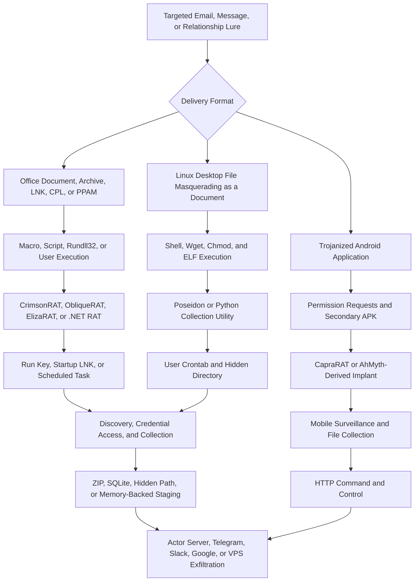

## Executive Summary

Transparent Tribe is a persistent cyber-espionage actor active since at least 2013. MITRE ATT&CK tracks the group as Transparent Tribe (`G0134`) and associates the names APT36, COPPER FIELDSTONE, Mythic Leopard, and ProjectM with it. Public reporting assesses the actor as Pakistan-based or Pakistan-aligned with high confidence, but does not conclusively identify a sponsoring government agency.

The actor primarily targets Indian military, defense, government, diplomatic, aerospace, research, and education organizations. Afghanistan, regional officials, activists, and diplomatic targets also appear in public reporting. Its operations consistently pursue strategic intelligence through credential theft, document collection, removable-media surveillance, browser and communications data theft, and endpoint or mobile-device monitoring.

Transparent Tribe has evolved from malicious Office documents and CrimsonRAT to a broader arsenal that includes ObliqueRAT, ElizaRAT, ApoloStealer, ConnectX, GLOBSHELL, PYSHELLFOX, CapraRAT variants, modified AhMyth Android implants, and campaign-specific downloaders. Recent operations use CPL, LNK, PPAM, double-extension executables, malicious Linux `.desktop` files, cloud-hosted payloads, and legitimate services such as Telegram, Slack, and Google Cloud Storage.

The most durable hunting pattern is a targeted lure followed by concealed execution, persistence in a user context, system and file discovery, strategic document or credential collection, local archive or database staging, and exfiltration through actor infrastructure or a legitimate cloud service. Behavioral indicators should carry more detection weight than hashes, domains, IP addresses, filenames, or a connection to a commonly used cloud platform.

> [!IMPORTANT]
> Cisco Talos tracks GravityRAT, HeavyLift, GravityAdmin, and Operation Celestial Force as Cosmic Leopard. Public evidence is insufficient to merge Cosmic Leopard with Transparent Tribe. Do not treat those tools or campaigns as confirmed APT36 activity without additional evidence.

## Scope and Method

This report prioritizes MITRE ATT&CK, Kaspersky, Cisco Talos, Zscaler ThreatLabz, and Check Point Research. CYFIRMA reporting supplements the research for 2025 and 2026 campaigns, but those campaign attributions remain medium confidence pending broader independent corroboration.

User-provided text, public telemetry, published schemas, and indicators are treated as untrusted until corroborated. Infrastructure, filenames, and hashes are historical investigation pivots rather than permanent block indicators. No query execution, optimization gain, or detection coverage is claimed without validation against tenant telemetry.

Vendor cluster names do not necessarily describe identical actor scopes. Earth Karkaddan and other overlapping labels require source-specific interpretation rather than automatic equivalence with Transparent Tribe.

## Campaign Timeline and Victimology

| Date | Evidence-Backed Development |
|---|---|
| 2013 onward | Public reporting identifies sustained espionage activity against Indian military, diplomatic, and government targets |
| 2017 to 2020 | Tailored spearphishing, malicious Office documents, fake government or file-sharing sites, dynamic DNS, CrimsonRAT, and USBWorm become recurring tradecraft |
| August 2020 | Kaspersky documents Crimson modules for keylogging, browser-password theft, USB propagation, microphone and webcam surveillance, and file exfiltration |
| 2020 to 2021 | ObliqueRAT provides an additional Windows capability, including payload retrieval from compromised websites; modified AhMyth-derived Android implants support mobile surveillance |
| July 2022 to April 2023 | Cisco Talos documents education-themed targeting of Indian universities and students through malicious documents and CrimsonRAT |
| September 2023 | Zscaler documents ElizaRAT CPL execution and Telegram command and control, malicious Linux `.desktop` files, Mythic Poseidon agents, GLOBSHELL, and PYSHELLFOX |
| November 2024 | Check Point documents ElizaRAT evolution through Slack, Google Cloud Storage, and VPS infrastructure, plus ApoloStealer and ConnectX collection modules |
| June 2025 | CYFIRMA reports a defense-themed protected PDF leading to a `.7z` archive and double-extension credential-stealing executable; attribution is medium confidence |
| February 2026 | CYFIRMA reports examination-themed ZIP files containing LNK and PPAM execution paths that stage a .NET RAT with Run-key persistence and raw TCP command and control; attribution is medium confidence |

Indian defense and government organizations remain the actor's central target set. Reported victimology also includes diplomatic missions, aerospace and research organizations, educational institutions, students, Afghan entities, regional government officials, and activists. Available evidence supports strategic, relationship-aware targeting rather than indiscriminate criminal distribution.

## Threat Actor Profile

| Attribute | Assessment |
|---|---|
| Motivation | Strategic cyber espionage with high confidence; financial or destructive objectives are not prominent |
| Assessed origin | Pakistan-based or Pakistan-aligned with high confidence; Zscaler states very high confidence |
| Sponsorship caveat | Public evidence does not conclusively identify a sponsoring Pakistani government or intelligence agency |
| Primary targeting | Indian military, defense, government, diplomatic, aerospace, research, and education organizations |
| Additional targeting | Afghanistan, regional officials, activists, government-adjacent organizations, and occasional diplomatic targets elsewhere |
| Collection priorities | Credentials, government and military documents, email and browser sessions, removable-media files, communications, screenshots, audio, video, location, and mobile data |
| Access model | Tailored spearphishing, malicious links and attachments, cloud-hosted archives, fake portals, social engineering, and trojanized mobile applications |
| Infrastructure model | Dynamic DNS, compromised websites, virtual private servers, actor domains, and legitimate cloud or collaboration services |
| Attribution confidence | High confidence in the long-running Transparent Tribe activity cluster; medium confidence in several 2025 and 2026 campaign-specific links |

Attribution should rest on the full chain of victimology, lure context, execution, persistence, collection behavior, infrastructure, and malware lineage. A single RAT family, cloud service, filename, or network indicator does not prove Transparent Tribe involvement.

## Infection and Attack Flow

### Stage 1: Targeting and Delivery

Transparent Tribe tailors lures to military, government, diplomatic, education, conference, résumé, examination, and relationship themes. Delivery formats include malicious Office documents, password-protected archives, PDF links, LNK files, CPL files, PPAM add-ins, double-extension executables, Linux `.desktop` files, fake government portals, and trojanized Android applications.

Cloud storage and compromised websites frequently host payloads or archives. The use of a legitimate hosting service is an evasion and delivery choice, not an attribution signal by itself.

### Stage 2: Execution and Decoy Activity

Windows chains use Office macros, OLE content, batch files, VBA, LNK files, Control Panel items, `rundll32.exe`, or direct user execution. ElizaRAT campaigns commonly combine CPL execution with a decoy document or video and create a working directory under AppData. The reported 2026 chain uses LNK and PPAM paths, batch and VBA staging, Mark-of-the-Web removal, and a hard link before .NET RAT execution.

Linux campaigns place a padded `.desktop` file in an archive and give it a document icon. Its `Exec=` field invokes a shell, downloads a decoy and ELF payload with `wget`, writes into `/tmp` or `~/.local/share`, changes permissions, and executes the implant.

### Stage 3: Persistence and Command and Control

Windows persistence includes Registry Run keys, Startup-folder LNK files, and scheduled tasks. Linux campaigns use user crontabs and hidden paths. Android persistence and collection depend on the permissions and services implemented by each trojanized application.

Command-and-control channels include HTTP, HTTPS, raw TCP, Telegram, Slack, Google services, dynamic DNS, compromised sites, and actor-controlled VPS infrastructure. Cloud APIs can carry victim registration, commands, payload downloads, and exfiltrated files.

### Stage 4: Discovery and Credential Access

Observed malware performs host, user, process, filesystem, and environment discovery. Crimson modules and later campaign payloads support keylogging and browser credential access. Linux tooling has targeted Firefox sessions and Indian government webmail. Reported campaigns also inspect machine names, time zones, and execution environments to identify analysis systems or unsuitable targets.

### Stage 5: Collection and Exfiltration

Collection focuses on office documents, PDFs, archives, browser sessions, email-related data, WhatsApp-related data, screenshots, clipboard content, removable-media files, audio, video, and mobile communications. ApoloStealer performs broad document collection, while ConnectX focuses on USB media. SQLite databases, ZIP archives, hidden directories, and `/dev/shm` support local staging before transfer through the active command-and-control channel or cloud service.

## Commonly Observed Tools and Capabilities

| Tool or Capability | Role and Observed Use |
|---|---|
| CrimsonRAT | Windows remote access, command execution, discovery, file transfer, and modular surveillance |
| USBWorm | Crimson-associated removable-media propagation and directory-lookalike behavior |
| ObliqueRAT | Windows espionage implant with payload delivery through attacker or compromised infrastructure |
| ElizaRAT | Windows implant using CPL-based delivery and Telegram, Slack, Google, or VPS command and control |
| ApoloStealer | Broad document discovery, collection, SQLite staging, and exfiltration |
| ConnectX | Removable-media monitoring and USB file collection |
| GLOBSHELL | Windows collection and exfiltration capability documented in the 2023 arsenal |
| PYSHELLFOX | Python-based collection focused on documents, browser sessions, webmail, and communications data |
| Mythic Poseidon | Third-party Mythic agent observed in Linux operations; its presence alone does not identify APT36 |
| CapraRAT variants | Android surveillance implants associated with Transparent Tribe mobile operations |
| Modified AhMyth implants | Android implants collecting SMS, contacts, calls, location, audio, WhatsApp media, and files |
| Peppy | Malware associated with Transparent Tribe in public reporting |
| Living-off-the-land utilities | `rundll32`, shell interpreters, `wget`, `chmod`, archive tools, Registry utilities, scheduled tasks, and crontab |
| Hosting and C2 services | Dynamic DNS, compromised websites, Telegram, Slack, Google Drive or Cloud Storage, and VPS infrastructure |

## MITRE ATT&CK Map for Hunting

| Technique | ID | Confidence | Evidence Pattern to Hunt |
|---|---|---|---|
| Spearphishing Attachment | T1566.001 | High | Targeted Office document, archive, LNK, CPL, PPAM, or executable attachment |
| Spearphishing Link | T1566.002 | High | Targeted link leading to a fake portal, protected archive, or hosted payload |
| Malicious File | T1204.002 | High | User opens an archive, document, control panel item, desktop entry, or APK |
| Windows Command Shell | T1059.003 | High | Batch or command-shell staging and payload execution |
| Unix Shell | T1059.004 | High | `.desktop` entry invokes `bash` or `sh` for download and execution |
| Visual Basic | T1059.005 | High | Office VBA and PPAM execution paths stage payloads |
| Control Panel | T1218.002 | High | `rundll32` or Control Panel executes a CPL from a user-writable path |
| Registry Run Keys and Startup Folder | T1547.001 | High | Run-key values or Startup LNK files launch the implant |
| Scheduled Task or Job | T1053 | High | Windows scheduled task or Linux user crontab provides persistence |
| Masquerading | T1036 | High | Double extensions, document icons, fake portals, or service-like filenames conceal payloads |
| Obfuscated Files or Information | T1027 | High | Protected archives, obfuscated .NET or VBA, and heavily padded `.desktop` files |
| System Information Discovery | T1082 | High | Implant collects host, environment, time-zone, or machine-name data |
| Process Discovery | T1057 | High | Implant inventories running processes before collection or tasking |
| File and Directory Discovery | T1083 | High | Recursive discovery identifies strategic files and removable-media content |
| Credentials from Web Browsers | T1555.003 | High | Crimson and later payloads access browser credentials or session data |
| Input Capture: Keylogging | T1056.001 | High | Crimson modules and reported later payloads record keyboard input |
| Screen Capture | T1113 | High | Windows and mobile implants collect screenshots |
| Audio Capture | T1123 | High | Crimson and Android variants collect microphone audio |
| Video Capture | T1125 | High | Crimson surveillance modules access webcam video |
| Data from Removable Media | T1025 | High | Crimson, ConnectX, and collection utilities target USB files |
| Local Data Staging | T1074.001 | High | SQLite, ZIP, hidden directories, or `/dev/shm` stage collected data |
| Web Protocols | T1071.001 | High | HTTP, HTTPS, and cloud APIs carry commands, payloads, or files |
| Non-Application Layer Protocol | T1095 | High | Crimson and the reported 2026 RAT use raw TCP command and control |
| Exfiltration to Web Service | T1567 | High | Telegram, Slack, or Google services transfer commands or collected files |
| Exfiltration Over C2 Channel | T1041 | High | Implants upload documents, archives, databases, and surveillance output |
| Replication Through Removable Media | T1091 | High | USBWorm copies itself and substitutes lookalike entries on removable media |
| Virtualization or Sandbox Evasion | T1497 | Medium-high | Machine-name, time-zone, delay, and environment checks reduce analysis exposure |

Mappings that depend only on a vendor technique list, without demonstrated behavior, are excluded. Public evidence does not support adding bootkit, rootkit, pre-OS, privilege-escalation, or exploitation techniques to the general APT36 profile without campaign-specific proof.

## Durable Indicators of Attack

| Attack Phase | Durable Behavioral Indicator | Hunting Value |
|---|---|---|
| Delivery | Targeted defense, government, education, résumé, conference, examination, or relationship lure contains a protected archive or unusual executable format | Narrows investigation when combined with recipient role and attachment ancestry |
| Execution | Office, shell, LNK, PPAM, or archive activity creates and runs content from AppData, ProgramData, Downloads, `/tmp`, or `~/.local/share` | Stronger than a campaign filename because paths and parent-child relationships persist |
| Signed binary proxy execution | `rundll32.exe` or Control Panel loads a CPL or DLL from a user-writable path | High-value ElizaRAT-compatible behavior with manageable environmental tuning |
| Linux execution | Document-themed `.desktop` file invokes a shell, `wget`, `chmod`, and an ELF payload | Unusual and comparatively discriminating outside software installation workflows |
| Persistence | Run key, Startup LNK, scheduled task, or user crontab references a recent file in a user-writable or hidden location | Connects initial execution to durable access |
| Collection | Unsigned or rare process recursively enumerates strategic documents, browser profiles, or removable drives | Captures multiple malware families through shared collection objectives |
| Staging | Document or USB enumeration is followed by ZIP, SQLite, hidden-directory, or `/dev/shm` staging | Connects discovery to likely exfiltration preparation |
| Cloud C2 | Uncommon process makes periodic API calls to Telegram, Slack, or Google and then writes or uploads files | Detects abuse of trusted services without blocking the service globally |
| Surveillance | Repeated screenshots, keylogging, clipboard access, or browser-session access follows initial execution | Supports espionage-focused triage and scoping |
| Exfiltration | Staged archives or databases are followed by repeated small uploads or transfer to a rare VPS | Connects collection to confirmed data movement |

## Volatile Indicators of Compromise

Indicators in this section are historical enrichment. Confirm ownership, reputation, observation time, and local context before blocking. Shared hosting, cloud services, and reassigned infrastructure can create unrelated matches.

### Network Indicators

| Type | Indicator | Campaign Context | Source Date |
|---|---|---|---|
| IP address | `64.188.25.206` | CrimsonRAT command and control | August 2020 |
| IP address | `173.212.192.229` | CrimsonRAT command and control | August 2020 |
| IP address | `45.77.246.69` | CrimsonRAT command and control | August 2020 |
| Domain | `newsbizupdates.net` | CrimsonRAT command and control | August 2020 |
| Domain | `uronlinestores.net` | CrimsonRAT command and control | August 2020 |
| Domain | `tryanotherhorse.com` | Android configuration and command and control | August 2020 |
| IP address | `212.8.240.221` | Android and ObliqueRAT-related infrastructure | August 2020 |
| Domain | `studentsportal.live` | Education-themed lure and infrastructure | July 2022 to April 2023 |
| IP address | `198.37.123.126` | Education-themed campaign infrastructure | July 2022 to April 2023 |
| Domain | `richa-sharma.ddns.net` | Education-themed CrimsonRAT infrastructure | July 2022 to April 2023 |
| Domain | `email9ov.in` | ElizaRAT campaign infrastructure | September 2023 |
| Domain | `baseuploads.com` | ElizaRAT and Linux payload hosting | September 2023 |
| IP address | `103.2.232.82` | ElizaRAT and Linux campaign infrastructure | September 2023 |
| IP address | `38.54.84.83` | Circle campaign command and control | November 2024 |
| IP address | `83.171.248.67` | Slack-themed ElizaRAT campaign command and control | November 2024 |
| Domain | `superprimeservices.com` | Defense-themed PDF-to-archive delivery | June 2025 |
| IP address | `93.127.130.89` | Reported raw TCP command and control | February 2026 |
| Domain | `sharemxme126.net` | Reported fallback command-and-control domain | February 2026 |

### File Indicators

| Hash Type | Hash | Context | Source Date |
|---|---|---|---|
| MD5 | `0294f46d0e8cb5377f97b49ea3593c25` | Android dropper | August 2020 |
| MD5 | `d7d6889bfa96724f7b3f951bc06e8c02` | ObliqueRAT-related dropper | August 2020 |
| SHA-1 | `516db7998e3bf46858352697c1f103ef456f2e8e` | Education-themed CrimsonRAT sample | July 2022 to April 2023 |
| MD5 | `fc99daa2e1b47bae4be51e5e59aef1f0` | ElizaRAT CPL | September 2023 |
| MD5 | `65167974b397493fce320005916a13e9` | Malicious Linux `.desktop` file | September 2023 |
| SHA-256 | `06d9662572a47d31a51adf1e0085278e0233e4299e0d7477e5e4a3a328dea9d1` | ElizaRAT dropper | November 2024 |
| SHA-256 | `d66ba4ee97a2f42d85ca383f3f61a2fac4f0b374aad1337f5f29245242f2d990` | ApoloStealer | November 2024 |
| SHA-256 | `f03ac870cb91c00b51ddf29b6028d9ddf42477970eafa7c556e3a3d74ada25c9` | Reported defense-phishing payload | June 2025 |
| SHA-256 | `34412e765822cf3fb32a5a5c9866fb29a9b98d627b4d9a3275fd3e754cf8e360` | Reported multi-vector Windows campaign component | February 2026 |

## Observable Signals by Attack Phase

| Phase | Observable Signals | Defender XDR and Sentinel Sources |
|---|---|---|
| Delivery | Targeted message, cloud-hosted archive, protected attachment, suspicious link, or uncommon file type | `EmailEvents`, `EmailAttachmentInfo`, `EmailUrlInfo`, `UrlClickEvents`, mail gateway, proxy, and DNS logs |
| Windows execution | Office, archive utility, LNK, PPAM, or `rundll32.exe` creates or runs content from a user-writable path | `DeviceProcessEvents`, `DeviceFileEvents`, `DeviceImageLoadEvents`, `DeviceEvents` |
| Linux execution | `.desktop` file launches shell, `wget`, `chmod`, or an ELF payload from a temporary or hidden path | `DeviceProcessEvents`, `DeviceFileEvents`, Linux audit logs, proxy, and DNS logs |
| Persistence | New Run key, Startup LNK, scheduled task, or user crontab references a recent payload | `DeviceRegistryEvents`, `DeviceFileEvents`, `DeviceProcessEvents`, `DeviceEvents`, Linux audit logs |
| Discovery | Rare process inventories systems, processes, files, browser profiles, or removable media | `DeviceProcessEvents`, `DeviceFileEvents`, `DeviceEvents` |
| Credential access | Browser data access, keylogging behavior, suspicious profile database reads, or credential-themed fake portal activity | `DeviceFileEvents`, `DeviceProcessEvents`, browser, proxy, identity, and sign-in logs |
| Collection | Document extension filtering, recursive USB access, screenshots, or surveillance data generation | `DeviceFileEvents`, `DeviceEvents`, `DeviceProcessEvents`, mobile threat defense telemetry |
| Staging | ZIP or SQLite creation, hidden-directory staging, or writes to `/dev/shm` after collection | `DeviceFileEvents`, `DeviceProcessEvents`, Linux audit logs |
| Command and control | Rare process contacts actor VPS infrastructure or legitimate cloud APIs at a periodic cadence | `DeviceNetworkEvents`, proxy, DNS, firewall, and `CloudAppEvents` |
| Exfiltration | Archive or database staging is followed by repeated uploads or unusual cloud egress | `DeviceNetworkEvents`, proxy, firewall, and cloud application logs |

Standard Defender XDR endpoint coverage does not provide complete Android surveillance visibility. Mobile hunting requires mobile threat defense, application, network, or device-management telemetry appropriate to the deployed platform.

## Priority Hunting Hypotheses

| ID | Hypothesis | Correlation Logic | Candidate Predicates and Telemetry | Priority | False Positives and Data Gaps |
|---|---|---|---|---|---|
| H1 | A targeted Office or archive lure deploys a Transparent Tribe-compatible Windows implant | External lure is followed by Office or archive execution, payload creation in AppData or ProgramData, persistence, and outbound command and control | Email and URL telemetry joined to `DeviceProcessEvents`, `DeviceFileEvents`, `DeviceRegistryEvents`, and `DeviceNetworkEvents` | Critical | Trusted macros, packaged applications, and software deployment can resemble individual steps; recover message and file ancestry |
| H2 | A CPL or DLL from a user-writable path launches ElizaRAT-compatible activity | Downloaded archive produces a CPL or DLL, `rundll32.exe` loads it, a decoy appears, and a Startup LNK or task precedes cloud or VPS traffic | `rundll32.exe`, `.cpl` or `.dll` path, image load, recent download, Startup file, scheduled task, cloud API, and rare destination | Critical | Legitimate control-panel software requires signer, path, prevalence, and installation-context baselines |
| H3 | A malicious Linux desktop entry installs a persistent espionage implant | Archive extraction is followed by `.desktop` execution, shell, `wget`, `chmod`, ELF launch, hidden file writes, and user crontab modification | Linux process and file telemetry, `.desktop` `Exec=` content, `/tmp`, `~/.local/share`, `/dev/shm`, crontab, DNS, and proxy logs | Critical | User-installed desktop applications can use similar commands; document icon, download ancestry, and hidden staging increase confidence |
| H4 | A rare process stages strategic documents or removable-media files for exfiltration | USB insertion or recursive document enumeration is followed by ZIP or SQLite creation and outbound transfer | `DeviceEvents`, `DeviceFileEvents`, `DeviceProcessEvents`, removable-media identifiers, archive/database creation, and `DeviceNetworkEvents` | High | Backup, indexing, DLP, and synchronization tools require process and account allowlists |
| H5 | A nonstandard process uses a collaboration or cloud API as command and control | Rare unsigned process establishes periodic cloud API traffic, writes a downloaded file, executes it, or uploads staged content | Process signer and prevalence, API hostname and path, connection cadence, file writes, child execution, `DeviceNetworkEvents`, proxy, and `CloudAppEvents` | High | Approved bots, browsers, collaboration clients, and automation require application and account baselines |
| H6 | A credential-themed government or defense lure leads to account compromise and endpoint persistence | Lookalike portal or protected document precedes credential submission, anomalous sign-in, browser data access, keylogging, or RAT persistence | Email and click telemetry, proxy redirects, domain age, identity sign-ins, `IdentityLogonEvents`, endpoint file and process activity | Critical | Legitimate government portals and password-reset workflows require domain verification and redirect-chain analysis |
| H7 | A user-context persistence artifact launches a recently downloaded rare binary | Run key, Startup LNK, task, or crontab references a file created shortly after email, browser, archive, or shell activity | `DeviceRegistryEvents`, `DeviceFileEvents`, `DeviceProcessEvents`, task telemetry, Linux audit logs, file prevalence, and signer | High | Many legitimate applications persist in user context; recent-download ancestry and rare network traffic reduce noise |
| H8 | Surveillance and browser-session collection follow a targeted lure | Initial execution is followed by recurring screenshots, browser-profile reads, clipboard or input capture, and periodic small uploads | Screenshot-file patterns, browser database access, API behavior, process modules, `DeviceFileEvents`, `DeviceProcessEvents`, and `DeviceNetworkEvents` | High | Accessibility, support, password-management, and browser-security products require process baselines and sequence correlation |

## Query-Building Blocks

| Building Block | Detection Intent | Candidate Predicates |
|---|---|---|
| Targeted delivery | Identify role-aware lures and uncommon executable content | External sender, protected archive, suspicious link, defense or education theme, LNK, CPL, PPAM, EXE, APK, or `.desktop` |
| User-writable proxy execution | Detect ElizaRAT-compatible CPL or DLL launch | `rundll32.exe`, Control Panel item, Downloads or AppData path, rare hash, unsigned image, recent archive extraction |
| Linux masquerading | Detect a document-themed desktop entry that invokes a shell | `.desktop`, document icon, `Exec=`, `bash`, `sh`, `wget`, `/tmp`, `~/.local/share`, `chmod`, or ELF child |
| User-context persistence | Detect persistence tied to a recent payload | Run key, Startup LNK, scheduled task, crontab, hidden path, recent file creation, rare signer or hash |
| Strategic collection | Detect actor objectives rather than a specific malware family | Recursive office-document access, browser profile reads, USB enumeration, screenshots, clipboard or keylogging artifacts |
| Local staging | Detect preparation for espionage exfiltration | ZIP, SQLite, hidden directory, `/dev/shm`, extension-filtered collection, archive or database growth |
| Cloud-service command and control | Detect unusual API usage without globally blocking a service | Rare process, direct API connection, periodic cadence, file download, child execution, upload, secondary VPS contact |
| Credential lure correlation | Connect phishing, endpoint, and identity compromise | Lookalike domain, redirect chain, credential submission, unusual sign-in, new device, token activity, endpoint persistence |

Useful correlation entities include `DeviceId`, normalized hostname, recipient address, sender domain, `AccountSid`, `InitiatingProcessAccountSid`, source and destination IP addresses, URL, file hash, removable-media identifier, and cloud application identity. Candidate time windows range from one hour for execution chains to 24 hours for delivery-to-persistence and identity correlation. These windows require tenant-specific validation.

## Detection Engineering Guidance

* Prioritize behavior across delivery, execution, persistence, collection, staging, and exfiltration over static indicators
* Correlate recipient role and lure theme with endpoint ancestry instead of relying on keywords alone
* Baseline legitimate `rundll32.exe` control-panel activity by path, signer, hash prevalence, and installer ancestry
* Inspect the `Exec=` value of suspicious Linux `.desktop` files and retain extracted archives for analysis
* Detect direct cloud API access from rare binaries while excluding approved browsers, collaboration clients, and automation
* Correlate removable-media access with archive or SQLite staging and subsequent egress
* Treat a cloud-service hostname, third-party Mythic agent, or dual-use utility as supporting evidence rather than attribution proof
* Use historical domains, IP addresses, and hashes for enrichment, scoping, and retrospective search rather than standalone high-severity alerts
* Validate table and column availability against the target tenant before implementing queries or analytic rules
* Tune Android hypotheses to the mobile threat defense and device-management data actually available

An example evidence score for prototyping is: targeted lure `+2`, suspicious execution `+3`, user-context persistence `+3`, strategic collection `+3`, local staging `+2`, unusual cloud or VPS command and control `+3`, and confirmed exfiltration `+4`. This score is a design aid and requires tenant-specific testing before production use.

## Triage and Containment Guidance

| Phase | Recommended Actions |
|---|---|
| Confirm | Recover the original message, URL chain, archive, decoy, execution ancestry, persistence artifact, collection output, and network timeline |
| Preserve | Capture memory where appropriate, original payloads, LNK or CPL content, PPAM and VBA, `.desktop` `Exec=` values, crontabs, Run keys, tasks, cloud API requests, and proxy or DNS logs |
| Scope | Search for the same sender, lure, hash, signer, filename, persistence value, destination, cloud API pattern, removable-media behavior, and staged archive across the environment |
| Contain | Isolate affected endpoints, remove malicious persistence after evidence capture, block confirmed actor infrastructure, revoke exposed cloud tokens, and restrict unauthorized cloud API access |
| Credential response | Reset exposed credentials, revoke sessions and tokens, inspect browser-stored credentials, and investigate sign-ins from new locations, devices, or infrastructure |
| Mobile response | Remove trojanized applications, revoke application permissions, inspect secondary APK installation, rotate credentials used on the device, and follow mobile threat defense guidance |
| Recovery | Reimage systems when implant removal cannot be verified, restore trusted application settings, and monitor for recurring persistence or command-and-control activity |

## Research Gaps and Confidence Limits

* Public reporting does not conclusively identify a sponsoring Pakistani government or intelligence agency
* Vendor actor clusters and aliases are not proven to be perfectly coextensive
* The 2025 and 2026 campaign attributions have limited independent corroboration and remain medium confidence
* Public victim counts and complete sector distributions are unavailable
* Delivery and post-compromise details are incomplete for several malware samples
* Android behavior varies materially by application and implant version, and standard endpoint telemetry may not observe it
* Legitimate cloud services, compromised sites, dynamic DNS, and VPS infrastructure can be shared with unrelated activity
* IoCs may expire, be reassigned, or appear in unrelated investigations
* Public reports do not establish that every listed capability appears in every campaign or intrusion

## Source References

* [MITRE ATT&CK: Transparent Tribe G0134](https://attack.mitre.org/groups/G0134/)
* [Kaspersky: Transparent Tribe Evolution Analysis, Part 1](https://securelist.com/transparent-tribe-part-1/98127/)
* [Kaspersky: Transparent Tribe Evolution Analysis, Part 2](https://securelist.com/transparent-tribe-part-2/98233/)
* [Cisco Talos: Transparent Tribe Expands Its Windows Malware Arsenal](https://blog.talosintelligence.com/2021/05/transparent-tribe-infra-and-targeting.html)
* [Cisco Talos: Transparent Tribe Begins Targeting Education Sector](https://blog.talosintelligence.com/2022/07/transparent-tribe-targets-education.html)
* [Zscaler ThreatLabz: A Peek Into APT36's Updated Arsenal](https://www.zscaler.com/blogs/security-research/peek-apt36-s-updated-arsenal)
* [Check Point Research: The Evolution of Transparent Tribe's New Malware](https://research.checkpoint.com/2024/the-evolution-of-transparent-tribes-new-malware/)
* [CYFIRMA: APT36 Phishing Campaign Targets Indian Defense](https://www.cyfirma.com/research/apt36-phishing-campaign-targets-indian-defense-using-credential-stealing-malware/)
* [CYFIRMA: APT36 Multi-Vector Execution Malware Campaign](https://www.cyfirma.com/research/apt36-multi-vector-execution-malware-campaign-targeting-indian-government-entities/)
* [Cisco Talos: Operation Celestial Force and Cosmic Leopard](https://blog.talosintelligence.com/cosmic-leopard/)

## Implementation Next Step

Convert hypotheses H1 through H8 into versioned Microsoft Defender XDR and Sentinel hunting queries. Validate table and column availability against the target tenant, then test expected results, false-positive rates, entity normalization, and cross-table time windows before promoting any query to a detection rule.